# Architecture & Testing — Playwright Automation Framework

**Project:** `playwright_framework` v1.0.0
**Source of truth:** the repository source code. Originally reverse-engineered 2026-08-14 as a seven-document technical set (numbered 00, 01, 03–07 — document 02, "Architecture & Design", was planned but never written, so several cross-references below to "the Architecture & Design document" point at content that does not exist anywhere in this repository or this file).
**This document** consolidates that technical documentation set, the master test-case catalogue, and the regression execution history into one file. Nothing from the original nine source documents has been deleted except clearly-marked pure duplication (noted inline where it occurs).

---

## ⚠ Read first

**A live Anthropic API key was committed to the repository.** `.env` contains `VISION_API_KEY=sk-ant-api03-…`, and `.gitignore` excludes only `.env.local` / `.env.*.local` — not `.env`. Revoke the key at `console.anthropic.com`, add `.env` to `.gitignore`, and purge it from git history if the remote is shared. Full remediation in [Technical Review & Recommendations § Findings — Critical](#findings--critical).

---

## Status legend

Used consistently throughout this document:

| Marker | Meaning |
|---|---|
| **[IMPLEMENTED]** | Present and functional in the current source code |
| **[PARTIAL]** | Present but incomplete, unused, or covering only part of its stated purpose |
| **[NOT IMPLEMENTED]** | Not implemented / not identified in the current implementation |
| **[RECOMMENDED]** | A proposal from this review — **not** existing functionality |

---

## What the framework actually is — one paragraph

Three unrelated test suites in one repository, 93 `test()` blocks total. **Suite A** (36 tests) is the real work: it automates the ALL Platform (AXL) children's literacy web app — Discovery onboarding, Foundation F1–F3, Mastery M4 — covering 24 documented test cases against `all-uat.theall.ai`. It solves five genuinely hard automation problems (iframe-only journey, no test IDs, SVG-baked labels, per-build CSS hashes, microphone-gated progress) with an iframe-transparent `Page` Proxy, local text-to-speech piped into a fake microphone, a mocked `SpeechRecognition` API, and passive interception of the app's own content API to discover correct answers. **Suite B** (15 tests) targets the public CURA Katalon demo site. **Suite C** (42 tests) is a complete, well-structured e-commerce scaffold whose target application is not configured in any environment. Reporting is a bespoke 1,951-line live-updating HTML reporter. CI is Jenkins, and as configured it cannot execute Suite A end to end.

### Notes on this documentation set

- **Old-vs-current gap analysis was not performed.** The reference document `F1_F3_Automation_Framework_and_Results.docx.pdf` was never supplied, so a comparison of the old documented framework against the current implementation could not be completed. Everything here describes the current implementation only.
- **All three suites are documented as equal peers** in structure and depth, per the agreed scope. Suite C's non-operational status is stated accurately wherever it is relevant, because the code contradicts any claim that it runs.
- **No metrics were invented.** Every timing, pass count and build reference comes from the regression execution record (see [Regression Report History](#regression-report-history)). Where the existing documentation claims coverage percentages that the code does not support (for example "Audio Lifecycle Testing — 100%"), the claim is recorded and corrected rather than repeated.
- **Nine inconsistencies between the older documentation and the code** are catalogued in [§ Documentation Inconsistencies Found](#documentation-inconsistencies-found), including a conflict between the old root `TRACEABILITY_MATRIX.md` (F2/F3 passing) and the regression report (F2/F3 failing on account state). Where they conflict, the code and the newer regression report are treated as authoritative. That root `TRACEABILITY_MATRIX.md` has since been retired in favour of this document.

### Reading paths by role

| If you are… | Read |
|---|---|
| **QA Manager / Engineering Manager** | [Overview](#overview) → [Technical Review & Recommendations](#technical-review--recommendations) |
| **New automation engineer onboarding** | [Overview](#overview) → [Test Execution Flow and Sequences](#test-execution-flow-and-sequences) → [Code and Component Reference](#code-and-component-reference) |
| **DevOps engineer** | [CI/CD, Reporting & Infrastructure](#cicd-reporting-and-infrastructure) → [Findings — High](#findings--high) |
| **QA Lead planning work** | [Traceability and Coverage](#traceability-and-coverage) → [Recommended Roadmap](#recommended-roadmap) |
| **Auditor / compliance** | [Traceability and Coverage](#traceability-and-coverage) → [Findings — Critical](#findings--critical) |

---

## Table of Contents

1. [Overview](#overview)
   - Executive Summary · Project Overview · The Three Suites · Automation Scope · Technology Stack · Custom-Built Components · High-Level Architecture · Overall Execution Flow · Major Components · C0 System Context · Key Design Decisions · Automation Benefits
2. [Code and Component Reference](#code-and-component-reference)
   - Folder Structure · File Responsibilities · Classes Inventory · Page Objects · Fixtures · Modules · Utilities · Services · Test Data · Constants · Dependencies · Call Graphs · Reusable Components · Where to Make Common Changes
3. [Test Execution Flow and Sequences](#test-execution-flow-and-sequences)
   - Test Lifecycle · Test Execution Flow · Authentication Flow · Fixture Flow · Main Business Journey · Locator Strategy · Wait/Synchronisation Strategy · Assertion Flow · Error Handling and Recovery · Debugging Workflow · Cleanup · Reporting Sequence · Business Flow Diagrams
4. [CI/CD, Reporting and Infrastructure](#cicd-reporting-and-infrastructure)
   - CI/CD Architecture · Pipeline · Triggers · Environment Setup · Dependency/Browser Installation · Report Generation · Artifacts · Screenshots/Video/Traces · Email Notifications · Failure Handling in CI · Alternative Execution Infrastructure · CI/CD Findings Summary
5. [Traceability and Coverage](#traceability-and-coverage)
   - Test Case Mapping (Suite A) · Test File Mapping (A/B/C) · Feature Mapping · Page/Object Mapping · Utility Mapping · Assertion Mapping · Automation Coverage · Coverage Gaps · Reusable Components · Execution Results Summary · Documentation Inconsistencies Found · Consolidated Traceability Table
6. [Master Test Case List](#master-test-case-list)
   - Discovery Flow Detailed Steps (TC-001–TC-010) · Foundation Level Test Case Descriptions (F0–F3) · Mastery Level Test Case Descriptions (M1–M9) · Notes & Assumptions · Historical Automation Roadmap
7. [Regression Report History](#regression-report-history)
   - Run 2026-08-12 (Build #4) · Single-User Full-Foundation E2E · Headed Re-run 2026-08-13 (Build #6) · Full Headed All-TC Run 2026-08-14 (Build #7) · Root Cause of TC-018 Failures and the Fix · Regression-Safety Conclusion
8. [Technical Review and Recommendations](#technical-review-and-recommendations)
   - Framework Strengths · Framework Weaknesses · Technical Debt · Code Quality Assessment · Maintainability Assessment · Scalability Assessment · Stability & Flakiness Risk Assessment · Findings — Critical/High/Medium/Low · Recommended Roadmap · Closing Assessment

---

## Overview

**Audience:** QA Lead, QA Manager, Engineering Manager, Architect, Project Manager

### Executive Summary

This repository contains a Playwright + TypeScript UI automation framework whose primary, actively-developed target is the **ALL Platform (AXL)**, an EkStep-derived children's literacy web application hosted at `https://all-uat.theall.ai`. The framework automates the application's onboarding ("Discovery"), its Foundation levels (F1–F3) and its Mastery level 4 (M4) — a total of 24 documented test cases (TC-001 … TC-024).

The engineering challenge here is unusual and worth stating plainly for a non-technical reader: the application under test is a gamified learning app that **has no test IDs, bakes most of its button labels into SVG images, renames its CSS classes on every build, runs its entire journey inside an iframe, and gates progress on the learner speaking into a microphone.** A conventional Playwright suite cannot drive it at all. The framework solves each of these obstacles with a specific, deliberate mechanism — an iframe-aware `Page` proxy, local text-to-speech piped into a fake microphone, a mocked Web Speech recognition API, and passive interception of the app's own content API to discover correct answers. These are documented in [Test Execution Flow and Sequences](#test-execution-flow-and-sequences) and in [§ Key Design Decisions](#key-design-decisions) below.

The framework additionally contains two other test suites that share the same folder structure: a 15-test suite against the public **CURA Healthcare** Katalon demo site, and a 42-test **e-commerce scaffold** whose target application is not present in any environment configuration. Both are documented as peers throughout this set, with their operational status stated accurately.

Reporting is a genuine strength: a bespoke 1,951-line Playwright reporter (`CustomTTAReporter`) produces timestamped, self-contained HTML reports with per-step screenshots, embedded video, trace links, console-log correlation and a run-history index, updating live during execution.

The most significant risks are (a) a **live API credential committed to the repository**, (b) a synchronisation strategy that leans on 241 fixed sleeps rather than Playwright's auto-waiting, and (c) 111 silently-swallowed exceptions that create a false-pass risk. These and 20 other findings are prioritised in [Technical Review and Recommendations](#technical-review-and-recommendations).

### Project Overview

| Attribute | Value | Evidence |
|---|---|---|
| Package name / version | `playwright_framework` v1.0.0 | `package.json` |
| Stated description | "A modular, scalable test automation framework built with Playwright and TypeScript" | `package.json` |
| Source root | `src/` | `playwright.config.ts` → `testDir: './src/tests'` |
| Total source files | 96 TypeScript/JSON files, ~14,800 lines | file census |
| Total test declarations | 93 `test()` blocks (1 `test.fixme`, 2 `test.skip`) | `src/tests/**` |
| Primary AUT | ALL Platform (AXL) — `https://all-uat.theall.ai` | `config/environments.ts` |
| Secondary AUT | CURA Healthcare demo — `https://katalon-demo-cura.herokuapp.com/` | `src/tests/katalon/**` |
| Third target | Generic e-commerce — `localhost:3000` / `example.com` | `src/config/index.ts` |
| CI platform | Jenkins (declarative pipeline) | `Jenkinsfile` |
| Containerisation | Docker + docker-compose (4-way sharding) | `Dockerfile`, `docker-compose.yml` |
| Defect tracking | Jira (referenced in test plan, no code integration) | `TestPlan_Summary.csv` |

#### The three suites

Understanding that this is one repository containing three unrelated suites is essential to reading everything that follows.

| # | Suite | Location | Tests | Target application | Operational status |
|---|---|---|---|---|---|
| **A** | **ALL Platform (AXL)** | `src/tests/discovery/` | 36 | `all-uat.theall.ai` (UAT/LAB/LAB2) | **[IMPLEMENTED]** — actively developed; execution results recorded 2026-08-12/13/14 |
| **B** | **CURA Katalon demo** | `src/tests/katalon/` | 15 | `katalon-demo-cura.herokuapp.com` | **[IMPLEMENTED]** — runnable against a public third-party demo site |
| **C** | **E-commerce scaffold** | `src/tests/*.spec.ts` | 42 | `localhost:3000` / `app.example.com` | **[PARTIAL]** — fully-built page objects, modules and API clients, but **no real application is configured**; credentials are `testuser@example.com` / `SecurePass123` |

Suite C is architecturally complete and well-structured — it is the template the other two were grown from — but 42 of the repository's 93 tests point at no reachable application, and its `src/api/` clients, `ApiHelper` and `WaitHelper` have **zero importers** anywhere in the codebase. See [Findings — Medium](#findings--medium) (technical debt) and [Automation Coverage](#automation-coverage) (coverage).

### Automation Scope

#### In scope — [IMPLEMENTED]

**ALL Platform (Suite A)**

- Guest authentication: PWA modal dismissal → Guest tab → User ID / Password → Grade selection → "Login as Guest" → "Continue to ALL"
- Discovery onboarding: microphone calibration skip, help-language selection, learning-language switch to English (including the Hindi-UI account path)
- Discovery Assessments 1 and 2: sentence display, record, replay, retry, next, completion
- Letter Hunt discovery assessment (deliberate failure path to reach the placement screen)
- Foundation F1: Letter Train (L1–L9), Letter Hunt practice (P1–P9), Apply challenges A1–A3
- Foundation F2: Letter Train plus word-based Letter Recognition practice, A1–A3
- Foundation F3: Letter Launcher (letters and words) and Memory Challenge mini-games, A1–A3
- Mastery M4: Speed Practice P1–P4 (Read Aloud, paced ticker, "Did you see" recall) through to the S1 gate

**CURA demo (Suite B)**

- Homepage element verification, login page verification, invalid and empty-credential login
- Appointment booking across three facilities, readmission checkbox, all three healthcare programs, comment field, date-omission path, confirmation page elements, back-navigation

**E-commerce scaffold (Suite C)**

- Login (valid, invalid, remember-me, logout), product search and detail, cart and checkout, plus a reporter-demonstration spec

#### Out of scope — [NOT IMPLEMENTED]

Explicitly declared out of scope in `TestPlan_Summary.csv` and confirmed absent from the code: audio pronunciation-quality analysis, load and performance testing, security/penetration testing, network throttling, CAPTCHA, third-party SSO, accessibility (WCAG) compliance.

Additionally **not identified in the current implementation**, though not formally declared out of scope:

- Mastery M1–M3 and M5–M9 (M4 is the only Mastery level automated; the app gates M4 behind M1–M3, so M4 is only reachable via a pre-positioned account)
- Progress Dashboard (`TestPlan_Summary.csv` marks it 0% coverage)
- Any API-level or contract testing of the ALL Platform
- Visual regression testing
- Email or chat notification of results

### Technology Stack

Versions are as declared in `package.json`. Note the framework has an unusually small dependency footprint — four dev dependencies and no production dependencies — which is a maintainability strength.

| Technology | Version | Where used | Purpose and why it matters |
|---|---|---|---|
| **TypeScript** | ^5.9.3 | All of `src/`, `config/` | Type-safe automation. `tsconfig.json` sets `strict: true`, which prevents a large class of null/undefined defects in page objects. `resolveJsonModule: true` allows test-data JSON to be imported and typed. |
| **@playwright/test** | ^1.60.0 | Test runner, assertions, fixtures, reporter API, browser automation | The single foundation of the framework. Supplies the runner, the `expect` assertion library, the fixture/DI mechanism, the `Reporter` interface that `CustomTTAReporter` implements, and the browser launch controls (including the fake-microphone flags without which Suite A could not run at all). |
| **Node.js** | @types/node ^25.9.1 | `scripts/`, `TtsHelper` | Hosts the runner. `TtsHelper` uses Node's `child_process.execFileSync` to shell out to Windows PowerShell for speech synthesis; `scripts/run-e2e.js` uses `spawnSync` to invoke the Playwright CLI. |
| **dotenv** | ^17.4.2 | `src/config/index.ts`, `config/environments.ts`, `playwright.config.ts` | Loads `.env` so credentials, grade, and vision-provider settings are not hardcoded in specs. **Note:** `.env` is currently committed — see the critical finding in [Findings — Critical](#findings--critical). |
| **npm** | (lockfile v3) | — | Package manager. `package-lock.json` present; CI uses `npm ci` for reproducible installs. |
| **Jenkins** | pipeline syntax | `Jenkinsfile` | CI orchestration: parameterised builds (test type, tag, browser, shard count), HTML report publishing, artifact archiving. |
| **Docker** | `mcr.microsoft.com/playwright:v1.40.0-jammy` | `Dockerfile`, `docker-compose.yml`, Jenkins agent | Reproducible browser environment. **Version mismatch:** the image pins Playwright 1.40.0 while `package.json` requires ^1.60.0 — see [Dependency and Browser Installation](#dependency-and-browser-installation). |
| **ESLint / Prettier** | (config files only) | `.eslintrc.json`, `.prettierrc` | Lint and format. Not in `devDependencies`, so `npm run lint` will fail on a clean install — [Findings — Medium](#findings--medium). |
| **Anthropic / OpenAI vision APIs** | provider-agnostic HTTP | `src/services/visionService.ts` | Optional fallback answer source for image-based multiple-choice assessments (M4 S1). Disabled unless `VISION_API_KEY` is set. |
| **Windows SAPI** (`System.Speech.Synthesis`) | OS built-in | `src/utils/TtsHelper.ts` | Generates WAV audio of a target word locally so it can be injected into the browser's fake microphone. **Windows-only** — this is the framework's hard platform dependency. |

#### Custom-built components (no third-party equivalent used)

| Component | Lines | Purpose |
|---|---|---|
| `src/utils/CustomTTAReporter.ts` | 1,951 | Bespoke live-updating HTML reporter with step/screenshot/video/trace correlation and run history |
| `src/utils/appFrame.ts` | ~70 | Proxy-based iframe-transparent `Page` wrapper |
| `src/utils/speechHook.ts` | ~80 | Browser-side `SpeechRecognition` mock |
| `src/services/answerSource.ts` | 133 | Pluggable correct-answer resolution (content-API sniffing or vision model) |
| `src/utils/answerMatcher.ts` | ~60 | Fuzzy free-text-to-option matcher |
| `scripts/rule-engine.js` + `rules/framework-rule-engine.json` | ~200 | Custom architectural-conformance linter enforcing file placement |

### High-Level Architecture

The framework is layered. Each layer depends only on layers below it; no layer reaches upward.

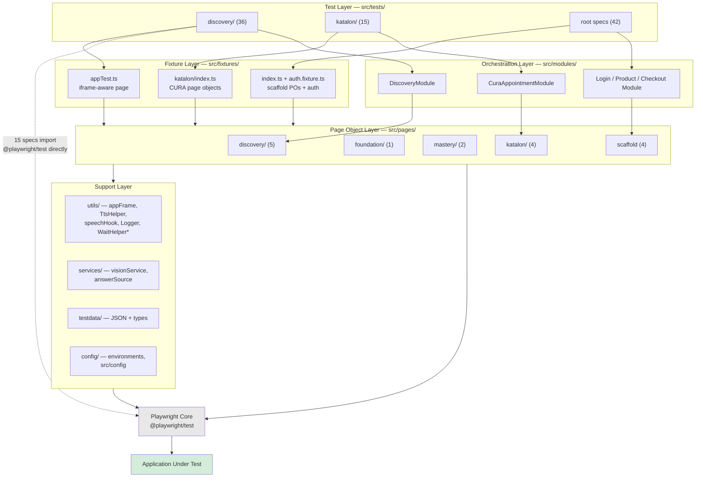

**Reading the diagram.** Tests obtain their page objects from fixtures (dependency injection). Where a journey spans several screens, a *Module* composes multiple page objects into one business flow — `DiscoveryModule.completeDiscoveryFlow()` is the clearest example, chaining login, mic test, help language, learning language, assessment start, assessment completion and the completion popup. Page objects own locators and single-screen actions. The support layer is stateless and shared. `WaitHelper` is marked with an asterisk because it exists but has no importers.

Two deviations from the ideal are visible and deliberate to record: 15 specs bypass the fixture layer entirely by importing `test` straight from `@playwright/test`, and there is no single root fixture — three independent `base.extend()` calls exist, so a spec inherits only the fixtures of whichever file it imports.

### Overall Execution Flow

```mermaid
graph TD
    A["npm run regression:uat"] --> B["scripts/run-e2e.js<br/>translates --env → ENV, selects<br/>5 regression specs, forces --workers=1"]
    B --> C["playwright.config.ts<br/>dotenv.config()"]
    C --> D["config/environments.ts<br/>resolveEnvironment()<br/>ENV → TEST_ENV → BASE_URL → uat"]
    D --> E["defineConfig: baseURL, timeout 120s,<br/>expect 15s, reporters, chromium project<br/>with fake-media launch args"]
    E --> F["CustomTTAReporter.onBegin<br/>creates tta-report/report_&lt;runId&gt;.html"]
    F --> G["Browser launch<br/>bundled Chromium, 1280x720,<br/>microphone permission granted"]
    G --> H["Fixture resolution<br/>appTest wraps page in appPage() Proxy"]
    H --> I["Pre-navigation hooks<br/>installSpeechRepeatHook /<br/>ContentApiAnswerSource.attach<br/>(M4 S1 only)"]
    I --> J["Test body: page.goto('/')<br/>→ guest login → Continue to ALL"]
    J --> K["Journey execution via<br/>page objects; DOM queries<br/>route into app iframe"]
    K --> L["Assertions: expect() on state,<br/>node sequences, URL/frame checks"]
    L --> M["Failure path:<br/>screenshot + video + trace<br/>retained on failure only"]
    L --> N["Cleanup: Playwright closes<br/>context and browser"]
    M --> N
    N --> O["CustomTTAReporter.onEnd<br/>copies artifacts, writes timestamped<br/>HTML + index.html redirect + history"]
    O --> P["Jenkins post-always:<br/>publishHTML x2, archiveArtifacts, cleanWs"]
    P --> Q["Notification"]
    Q --> R["NOT IMPLEMENTED —<br/>no email; Slack commented out"]

    style R fill:#f8d7da
    style I fill:#fff3cd
```

Each step is expanded in [Test Execution Flow and Sequences](#test-execution-flow-and-sequences).

### Major Components

| Component | Path | Responsibility |
|---|---|---|
| **Environment registry** | `config/environments.ts` | Single source of truth for instance URLs (UAT, LAB, LAB2) with documented resolution precedence. Tests call `page.goto('/')` and never hardcode a URL. |
| **Playwright config** | `playwright.config.ts` | Timeouts, retries, parallelism, four reporters, three browser projects, fake-media launch arguments. |
| **Environment-aware runner** | `scripts/run-e2e.js` | Translates `--env=lab` into `ENV`, defines the five-spec regression set, forces serial execution for it. |
| **Architectural linter** | `scripts/rule-engine.js` | Enforces file-placement and naming conventions from `rules/framework-rule-engine.json`. |
| **iframe proxy** | `src/utils/appFrame.ts` | Makes the entire suite iframe-aware via a one-line import swap. |
| **Speech mock** | `src/utils/speechHook.ts` | Replaces browser `SpeechRecognition` with a mock that echoes the app's own dictated phrase. |
| **TTS + mic injection** | `src/utils/TtsHelper.ts` + `FoundationPage.installMicInjection()` | Synthesises the correct word locally and feeds it into the app's audio recording stream. |
| **Answer sources** | `src/services/answerSource.ts` | Two interchangeable strategies for determining the correct answer to a picture MCQ. |
| **Foundation driver** | `src/pages/foundation/FoundationPage.ts` | 1,063 lines; the state machine that recognises and completes every F-series mini-game. |
| **Mastery driver** | `src/pages/mastery/MasteryPage.ts` + `VqaSpeakingAssessment.ts` | M4 Speed Practice and the S1 speaking assessment. |
| **Custom reporter** | `src/utils/CustomTTAReporter.ts` | Live HTML reporting with full artifact correlation. |
| **CI pipeline** | `Jenkinsfile` | Checkout → install → lint → build → test → publish → archive. |

### C0 — System Context Diagram

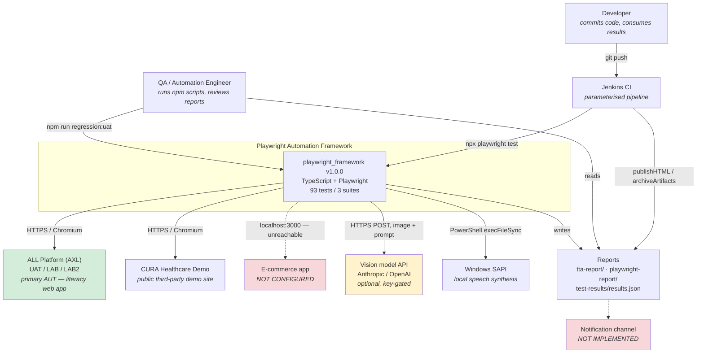

**Explanation.** Two human actors interact with the system. The framework drives three application targets, of which only two are reachable. It depends on two external services: a vision model API (optional, disabled without a key) and the local Windows speech engine (mandatory for F-series word assessments). It produces three report artifacts consumed directly by humans and archived by Jenkins. The notification edge is dashed and red because no notification mechanism exists in the codebase.

### Key Design Decisions

Each decision below is recorded with what it does, why it exists, what it solves, its benefit, and its limitation — as required for architecture review.

#### 1. Iframe-transparent `Page` proxy — [IMPLEMENTED]

**What.** `appPage(page)` in `src/utils/appFrame.ts` returns a JavaScript `Proxy` around Playwright's `Page`. A whitelist of DOM-query methods (`locator`, `getByRole`, `getByText`, `evaluate`, `$`, `$$`, `waitForSelector`, `content`, `title`, and others) is routed to the application's child iframe; everything else (`mouse`, `keyboard`, `goto`, `waitForURL`, `screenshot`, `waitForTimeout`) stays on the real `Page`.

**Why.** After the post-2026-08 AXL deployment, the entire learning journey renders inside a same-origin, full-viewport `/all-app/index.html` iframe. Every existing page object and spec queried the main frame and would find nothing.

**How.** Routing is resolved lazily per call. `currentAppFrame()` selects the child frame *by structure* — the direct `http(s)` child of the main frame — rather than by a fixed URL, because the iframe navigates internally as the journey progresses. Before the iframe exists (on the login and home pages) it falls back to the main frame automatically.

**Problem solved.** Made an entire existing suite iframe-aware with a one-line import change per spec (`from '../../fixtures/appTest'` instead of `from '@playwright/test'`) instead of rewriting every locator with `frameLocator()`.

**Benefit.** Minimal, low-risk migration; page objects remain readable; coordinate clicks via `page.mouse` still land correctly because the iframe is full-viewport at (0,0).

**Limitation.** The method whitelist is manual — a Playwright API addition would need a code change. Debugging is harder because stack traces pass through the Proxy. Selecting the frame structurally would break if the app ever renders two sibling iframes.

#### 2. Local TTS piped into a fake microphone — [IMPLEMENTED]

**What.** `TtsHelper.generateWavBase64(word)` shells out to PowerShell's `System.Speech.Synthesis` to produce a 16 kHz/16-bit/mono WAV, returned base64. `FoundationPage.installMicInjection()` overrides `navigator.mediaDevices.getUserMedia` to return a `MediaStreamAudioDestinationNode` stream, and `window.__playInjected(b64, ms)` decodes and plays the WAV into that stream while the app records.

**Why.** F-series "say the word" screens display a word as *text* with no audio prompt, and the app hosts no reusable word audio. Chromium's `--use-fake-device-for-media-stream` supplies only a synthetic tone, which the app rejects.

**Problem solved.** Allows the automation to feed the *correct word* into the microphone so the app's own grading accepts it — without a real microphone, a human reader, or pre-recorded audio fixtures.

**Benefit.** Deterministic; no network dependency; results cached per word per run in a static `Map`.

**Limitation.** **Windows-only.** `execFileSync('powershell', …)` will fail on the Linux CI agent the Jenkinsfile and Dockerfile specify, which means the F-series word assessments cannot currently run in CI. This is a significant architectural constraint recorded as a High finding in [Technical Review and Recommendations](#technical-review-and-recommendations).

#### 3. Mocked Web Speech recognition — [IMPLEMENTED]

**What.** `installSpeechRepeatHook(page)` uses `page.addInitScript` to (1) wrap `speechSynthesis.speak` to capture the dictated phrase into `window.__lastSpoken`, and (2) replace `SpeechRecognition`/`webkitSpeechRecognition` with a mock class whose `start()` emits a synthetic final result whose transcript is either an explicit override (`window.__srForce`) or the last dictated phrase.

**Why.** Mastery S-series listen-and-repeat assessments gate on browser speech recognition, which returns nothing in automated Chromium ("We can't hear you!").

**Benefit.** Isolated and opt-in — installed only in the specs that need it, so the F-series is untouched. Because `addInitScript` applies to the same-origin app iframe too, it works inside the AXL iframe.

**Limitation.** It mocks the application's own dependency rather than exercising it, so the assessment's real ASR path is never tested. And per the M4 S1 spec's own block comment, submission is currently blocked by an application defect regardless.

#### 4. Pluggable answer sources (Strategy pattern) — [IMPLEMENTED]

**What.** The `AnswerSource` interface has two implementations. `ContentApiAnswerSource` passively attaches a `page.on('response')` listener before navigation, filters for `GetContent|mechanic|content` JSON payloads containing `mechanics_data|isAns|correctness`, and indexes every question → correct-option pair it finds (keyed both by normalised question text and by normalised sorted option-set). `VisionAnswerSource` sends the captured illustration plus question and options to a vision model.

**Why.** Picture multiple-choice assessments are gated on the *correct* answer, and nothing about the questions may be hardcoded (the content changes per build and per learner).

**Benefit.** The content-API source is deterministic, free, and involves no third-party service — the right default for a reliable regression suite. It is purely passive (observes responses only; no request interception, no application mutation). The vision source is provider-agnostic (`VISION_PROVIDER=anthropic|openai`) with no keys in code. `VqaSpeakingAssessment` depends only on the interface, so the flow is agnostic to how the answer was obtained.

**Limitation.** The content-API source depends on the application's internal response shape — a payload refactor breaks it silently (it returns `''`, which the caller treats as "no answer"). The vision source costs money and introduces non-determinism, mitigated by `answerMatcher.matchOption()` fuzzy scoring with a 0.3 confidence floor.

#### 5. Geometry- and text-based locators instead of test IDs — [IMPLEMENTED, with risk]

**What.** Locators use, in order of preference: role (`getByRole('tab', { name: /^Guest$/i })`), exact or regex text (`getByText(/Start\s*F\d+/i)`), stable IDs where the app provides them (`#username-guest`, `#grade-guest`), and — where a label exists only inside an SVG — geometric DOM scanning inside `page.evaluate()` filtered by bounding-box position, size, aspect ratio and `cursor: pointer`, with fixed-coordinate `page.mouse.click()` as a last resort.

**Why.** As `FoundationPage`'s own comment records: "this app bakes most of its button labels into SVGs and has no data-testid/aria hooks, and its css-* hashes change per build."

**Benefit.** It works. The suite drives an application that is genuinely hostile to automation, and the strategy correctly prefers semantic locators wherever the app offers them.

**Limitation.** Geometric selection is pinned to the 1280×720 viewport configured in `playwright.config.ts`; a layout change or different viewport breaks it. Three hashed-class locators remain in `AssessmentPage` (`div.css-1w4297d`, `div.css-4g6ai3`, `div.css-1m9gxh8`) which will break on the next build. Full analysis in [Locator Flow and Strategy](#locator-flow-and-strategy).

#### 6. Single-session, long-running journey tests — [IMPLEMENTED, with trade-off]

**What.** Suite A's principal specs are single tests covering many test cases in one browser session with one login. `discovery-e2e.spec.ts` covers TC-001 → TC-019 with `test.setTimeout(75 * 60 * 1000)`.

**Why.** The application is a sequential learning journey — F2 content is only reachable after completing F1. Independent per-TC tests would each need to replay the entire preceding journey.

**Benefit.** Realistic end-to-end validation; execution time far lower than replaying prerequisites 19 times. The recorded full-Foundation single-user run completed in 68m41s.

**Limitation.** Violates test independence. A failure at TC-014 leaves TC-015 … TC-019 unexecuted, so one defect masks the rest. Not parallel-safe — `scripts/run-e2e.js` forces `--workers=1` for the regression set. Diagnosis requires reading a 75-minute trace. The mitigation used is Playwright `test.step()` blocks, which give per-step granularity in the reports.

#### 7. Persistent pre-positioned accounts — [PARTIAL]

**What.** F2, F3 and M4 specs log in as fixed accounts (`Testf2auto`, `Testf3auto`, `m4auto`; password equals username) that the application has already advanced to the relevant level.

**Why.** Avoids replaying Discovery and all preceding levels on every run.

**Limitation.** This is the framework's most fragile mechanism, and the recorded evidence proves it. The 2026-08-12 regression run recorded TC-020 and TC-021/022 both **FAIL** because on Build #4 `Testf2auto` no longer resumes at F2 and `Testf3auto` lands on a fresh Discovery screen (full detail in [Regression Report History](#regression-report-history)). The accounts are also *forward-only* — once an account completes a level it can never test it again, and `foundation-f3.spec.ts` handles this by calling `test.skip(true, …)` when `isPastF3()` returns true, which means coverage silently erodes rather than failing loudly. See [Findings — High](#findings--high).

### Automation Benefits

Only measurements actually present in the repository are quoted. No percentages or time savings have been invented.

#### Measured, from the regression execution record

| Metric | Recorded value |
|---|---|
| Regression wall time (5 specs, serial, UAT, headless, 2026-08-12) | **25m 42s** |
| Result of that run | 2 specs passed · 2 failed · 1 skipped |
| Discovery + F1 coverage in that run | **19/19 test cases PASS** (TC-001 … TC-019) |
| Single-user full-Foundation E2E (Discovery + F1 + F2 + F3) | **PASSED, 68m 41s**, one generated guest user |
| Headed re-run on Build #6 / v3.0.7 (2026-08-13) | Foundation all green, **78m 24s** |
| Full headed all-TC run on Build #7 (2026-08-14) | **ALL GREEN**, 2 specs passed · 0 failed · 1 skipped, **76m 12s** |
| Longest individual step recorded | TC-019 (F1 A2 → L7–L9/P7–P9 → A3): **8m 43s** (25m42s run) / **9m 59s** (76m12s run) |
| Builds validated against | #4 (`371bfce`), #6 (`36a8321` / v3.0.7), #7 (`3b6a229`) |

Full detail, including the Build #7 all-green run and the `recoverIfDisconnected()` fix, is in [Regression Report History](#regression-report-history).

#### Qualitative benefits — [IMPLEMENTED]

- **Regression automation.** 19 Discovery/F1 test cases plus F2 and F3 execute unattended against a deployed UAT build. The regression report demonstrates this was used to validate three successive application builds.
- **Repeatability and consistency.** The same journey is driven identically every run. `DiscoveryHelper.createTestUser()` generates a timestamped unique user per run so Discovery always starts from a clean state, removing the tester-to-tester variation inherent in manually replaying a 70-minute learning journey.
- **Reduced human error.** The F-series requires reading and speaking specific letters and words hundreds of times per run; automation removes transcription and sequencing mistakes.
- **Reduced manual effort.** The full Foundation journey takes 68–78 minutes of machine time with zero human attendance. The equivalent manual effort is not recorded in the repository and is therefore not estimated here.
- **Reusability.** `FoundationPage` node-completion helpers are shared across F1, F2 and F3; `MasteryPage` composes `FoundationPage`'s mic injection rather than duplicating it; `VqaSpeakingAssessment` and `answerMatcher` are explicitly designed for reuse across M4–M9.
- **Multi-environment support.** One registry change adds an instance; `npm run regression:lab2` runs the identical suite elsewhere with no test edits.
- **Automated reporting.** Timestamped HTML reports with embedded video, per-step screenshots and traces are produced on every run and retained as a browsable history — a permanent, shareable evidence trail.
- **Faster feedback.** The reporter writes and updates the HTML report *live* during execution (`updateReportRealTime()` on every step), so a long run can be monitored rather than waited out.
- **Honest failure reporting.** TC-024 is marked `test.fixme` with a detailed evidence-backed block comment rather than being deleted or allowed to pass falsely — a genuine quality practice worth noting.

#### Claimed but not substantiated

`TestPlan_Summary.csv` asserts "Regression Testing — Discovery — ✅ Completed — 100%" and "Audio Lifecycle Testing — ✅ Completed — 100%". No audio-lifecycle test (audio behaviour across navigation and language changes) is identified in the current implementation. The 100% figures have no supporting requirements baseline in the repository. Treated as **[NOT IMPLEMENTED]** / unsubstantiated — see [Coverage Claims Requiring Correction](#automation-coverage).

---

## Code and Component Reference

**Audience:** Automation Engineers joining the project. **Goal:** allow a new engineer to understand the codebase without a walkthrough.

### Folder Structure and Responsibilities

| Path | Owns | Read this first if you are… |
|---|---|---|
| `config/environments.ts` | Instance URLs and resolution precedence | adding or switching an environment |
| `playwright.config.ts` | Runner behaviour, browsers, reporters, media flags | changing timeouts, parallelism, or artifacts |
| `scripts/run-e2e.js` | The regression entry point and spec list | adding a spec to the regression set |
| `scripts/rule-engine.js` + `rules/*.json` | Architectural conformance rules | adding a new file type or convention |
| `src/tests/` | Test declarations, tags, `test.step` structure | writing a new test |
| `src/fixtures/` | Dependency injection, iframe wrapping, auth contexts | adding a shared object to tests |
| `src/modules/` | Multi-screen business journeys | changing a whole flow |
| `src/pages/` | Locators and single-screen actions/assertions | the app's UI changed |
| `src/utils/` | Cross-cutting capability (frame, audio, speech, log, report) | working on infrastructure |
| `src/services/` | External-service abstraction (vision, answer resolution) | changing how answers are obtained |
| `src/testdata/` | Typed static data and runtime generators | changing credentials or fixtures data |
| `src/config/` | Scaffold-only configuration | *(rarely — scaffold only)* |
| `src/api/` | HTTP clients (orphaned) | *(nothing imports this)* |
| `docs/` | Test cases, traceability, regression results | understanding scope and results |

### File Responsibilities — quick reference

#### Root configuration

| File | Responsibility | Key contents |
|---|---|---|
| `playwright.config.ts` | Runner configuration | `testDir './src/tests'`, `timeout 120000`, `expect.timeout 15000`, `fullyParallel`, `retries CI?2:0`, `workers CI?2:3`, 4 reporters, 3 projects, chromium fake-media args, `viewport 1280×720` |
| `package.json` | Scripts and dependencies | ~45 scripts; devDeps: `@playwright/test ^1.60.0`, `@types/node ^25.9.1`, `dotenv ^17.4.2`, `typescript ^5.9.3` |
| `tsconfig.json` | Compiler options | `target ES2020`, `strict true`, `resolveJsonModule true`, 7 unused path aliases, `include ["**/*.ts"]` |
| `.env` | Runtime configuration | **⚠ contains a live `VISION_API_KEY`; not gitignored** |
| `.gitignore` | VCS exclusions | ⚠ ignores `.env.local`/`.env.*.local` but **not** `.env`; also does not ignore `tta-report/` or `.auth/` |
| `Jenkinsfile` | CI pipeline | Docker agent `playwright:v1.40.0-jammy`, 4 parameters, 5 stages, `publishHTML` ×2, `archiveArtifacts` ×2, `cleanWs` |
| `Dockerfile` | Container image | **⚠ corrupted — `COPY package*.json 44444./`, `CO PY . .`, `m# Build TypeScript`; will not build** |
| `docker-compose.yml` | Sharded execution | `playwright-base` + `shard-1..4` + `smoke` + `regression` + `merge-reports` (with `depends_on … service_completed_successfully`) |
| `run-demo.bat` | Windows launcher | Convenience wrapper |
| `.cursorrules`, `.windsurfrules` | AI-assistant conventions | Editor-agnostic project rules |
| `commitlint.config.js`, `.lintstagedrc` | Commit hygiene | Configured; hooks not installed (`husky` absent) |
| `mint.json` | Docs-site config | For `docs/ai-agents/*.mdx` |

#### `config/environments.ts` — the environment registry

```ts
export interface AppEnvironment {
  key: string;       // 'uat'
  name: string;      // 'UAT' — shown in the report header
  baseURL: string;   // origin, no trailing slash, no /login
  loginURL: string;  // human login URL, for docs/logging
}

export const ENVIRONMENTS: Record<string, AppEnvironment> = {
  uat:  { key:'uat',  name:'UAT',  baseURL:'https://all-uat.theall.ai',  loginURL:'https://all-uat.theall.ai/login' },
  lab:  { key:'lab',  name:'LAB',  baseURL:'https://lab.the-axl.ai',     loginURL:'https://lab.the-axl.ai/login' },
  lab2: { key:'lab2', name:'LAB2', baseURL:'https://lab2.the-axl.ai',    loginURL:'https://lab2.the-axl.ai/login' },
};

export const DEFAULT_ENV_KEY = 'uat';
export function resolveEnvironment(): AppEnvironment
```

**`resolveEnvironment()` precedence** (highest first):
1. `ENV` or `TEST_ENV` — the normal selector (`npm run e2e -- --env=lab`). Unknown key → `console.warn` listing known keys, then falls through.
2. `BASE_URL` — exact normalised match against a registered entry, else a synthetic `CUSTOM` environment is returned.
3. Default `uat`.

**To add an environment:** add one entry to `ENVIRONMENTS`. No test or page-object change is required.

**Known defect:** `DiscoveryLoginPage.expectOnLoginPage()` hardcodes `/.*all-uat\.theall\.ai.*/`, which defeats this design on LAB/LAB2.

#### `scripts/run-e2e.js` — the regression entry point

Responsibilities:
- Parse `--env=<key>`, `--env <key>`, `--regression`, `--headed`; pass everything else through.
- Set `process.env.ENV` and `process.env.TEST_MODE`.
- Default `--project=chromium` unless the caller specified a project.
- When `--regression` and no explicit spec/grep target: run the five `REGRESSION_SPECS` with `--workers=1`.
- Invoke the Playwright CLI directly via Node (`require.resolve('@playwright/test/cli')` + `spawnSync(process.execPath, …)`) — no `npx`, no shell, for cross-platform robustness.
- Propagate the child exit code.

**To add a spec to the regression set:** append its path to the `REGRESSION_SPECS` array with a comment naming the test cases it covers, following the existing convention.

#### `scripts/rule-engine.js` + `rules/framework-rule-engine.json`

A custom architectural linter. `sourceRoots` lists the eight `src/` sub-trees it inspects. `placementRules` map a filename regex to a required folder:

| Rule id | Pattern | Must live under | Message |
|---|---|---|---|
| `page-placement` | `Page\.ts$` | `src/pages` | Page objects must live in src/pages |
| `module-placement` | `(Module\|Modal)\.ts$` | `src/modules` | Modules/Modals must live in src/modules |
| `util-placement` | `(Util\|Utils\|Helper\|Logger\|Generator\|Reporter)\.ts$` | `src/utils` | Utility classes must live in src/utils |
| `api-placement` | `Api\.ts$` | `src/api` | API clients must live in src/api |
| `spec-placement` | `\.spec\.ts$` | `src/tests` | *(spec placement)* |

Invoked via `npm run rules:check` (all), `rules:changed` (git diff), `rules:staged` (pre-commit). The `--staged` mode is designed for a git hook; `.lintstagedrc` exists but no hook installer (`husky`) is in `devDependencies`, so it is not currently enforced automatically.

Note the `module-placement` rule matches `Modal.ts` — implying an intended Modal convention that no file currently uses.

### Classes — complete inventory

#### Page objects

| Class | File | Lines | Locators | Actions | Assertions |
|---|---|---|---|---|---|
| `DiscoveryLoginPage` | `pages/discovery/DiscoveryLoginPage.ts` | 169 | 8 | 9 | 4 |
| `MicrophoneTestPage` | `pages/discovery/MicrophoneTestPage.ts` | ~70 | 4 | 3 | 3 |
| `HelpLanguagePage` | `pages/discovery/HelpLanguagePage.ts` | 325 | several | several | several |
| `LearningLanguagePage` | `pages/discovery/LearningLanguagePage.ts` | 290 | several | several | several |
| `AssessmentPage` | `pages/discovery/AssessmentPage.ts` | 260 | 11 | 12 | 8 |
| `FoundationPage` | `pages/foundation/FoundationPage.ts` | **1063** | 3 | ~28 | 9 |
| `MasteryPage` | `pages/mastery/MasteryPage.ts` | 521 | several | ~15 | several |
| `VqaSpeakingAssessment` | `pages/mastery/VqaSpeakingAssessment.ts` | 289 | — | 4 | — |
| `CuraHomePage` | `pages/katalon/CuraHomePage.ts` | ~80 | several | several | several |
| `CuraLoginPage` | `pages/katalon/CuraLoginPage.ts` | ~66 | 5 | 4 | 6 |
| `CuraAppointmentPage` | `pages/katalon/CuraAppointmentPage.ts` | 115 | several | several | several |
| `CuraConfirmationPage` | `pages/katalon/CuraConfirmationPage.ts` | 101 | several | several | several |
| `LoginPage` | `pages/LoginPage.ts` | 157 | 8 | several | several |
| `HomePage` | `pages/HomePage.ts` | 170 | several | several | several |
| `ProductPage` | `pages/ProductPage.ts` | 180 | several | several | several |
| `CheckoutPage` | `pages/CheckoutPage.ts` | 175 | several | several | several |

#### Modules, services, utilities, API clients

| Class | File | Lines | Purpose |
|---|---|---|---|
| `DiscoveryModule` | `modules/discovery/DiscoveryModule.ts` | 783 | Discovery journey orchestration, 13 methods |
| `CuraAppointmentModule` | `modules/katalon/CuraAppointmentModule.ts` | 175 | CURA booking journey |
| `LoginModule` | `modules/LoginModule.ts` | 152 | Scaffold login/logout journeys |
| `ProductModule` | `modules/ProductModule.ts` | 164 | Scaffold product journeys |
| `CheckoutModule` | `modules/CheckoutModule.ts` | 168 | Scaffold checkout journeys |
| `VisionService` | `services/visionService.ts` | 135 | Provider-agnostic VQA over HTTP |
| `ContentApiAnswerSource` | `services/answerSource.ts` | — | Passive response sniffing for correct answers |
| `VisionAnswerSource` | `services/answerSource.ts` | — | Vision-model answer strategy |
| `Logger` | `utils/Logger.ts` | 103 | Levelled contextual logging |
| `WaitHelper` | `utils/WaitHelper.ts` | 148 | Polling/retry utilities — **0 importers** |
| `DataGenerator` | `utils/DataGenerator.ts` | 177 | 13 static random generators — **0 effective uses** |
| `ApiHelper` | `utils/ApiHelper.ts` | 146 | HTTP wrapper — used only by orphaned `api/` |
| `TtsHelper` | `utils/TtsHelper.ts` | ~55 | Windows SAPI WAV synthesis with cache |
| `DiscoveryHelper` | `utils/DiscoveryHelper.ts` | ~60 | Unique test-user generation |
| `CustomTTAReporter` | `utils/CustomTTAReporter.ts` | **1951** | Live HTML reporter |
| `AuthApi` | `api/AuthApi.ts` | 175 | **Orphaned** |
| `ProductApi` | `api/ProductApi.ts` | 188 | **Orphaned** |
| `OrderApi` | `api/OrderApi.ts` | 195 | **Orphaned** |

### Page Objects — detailed reference

#### `DiscoveryLoginPage` — AXL authentication

**Static:** `DEFAULT_GRADE = process.env.GRADE || '2'` (grades 1–8).

**Locators**

| Name | Selector | Note |
|---|---|---|
| `appReadyGotItButton()` | `getByRole('button',{name:/Got it/i}).first()` | PWA "App Ready" modal — may not appear |
| `guestTab()` | `getByRole('tab',{name:/^Guest$/i}).first()` | Anchored regex |
| `studentTab()` | `getByRole('tab',{name:/^Student$/i}).first()` | Declared, unused |
| `usernameInput()` | `locator('#username-guest, input[placeholder="User ID"]').first()` | OR'd for resilience |
| `passwordInput()` | `locator('#password-guest, input[placeholder="Password"]').first()` | OR'd |
| `gradeSelect()` | `locator('#grade-guest')` | Native `<select>` |
| `loginButton()` | `getByRole('button',{name:/Login as Guest/i}).first()` | |
| `continueToAllButton()` | `getByText('Continue to ALL',{exact:true}).first()` | `exact` avoids "Continue to AML" |
| `micTestSkip()` | `getByText('Skip',{exact:true}).first()` | |
| `errorMessage()` | `locator('[class*="error"], [role="alert"]')` | |

**Actions**

| Method | Behaviour |
|---|---|
| `navigate()` | `page.goto('/')` then `waitForTimeout(3000)`. Uses `'/'` so Playwright resolves against `baseURL` — never hardcodes a URL |
| `dismissAppReadyModal()` | 4 s visibility probe → click → 600 ms settle. Best-effort |
| `selectGuestTab()` | Click by role; if `#grade-guest` is not visible within 2 s, `evaluate` scans `[role="tab"], button` for `innerText === 'Guest'`, computes the bounding-box centre, and `page.mouse.click`s it, then waits for `#grade-guest` |
| `selectGrade(grade)` | `selectOption(grade)`, falling back to `selectOption({label: grade})` |
| `enterUsername(u)` / `enterPassword(p)` | `fill()` |
| `clickLogin()` | Click "Login as Guest" |
| `continueToAll()` | `waitForURL(/\/home/i, 30 s)` → wait for button visible (15 s) → click (10 s) → `waitForURL(/\/all/i, 30 s)` → `waitForTimeout(4000)` for the iframe → `skipMicTestIfPresent()` |
| `skipMicTestIfPresent()` | 6 s probe → click → 2 s. Comment: requires a real pointer click; an in-page click is ignored |
| `login(u, p, grade = DEFAULT_GRADE)` | Composes: dismiss modal → guest tab → username → password → grade → login → continue to ALL |

**Assertions:** `expectOnLoginPage()` (⚠ hardcodes the UAT hostname), `expectUsernameFieldVisible()`, `expectPasswordFieldVisible()`, `expectLoginButtonVisible()`.

#### `AssessmentPage` — recording controls

Shared by Discovery assessments *and* reused by `FoundationPage` for the F-series "say the word" microphone (the same 70×70 centred record/stop toggle).

**Locators**

| Name | Selector | Risk |
|---|---|---|
| `startAssessmentButton()` | `getByText('Start Assessment',{exact:true}).first()` | ✅ |
| `skipDemoButton()` | `getByText('Skip Demo',{exact:true}).first()` | ✅ |
| `startGameButton()` | `getByText('Start Game',{exact:true}).first()` | ✅ |
| `confirmButton()` | `getByText('Confirm',{exact:true}).first()` | ✅ |
| `letsStartButton()` | `getByText(/Let.?s\s*Start/i).first()` | ✅ tolerant of the apostrophe |
| `playButton()` | `locator('img[alt="Play"]').first()` | ✅ |
| `retryButton()` | `locator('div.css-1w4297d, img[alt="Retry"]').first()` | ⚠ hashed class (OR'd with `alt`, so partly mitigated) |
| `nextButton()` | `locator('div.css-4g6ai3, div.css-1m9gxh8 > div').first()` | ❌ **two hashed classes, no fallback** |
| `continueButton()` | `getByText(/^Continue$\|जारी रखें/).first()` | ✅ bilingual |
| `sentenceText()` | `getByRole('heading',{level:4})` … | ✅ |
| `completionPopup()` | `getByText(/Hurray\|successfully completed\|completed assessment/i).first()` | ✅ |

**Actions:** `clickStartAssessment`, `clickSkipDemo`, `clickMike`, `clickStop`, `clickPlay`, `clickRetry`, `clickNext`, `clickContinue`, `clickRecordToggle`, `recordToggleCenter`, `getSentenceText`, `recordSentence`, `startAssessment`, `completeAllSentences`.

`recordToggleCenter()` / `clickRecordToggle()` implement the centred round record/stop control by coordinate — the control has no accessible name and no stable class. This is the method `FoundationPage` reuses.

**Assertions:** `expectSentenceVisible`, `expectMikeButtonVisible`, `expectPlayButtonVisible`, `expectRetryButtonVisible`, `expectNextButtonVisible`, `expectContinueButtonVisible`, `expectStartAssessmentVisible`, `expectCompletionPopupVisible`.

#### `FoundationPage` — the F-series driver (1,063 lines)

The largest and most important class. Constructor composes `AssessmentPage` (for the record toggle). Private field `lhNetLetter` holds a target letter recovered from the network as a backup to the `play()` hook.

**Locators (3):** `resultMessage()` = `getByText(/learning journey|language skills|Hurray/i).first()`; `startF1Button()` = `getByText(/Start\s*F1/i).first()`; `startFoundationButton()` = `getByText(/Start\s*F\d+/i).first()` (generic, used for F2/F3).

**Navigation and entry**

| Method | Behaviour |
|---|---|
| `clickLetsStart()` | Three-tier fallback. (1) `getByText(/Let.?s\s*Start/i)` click with 4 s timeout. (2) `evaluate` scans `div, button, svg` for an element in the lower-centre band (`cx` 520–760, `cy` 380–560), width 80–320, height 28–90, `cursor:pointer` → returns its centre. (3) `page.mouse.click(640, 472)` fixed fallback. Necessary because the label is an SVG |
| `clickStartF1()` | `startF1Button().click({timeout:15000, force:true})` |
| `clickStartFoundationIfPresent()` | Returns `boolean`; used by the driver loops |
| `switchToEnglishForF2()` | Four guarded steps — see [The English-switch path](#authentication-flow) |
| `dismissCoachmarks(maxTries = 6)` | Bounded retry loop |

**State detection**

| Method | Returns | Basis |
|---|---|---|
| `trainProgress()` | `string` e.g. `"7/16"` | Reads the Letter Train counter; empty when the lesson ends |
| `isOnPracticeDemo()` | `boolean` | Page-text markers |
| `isOnResultScreen()` | `boolean` | Result-screen text |
| `isOnWordRecognition()` | `boolean` | F2 word-option practice |
| `isOnLetterLauncher()` | `boolean` | F3 game |
| `isOnMemoryChallenge()` | `boolean` | F3 game |
| `isOnApplyEntry()` | `boolean` | Apply challenge entry |
| `isPastF3()` | `boolean` | Detects the next-phase map |
| `foundationLevel()` | `string` | Reads the footer level image, e.g. `'F1'`. The F2 spec notes it can be absent on the brief post-Apply transition screen, so it is used only as a guard |
| `appUrl()` | `string` | `currentAppFrame(this.page).url()` — route checks must read the **frame**, not the page |

**Game drivers**

| Method | Signature | Behaviour |
|---|---|---|
| `completeLetterTrain()` | `(): Promise<void>` | Two-phase loop, 45 iterations max, `stuck >= 8` exit. See [Test Case Flow — main business journey](#test-execution-flow-and-sequences) |
| `completeLetterHuntPractice()` | `(): Promise<void>` | F1 practice; uses the `play()` hook to identify the target letter |
| `completeWordRecognitionPractice()` | `(): Promise<void>` | F2 practice with word options; audio still at `/audio/<lang>/letter/<WORD>.wav` so the same hook reads the answer |
| `completeLetterLauncher(maxRounds = 80)` | `(): Promise<void>` | F3 match-shown-to-spoken → press ✓/✗. `captureState('letter-launcher-stuck')` after 25 misses |
| `completeMemoryChallenge(maxRounds = 8)` | `(): Promise<void>` | Memorise a sequence, click it back in order, submit via "Check Sequence". `captureState('memory-challenge-no-sequence')` on failure to read the sequence |
| `completeApplyChallenge()` | `(): Promise<void>` | Apply challenge (3 levels, fuel /100 in F3) |
| `completeLearnPracticePair()` | `(): Promise<void>` | One Learn + one Practice node |
| `completeFoundationThroughApply(targetApplies, startApplyNum = 1, maxNodes = 120)` | `(): Promise<string[]>` | **Primary F1/F2 driver.** Returns the node sequence, e.g. `['StartF','L1','P','L2','P','A1']` |
| `completeF3(maxNodes = 120)` | `(): Promise<string[]>` | **Primary F3 driver.** Returns markers `['StartF3','LL','LL','MC',…]` |
| `recoverIfDisconnected()` | `(): Promise<boolean>` | Added after the Build #7 mid-run redeploy incident (see [Regression Report History](#regression-report-history)): detects the app's "Couldn't connect right now" screen by its connectivity copy (deliberately not by the "Try Again" button alone, since games have their own "TRY AGAIN" for wrong answers), clicks Try Again / reloads, and resumes; throws with a screenshot after 3 failed attempts instead of hanging. Wired into 4 stall points (Letter Train, Apply Challenge, Foundation-through-Apply, F3) so it fires only when progress has stalled |

**Browser-side hooks**

| Method | Behaviour |
|---|---|
| `installMicInjection()` | Creates an `AudioContext` + `MediaStreamAudioDestinationNode`, overrides `navigator.mediaDevices.getUserMedia` to return that stream when `constraints.audio` is set, and exposes `window.__playInjected(b64, ms)` which base64-decodes, `decodeAudioData`s, and plays the buffer on loop into the destination for `ms`. Guarded by `window.__micInjectInstalled` |
| `installLetterLauncherHook()` | Intercepts audio `play()` to recover the spoken letter/word from the audio URL. **Must be installed before the F3 games preload their audio** — `foundation-f3.spec.ts` calls it immediately after login |
| `readCurrentWord()` | `evaluate` scans `h1,h2,h3,h4,h5,div,span,p` for text matching `/^[A-Za-z]{2,15}$/` within `y` 150–400 and width ≥ 20, choosing the element with the **smallest area** — the tightest wrapper. This avoids the coloured first-letter span and any larger container |
| `rightmostArrow()` | Private; locates the lower-centre next-arrow |

**Assertions (9):** `expectF1Landing`, `expectOnResultScreen`, `expectOnPracticeDemo`, `expectOnLetterTrain`, `expectOnApplyChallenge`, `expectPastApplyChallenge`, `expectFoundationApplyCompleted`, `expectOnFoundationLevel(label)`.

**Diagnostics:** `captureState(tag)` writes `test-results/<tag>.png` (`fullPage: false`) and logs the leading page text; `pageTextHead()` returns that text.

**Refactoring note — [RECOMMENDED]:** at 1,063 lines and 40 methods spanning three levels and six mini-games, this class exceeds a reasonable page-object scope. Decompose into per-game page objects with a thin `FoundationDriver`. This is a Medium finding — see [Findings — Medium](#findings--medium).

#### `MasteryPage` and `VqaSpeakingAssessment`

**`MasteryPage`** (521 lines) drives M4 Speed Practice. Composes `FoundationPage` to reuse its mic injection — explicitly so the F-series stays unchanged.

Methods: `startLevelButton(n)` (parameterised locator), `startLevel(n)`, `clickStartGame`, `clickNextArrow`, `currentNode`, `detectState`, `readSentence`, `installReadAloudInjection`, `doReadAloudItem`, `isDidYouSeeCard`, `answerDidYouSee`, `completeM4Practices`, `driveToS1`, `isS1Entry`, `isAtS1`, `isPastS1`, `answerS1Item`, `completeS1`.

**`VqaSpeakingAssessment`** (289 lines) — reusable driver for "look at the picture and speak the correct answer" (M4 S1 / TC-024, designed for M4–M9).

```ts
export interface VqaItem { question: string; options: string[]; imageSrc: string; }
export interface VqaAttempt {
  item: VqaItem; sourceAnswer: string; chosen: string; score: number;
  via: 'hook' | 'ui';
  outcome: 'advanced' | 'wrong' | 'nomatch' | 'timeout';
}
class VqaSpeakingAssessment {
  constructor(private readonly page: Page, private readonly source: AnswerSource) {}
  async isOnQuestion(): Promise<boolean>   // /speak the correct answer/i in body text
  async livesLeft(): Promise<number>       // "You have N lives" → N, or -1
  async readItem(): Promise<VqaItem>       // tightest-text-leaf + geometry; NOISE regex filter
  async answerS1Item(...)                  // resolve → match → inject → submit → verify advance
}
```

`readItem()` uses a `NOISE` regex — `/^(English|Guest|You have|Words|Build|S\d|P\d|Level|Logout|\d+)$/i` — to exclude chrome text, then geometry (options sit below the question, above the footer, right of the radio/▶ icons). Deliberately not tied to specific strings or a fixed option count.

Requires `installSpeechRepeatHook(page)` to have run **before** navigation, plus an `AnswerSource`.

#### CURA page objects

Clean, conventional, ID-based — the easiest classes in the repository to read, and the right model for a well-behaved application.

`CuraLoginPage` locators: `#txt-username`, `#txt-password`, `#btn-login`, `h2:has-text("Login")`, `.text-danger`.
Actions: `enterUsername`, `enterPassword`, `clickLogin`, `getErrorMessage`.
Assertions: `expectOnLoginPage`, `expectUsernameFieldVisible`, `expectPasswordFieldVisible`, `expectLoginButtonVisible`, `expectPasswordFieldMasked`, `expectErrorVisible`.

`CuraAppointmentPage` covers `#combo_facility`, `#chk_hosp498`, `#radio_program_medicare|medicaid|none`, `#txt_visit_date`, `#txt_comment`, `#btn-book-appointment`. `CuraConfirmationPage` covers `#facility`, `#hospital_readmission`, `#program`, `#visit_date`, `.lead`.

**Usage gap:** these page objects are bypassed by `tc001` (34 inline `page.locator` calls) and `tc004`–`tc009`, `tc013`, `tc015`.

### Fixtures — reference

Full table in [Fixture Flow](#fixture-flow). Source for the two that matter most:

**`src/fixtures/appTest.ts`** — the entire iframe migration:

```ts
import { test as base, expect } from '@playwright/test';
import { appPage } from '../utils/appFrame';

export const test = base.extend({
  page: async ({ page }, use) => { await use(appPage(page)); },
});
export { expect };
```

Its doc comment records the intent: *"Discovery / Foundation / Mastery specs import { test, expect } from this module instead of '@playwright/test' — a one-line swap that makes every existing `page` usage (specs and page objects) work against the new iframe with no other changes."*

**`src/fixtures/katalon/index.ts`** — the conventional POM fixture pattern:

```ts
export type CuraTestFixtures = {
  curaHomePage: CuraHomePage; curaLoginPage: CuraLoginPage;
  curaAppointmentPage: CuraAppointmentPage; curaConfirmationPage: CuraConfirmationPage;
  curaAppointmentModule: CuraAppointmentModule;
};
export const test = base.extend<CuraTestFixtures>({
  curaHomePage: async ({ page }, use) => { await use(new CuraHomePage(page)); },
  // … one per fixture
});
export { expect } from '@playwright/test';
```

**`src/fixtures/auth.fixture.ts`** — implemented, **entirely unused**. Exports `authTest` (with `authenticatedContext` writing `context.storageState({path:'.auth/user.json'})`, and `authenticatedPage`) and `authenticatedTest` (a `page` override that tries `newContext({storageState:'.auth/user.json'})` and falls back to a fresh UI login in a `catch`). This is a complete session-reuse implementation waiting to be adopted.

### Modules — reference

#### `DiscoveryModule` (783 lines)

Constructor builds five page objects and `Logger.create('DiscoveryModule')`.

| Method | Signature | Purpose |
|---|---|---|
| `doLogin(username, password)` | `Promise<void>` | 4 logged steps: navigate, username, password, click |
| `handleMicrophoneTest()` | `Promise<void>` | Wait for welcome text, read it, click Skip |
| `selectHelpLanguage(language)` | `Promise<void>` | Handles the Kannada/Telugu popup → Confirm, then the `/discover-start` header dropdown → English → Confirm. Documented as a 5-step flow in the method comment |
| `selectLearningLanguage(language)` | `Promise<void>` | Learning-language selection |
| `startAssessment()` | `Promise<void>` | |
| `recordSentence()` | `Promise<void>` | |
| `replayAudio()` | `Promise<void>` | |
| `reRecordAudio()` | `Promise<void>` | |
| `moveToNextSentence()` | `Promise<void>` | |
| `completeAssessment(sentenceCount = 5)` | `Promise<void>` | |
| `handleCompletionPopup()` | `Promise<void>` | |
| `completeDiscoveryFlow(username, password, helpLanguage='English', learningLanguage='English')` | `Promise<void>` | Composes the seven steps above |

**Important caveat:** `discovery-e2e.spec.ts` — the primary regression spec — does **not** use `DiscoveryModule`; it drives page objects directly with its own inline helpers. The module and the spec therefore encode two parallel implementations of the same journey. Recorded as a Medium duplication finding.

#### `CuraAppointmentModule` (175 lines)

Composes the four CURA page objects into booking journeys. Constructed but never called in `tc001`.

#### Scaffold modules

`LoginModule` (`doLogin`, `doLoginWithRememberMe`, `doLogout`, `verifyLoggedIn`, `verifyLoggedOut`), `ProductModule`, `CheckoutModule`. All use `Logger`. Target the unconfigured application.

### Utilities — detailed reference

#### `appFrame.ts` ★

```ts
const FRAME_METHODS = new Set<string>([
  'evaluate','evaluateHandle','locator','getByRole','getByText','getByLabel',
  'getByPlaceholder','getByAltText','getByTitle','getByTestId','frameLocator',
  'waitForSelector','waitForFunction','$','$$','$eval','$$eval','content','title',
]);

export function currentAppFrame(page: Page): Frame {
  const main = page.mainFrame();
  const child = page.frames().find(
    (f) => f !== main && f.parentFrame() === main && /^https?:/i.test(f.url())
  );
  return child || main;
}

export async function waitForAppFrame(page: Page, timeout = 30000): Promise<Frame>
export function appPage(page: Page): Page   // returns a Proxy
```

`waitForAppFrame` polls `document.querySelectorAll('iframe').length > 0` via `waitForFunction` and `.catch`es to the main frame. **It is exported but not called by `continueToAll()`**, which uses `waitForTimeout(4000)` instead — an easy improvement.

#### `TtsHelper.ts`

```ts
static generateWavBase64(text: string): string
```

1. Sanitise: `text.replace(/[^A-Za-z0-9 ]/g,'').trim()`; return `''` if empty.
2. Cache lookup on the lower-cased word (`static cache = new Map<string,string>()`).
3. Build a PowerShell one-liner: `Add-Type -AssemblyName System.Speech`, `New-Object SpeechSynthesizer`, `SpeechAudioFormatInfo(16000, Sixteen, Mono)`, `SetOutputToWaveFile`, `Speak`, `Dispose`.
4. `execFileSync('powershell', ['-NoProfile','-NonInteractive','-Command', ps], {stdio:'ignore'})`.
5. Read the WAV, base64-encode, `unlinkSync` the temp file, cache, return.

16 kHz / 16-bit / mono PCM is chosen because it is widely decodable by `decodeAudioData` — stated in the comment.

**⚠ Windows-only.** This is the framework's hard platform dependency and the reason the F-series cannot run on the Linux CI image.

#### `speechHook.ts`

```ts
export async function installSpeechRepeatHook(page: Page): Promise<void>
```

`page.addInitScript` (so it applies to the same-origin app iframe too), guarded by `window.__speechHook`:

1. Wrap `speechSynthesis.speak` to capture `utterance.text` into `window.__lastSpoken`.
2. Replace `SpeechRecognition` / `webkitSpeechRecognition` with `class MockSpeechRecognition extends EventTarget`, implementing `onresult`/`onend`/`onstart`/`onerror`/`onspeechend`/`onaudioend`, `lang`, `continuous`, `interimResults`, `maxAlternatives`, and `start()`/`stop()`/`abort()`.
3. `start()` fires `start` after 40 ms, then after 700 ms emits a synthetic `result` event whose transcript is `window.__srForce || window.__lastSpoken`, with `confidence: 0.97`, `isFinal: true`, followed by `speechend`, `audioend`, `end`.
4. Appends to `window.__srEvents` for debugging (`'start'`, `'emit:<transcript>'`).

Result: the app receives a clean, correct transcript and accepts the answer — no real audio, no backend ASR.

#### `answerMatcher.ts`

```ts
export interface OptionMatch { index: number; option: string; score: number; }
export function matchOption(answer: string, options: string[], min = 0.3): OptionMatch | null
```

Normalises both sides (lower-case, strip punctuation, collapse whitespace), removes stopwords (`a an the is are in on at of to it this that`), then scores:

| Score | Condition |
|---|---|
| `1.0` | Exact normalised equality |
| `0.9` | One string fully contains the other |
| `0 … 0.8` | Jaccard overlap of content tokens × 0.8 |

Returns `null` below `min` — the caller treats that as "answer unusable" rather than guessing. Pure and provider-agnostic; the doc comment states it is intended to be unit-testable. **No unit tests exist.**

#### `Logger.ts`

```ts
export enum LogLevel { DEBUG='DEBUG', INFO='INFO', WARN='WARN', ERROR='ERROR' }
class Logger {
  constructor(context: string)
  static create(context: string): Logger
  static setLogLevel(level: LogLevel): void
  static getLogLevel(): LogLevel
  debug/info/warn/error(message, error?): void
  step(stepNumber: number, description: string): void
  testStart(testName: string): void        // ========== START: name ==========
  testEnd(testName: string): void
}
```

Format: `[ISO timestamp] [LEVEL] [context] message`. `shouldLog` compares ordinal positions in the level array.

**Defect:** the static default is `LogLevel.INFO` and **nothing calls `setLogLevel()`**, so the `LOG_LEVEL` environment variable read by `src/config` has no effect. `debug()` output is unreachable.

#### `WaitHelper.ts` — [PARTIAL, 0 importers]

`waitForCondition(condition, {timeout, interval=500, message})`, `waitForTextContains`, `waitForTextEquals`, `waitForElementCount`, `waitForUrlContains`, `waitForNetworkIdle`, `retry<T>(action, {retries=3, delay=1000})`, `waitForElementStable(locator)` (compares bounding boxes at 100 ms intervals).

Well-written and directly applicable to the bespoke polling loops that currently exist inline in `FoundationPage`. Adopting it would remove real duplication.

#### `DataGenerator.ts` — [PARTIAL, 0 effective uses]

13 statics: `randomString`, `randomEmail`, `randomPhone`, `randomInt`, `randomFloat`, `randomBoolean`, `randomDate`, `randomUUID`, `randomPassword`, `randomFirstName`, `randomLastName`, `randomFullName`, `randomAddress`. Imported by `DiscoveryHelper` but never called there.

#### `DiscoveryHelper.ts`

```ts
static generateUniqueUsername(): string        // `testuser_${Date.now()}`
static createTestUser(): TestUser              // { username, password: username, timestamp }
static createMultipleTestUsers(count): TestUser[]   // busy-waits on Date.now() for uniqueness
static async waitForAudioCompletion(ms = 2000): Promise<void>   // mock
static async simulateRecording(ms = 3000): Promise<void>
```

`createTestUser` implements the stated requirement *"Create a unique username with same password as username."* The busy-wait loop in `createMultipleTestUsers` blocks the event loop; a `setTimeout(1)` would be preferable — minor.

#### `ApiHelper.ts` — [PARTIAL]

`callApi({url, method, headers, data, params, timeout})` over `Page | APIRequestContext` (detected by `'request' in this.context`), plus `buildUrl` with `URLSearchParams` and a `RetryOptions`-based polling variant. Used only by the orphaned `api/` clients.

#### `CustomTTAReporter.ts` (1,951 lines)

Interfaces: `StepData` (title, category, duration, status, screenshot, error, stackTrace, startTime, consoleLogs, stepIndex, videoStartTime, videoEndTime), `TestData` (id, title, fullTitle, file, describePath, location, duration, status, retry, screenshots, steps, video, trace, error, errorStack, tags), `FileGroup`, `SuiteStats`.

Key methods: `onBegin`, `initializeLiveReport`, `onTestBegin`, `onStepEnd`, `onTestEnd`, `updateReportRealTime`, `generateHTMLRealTime`, `onEnd`, `generateReport`, `generateHistoryPage`, `generateHTML`, `generateMetaSection`, `generateSuiteStatus`, `generateRunStatus`, `generateFilters`, `generateTestTable`, `associateLogsWithSteps`, `formatTime`, `formatDuration`, `formatVideoTime`. Full lifecycle and internals are detailed in [Sequence Diagram — Reporting](#test-execution-flow-and-sequences) and [Report Generation](#cicd-reporting-and-infrastructure).

### Services

#### `visionService.ts`

```ts
export interface VisionConfig {
  provider: 'anthropic' | 'openai'; apiKey: string;
  model: string; endpoint: string; maxTokens: number;
}
class VisionService {
  constructor(cfg?: Partial<VisionConfig>)   // env-backed with per-field override
  isConfigured(): boolean                    // apiKey.trim().length > 0
  get describe(): string                     // "anthropic:claude-sonnet-5"
  async answer(imageBase64, mediaType, question, options): Promise<string>
  private buildPrompt(question, options): string
  private callAnthropic(...) / callOpenAI(...)
}
```

Defaults: `anthropic` / `claude-sonnet-5` / `https://api.anthropic.com/v1/messages`; `openai` / `gpt-4o` / `https://api.openai.com/v1/chat/completions`. `maxTokens` 64.

`buildPrompt` numbers the options and instructs: *"Reply with ONLY the exact text of the single correct option, copied verbatim from the list above. Do not add punctuation, quotes, explanation, or the option number."* Both providers throw on non-`ok` with the status and the first 300 characters of the body.

Configuration is read from the environment with **no keys hardcoded** — the design is correct; the failure is that `.env` (with a real key) is committed.

#### `answerSource.ts`

```ts
export interface AnswerContext {
  question: string; options: string[];
  captureImage: () => Promise<{ base64: string; mediaType: string }>;  // lazy
}
export interface AnswerSource {
  readonly describe: string;
  isReady(): Promise<boolean>;
  answer(ctx: AnswerContext): Promise<string>;
}
```

**`ContentApiAnswerSource`** — private constructor; `static attach(page)` registers the response listener and returns the instance.

- Listener filter: URL matches `/GetContent|mechanic|content/i`; content-type contains `json` or the URL ends `.json`; body matches `/mechanics_data|isAns|correctness/i`. All inside `try {} catch {}` ("ignore non-JSON / consumed bodies").
- `ingest(body)`: `JSON.parse`, `collectItems(json)`, then for each item derive the correct option from `options.find(o => o.isAns === true)?.text`, or from the first non-empty array value in a `correctness` object.
- Indexes into two maps: `byQuestion` (normalised question → correct option) and `byOptions` (normalised sorted option-set joined by `|` → correct option) as a fallback.
- `collectItems` walks the payload recursively with a `seen` Set (cycle-safe), collecting any object with an `options` array whose members have an `isAns` key.
- `answer(ctx)`: if nothing captured yet, poll `waitForTimeout(500)` up to 10 times; try `byQuestion`, then `byOptions`; return `''` if neither hits.

**`VisionAnswerSource`** — wraps `VisionService`; `isReady()` returns `vision.isConfigured()`; `answer()` invokes the lazy `captureImage()` then the model.

The class comment states the design intent plainly: *"Nothing about the questions/answers is hardcoded — both sources derive the answer at runtime. Reusable across M4–M9 image/text MCQ activities."*

### Test Data

| File | Contents |
|---|---|
| `testdata/types.ts` | `UsersData`, `InvalidUser` |
| `testdata/users.json` | 3 valid users (`testuser@example.com`/`SecurePass123`, `admin@example.com`, `premium@example.com`) with `id`, `firstName`, `lastName`, `role`; plus `invalidUsers` |
| `testdata/products.json` | 106 lines of product fixtures |
| `testdata/discovery/discovery-types.ts` | `TestUser { username, password, timestamp }` |
| `testdata/discovery/discovery-data.json` | `baseUrl` (⚠ duplicates the registry), `languages.help/learning` (English, Telugu, Hindi), `assessments.discovery1/2` (`sentenceCount: 5`, sample sentences), `testUsers.prefix` (`testuser_`) |
| `testdata/katalon/cura-types.ts` | `CuraTestData` |
| `testdata/katalon/cura-data.json` | `validUser` (`John Doe` / `ThisIsNotAPassword`), 2 `invalidUsers` with `expectedError`, `facilities[3]`, `healthcarePrograms[3]`, `defaultAppointment` |
| `src/config/index.ts` → `testData` | `validCreditCard`, `invalidCreditCard`, `addresses.us/uk` |

**Hardcoded in specs instead of test data** — the anti-pattern to fix first: `Testf2auto`, `Testf3auto`, `m4auto` (four occurrences), `DEMO_SENTENCE = 'The cat is sleeping'`, and the CURA URL in six specs.

### Constants

| Constant | Value | Location |
|---|---|---|
| `DEFAULT_ENV_KEY` | `'uat'` | `config/environments.ts` |
| `ENVIRONMENTS` | 3 entries | `config/environments.ts` |
| `DiscoveryLoginPage.DEFAULT_GRADE` | `process.env.GRADE \|\| '2'` | `pages/discovery/DiscoveryLoginPage.ts` |
| `FRAME_METHODS` | 19 method names | `utils/appFrame.ts` |
| `DEFAULT_MODELS` | `{anthropic:'claude-sonnet-5', openai:'gpt-4o'}` | `services/visionService.ts` |
| `DEFAULT_ENDPOINTS` | provider URLs | `services/visionService.ts` |
| `STOP` | 13 stopwords | `utils/answerMatcher.ts` |
| `NOISE` | chrome-text regex | `pages/mastery/VqaSpeakingAssessment.ts` |
| `DEMO_SENTENCE` | `'The cat is sleeping'` | `tests/discovery/discovery-e2e.spec.ts` |
| `REGRESSION_SPECS` | 5 paths | `scripts/run-e2e.js` |
| `LogLevel` | enum | `utils/Logger.ts` |
| Loop bounds | `maxNodes 120`, `maxRounds 80`/`8`, 45 iterations, `stuck 8`/`12`/`25`, `maxTries 6` | `pages/foundation/FoundationPage.ts` |

### Dependencies (declared)

```json
"devDependencies": {
  "@playwright/test": "^1.60.0",
  "@types/node": "^25.9.1",
  "dotenv": "^17.4.2",
  "typescript": "^5.9.3"
}
```

No `dependencies`. Notably **absent despite being referenced**: `eslint`, `prettier` (config files exist; `npm run lint` and `npm run format` will fail on a clean install), `husky` (`.lintstagedrc` and `commitlint.config.js` exist but no hook installer), `@commitlint/*`.

### Function Relationships — call graphs

#### Login

```
spec
 └─ new DiscoveryLoginPage(page)
 └─ login.navigate() ──────────────► page.goto('/') ──► [Proxy: Page] ──► baseURL
 └─ login.login(u, p, grade)
      ├─ dismissAppReadyModal() ──► appReadyGotItButton() ──► [Proxy: main frame]
      ├─ selectGuestTab()
      │    ├─ guestTab().click()
      │    └─ (fallback) page.evaluate(scan) ──► page.mouse.click(x, y)
      ├─ enterUsername() ──► usernameInput().fill()
      ├─ enterPassword() ──► passwordInput().fill()
      ├─ selectGrade() ──► gradeSelect().selectOption(value) ──► (fallback) {label}
      ├─ clickLogin() ──► loginButton().click()
      └─ continueToAll()
           ├─ page.waitForURL(/\/home/i)
           ├─ continueToAllButton().waitFor().click()
           ├─ page.waitForURL(/\/all/i)
           ├─ page.waitForTimeout(4000)          ← waitForAppFrame() would be better
           └─ skipMicTestIfPresent() ──► micTestSkip().click()
```

#### Foundation level drive

```
spec
 └─ foundation.completeFoundationThroughApply(1)
      ├─ clickStartFoundationIfPresent() ──► startFoundationButton().click()
      ├─ [loop] isOnPracticeDemo / isOnWordRecognition / isOnApplyEntry / foundationLevel
      ├─ completeLetterTrain()
      │    ├─ dismissCoachmarks()
      │    ├─ installMicInjection() ──► page.evaluate(getUserMedia override)
      │    ├─ [loop] trainProgress()
      │    ├─ rightmostArrow() ──► page.mouse.click()          (learn phase)
      │    └─ readCurrentWord() ──► TtsHelper.generateWavBase64()
      │         └─ execFileSync(powershell) ──► SAPI ──► WAV ──► base64
      │         └─ AssessmentPage.clickRecordToggle()
      │         └─ page.evaluate(__playInjected(b64, 3000))
      │         └─ AssessmentPage.clickRecordToggle()
      ├─ completeLetterHuntPractice() / completeWordRecognitionPractice()
      ├─ completeApplyChallenge()
      └─ (unrecognised) captureState(tag) ──► page.screenshot()
                        pageTextHead() ──► throw Error(node sequence + level + text)
```

#### M4 S1 answer resolution

```
mastery-m4-s1.spec.ts
 ├─ installSpeechRepeatHook(page)                 ← BEFORE navigation
 ├─ ContentApiAnswerSource.attach(page)           ← BEFORE navigation
 │    └─ page.on('response') ──► ingest(body) ──► collectItems() ──► byQuestion / byOptions
 ├─ login.login('m4auto','m4auto')
 ├─ mastery.startLevel(4) / driveToS1()
 └─ VqaSpeakingAssessment(page, source)
      ├─ isOnQuestion() ──► page.evaluate(body text)
      ├─ readItem() ──► page.evaluate(tightest leaf + geometry + NOISE filter)
      ├─ source.answer({question, options, captureImage})
      │    ├─ ContentApiAnswerSource: byQuestion.get() → byOptions.get() → ''
      │    └─ VisionAnswerSource: captureImage() ──► VisionService.answer() ──► HTTP
      ├─ matchOption(answer, options, 0.3) ──► {index, option, score} | null
      ├─ inject: window.__srForce = chosen
      └─ submit: click mic ──► MockSpeechRecognition emits transcript ──► verify advance
```

### Reusable Components

Ranked by demonstrated or potential reuse value.

| Component | Reuse status | Notes |
|---|---|---|
| `appFrame.appPage` | ★★★ **Reused** | Used by every Suite A spec via one fixture; generalises to any same-origin-iframe application |
| `AssessmentPage.clickRecordToggle` | ★★★ **Reused** | Discovery assessments **and** the entire F-series word phase |
| `FoundationPage.installMicInjection` | ★★★ **Reused** | Composed by `MasteryPage` rather than duplicated |
| `FoundationPage` node helpers | ★★★ **Reused** | `completeLetterTrain`, `completeLearnPracticePair`, `completeApplyChallenge` shared across F1, F2, F3 |
| `TtsHelper` | ★★ **Reused** | Any word-audio requirement; caches per word |
| `speechHook` | ★★ **Designed for reuse** | Any speaking assessment; explicitly opt-in to protect the F-series |
| `AnswerSource` + `answerMatcher` | ★★ **Designed for reuse** | Documented as intended for all M4–M9 image/text MCQ activities |
| `VqaSpeakingAssessment` | ★★ **Designed for reuse** | Reads question/options structurally, not by fixed strings or option count |
| `Logger` | ★★ **Reused** | 5 modules |
| `DiscoveryHelper.createTestUser` | ★★ **Reused** | Discovery module and E2E spec |
| `config/environments.ts` | ★★★ **Reused** | Every run; adding an instance is one line |
| `CustomTTAReporter` | ★★★ **Reused** | Every run, all suites; portable to any Playwright project |
| `scripts/run-e2e.js` | ★★ **Reused** | All environment-aware npm scripts |
| `scripts/rule-engine.js` | ★★ **Reusable** | Generic; driven entirely by JSON config |
| `WaitHelper` | ☆ **Unused** | Would remove duplication if adopted |
| `DataGenerator` | ☆ **Unused** | — |
| `ApiHelper` + `api/*` | ☆ **Unused** | — |

### Where to make common changes

| Task | File(s) to edit |
|---|---|
| Add an environment | `config/environments.ts` → `ENVIRONMENTS` |
| Change a timeout or artifact policy | `playwright.config.ts` |
| Add a spec to the regression run | `scripts/run-e2e.js` → `REGRESSION_SPECS` |
| A CURA selector changed | `src/pages/katalon/<Page>.ts` |
| An AXL screen changed | `src/pages/discovery/` or `pages/foundation/FoundationPage.ts` |
| A new F-series mini-game appeared | `FoundationPage`: add an `isOn<Game>()` predicate + a `complete<Game>()` driver + a dispatch branch in `completeFoundationThroughApply` / `completeF3` |
| Change the guest grade | `.env` → `GRADE` |
| Change CURA test data | `src/testdata/katalon/cura-data.json` |
| Switch the S1 answer strategy | `S1_ANSWER_SOURCE=vision` + `VISION_API_KEY` |
| Change report layout | `src/utils/CustomTTAReporter.ts` → `generateHTML*` methods |
| Add an architectural convention | `rules/framework-rule-engine.json` → `placementRules` |
| Add a shared object to tests | the relevant `src/fixtures/*` file |

---

## Test Execution Flow and Sequences

**Audience:** QA Engineers, Automation Engineers, new team members

This section answers, for a new engineer: how does a test start, how does authentication work, how does a test interact with the application, how are elements located, how are waits handled, how are assertions performed, and what happens when a test fails.

### Test Lifecycle

#### Entry points

Every execution begins with an npm script. The 45 scripts fall into four groups:

| Group | Example | What it does |
|---|---|---|
| **Raw Playwright** | `npm test`, `test:headed`, `test:ui`, `test:debug`, `test:chromium` | `playwright test` with flags; no environment translation |
| **Tag-filtered** | `test:smoke` (`--grep @Smoke`), `test:p0` (`--grep @P0`), `test:regression` (`--grep @Regression`) | Tag selection |
| **Environment-aware** ★ | `e2e`, `regression`, `regression:uat`, `regression:lab`, `regression:lab2`, and `:headed` variants | Routed through `scripts/run-e2e.js` |
| **Targeted debug** | `test:tc002-debug`, `test:all-debug`, `test:dropdown-debug`, `test:english-flow`, … | Single debug spec, `--headed --workers=1` |

The canonical regression command is:

```bash
npm run regression:uat        # → node scripts/run-e2e.js --regression --env=uat
```

#### What `scripts/run-e2e.js` does

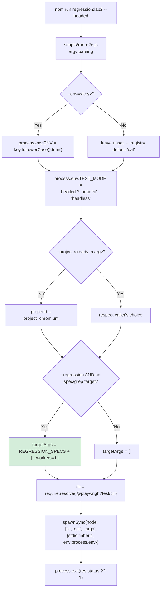

The five specs in `REGRESSION_SPECS`, described in the file as *"the real, production regression test cases (excludes scratch/debug specs)"*:

```
src/tests/discovery/discovery-e2e.spec.ts    TC-001..TC-019 (Discovery + F1)
src/tests/discovery/foundation-f2.spec.ts    TC-020 (F2)
src/tests/discovery/foundation-f3.spec.ts    TC-021/TC-022 (F3)
src/tests/discovery/mastery-m4.spec.ts       TC-023 (M4 P1-P4)
src/tests/discovery/mastery-m4-s1.spec.ts    TC-024 (M4 S1 — test.fixme)
```

Two design points worth noting. First, the runner invokes the Playwright CLI **directly via Node** (`require.resolve` + `spawnSync(process.execPath, …)`) rather than through `npx` or a shell — deliberately, for cross-platform robustness. Second, it forces `--workers=1` for the regression set with the explicit reason that the single-session Discovery E2E and heavy PWA runs are not parallel-safe.

#### Full lifecycle

```mermaid
sequenceDiagram
    autonumber
    participant U as Engineer / Jenkins
    participant R as scripts/run-e2e.js
    participant C as playwright.config.ts
    participant E as config/environments.ts
    participant PW as Playwright runner
    participant RPT as CustomTTAReporter
    participant BR as Chromium
    participant FX as Fixtures
    participant T as Test body
    participant PO as Page objects
    participant APP as ALL Platform

    U->>R: npm run regression:uat
    R->>R: ENV=uat, TEST_MODE=headless,<br/>--project=chromium, 5 specs, --workers=1
    R->>PW: spawnSync(node, cli test …)
    PW->>C: load config
    C->>C: dotenv.config()
    C->>E: resolveEnvironment()
    E-->>C: {key:'uat', name:'UAT',<br/>baseURL:'https://all-uat.theall.ai'}
    C->>C: process.env.TEST_ENV='UAT'<br/>process.env.TEST_MODE='headless'
    C-->>PW: defineConfig{testDir, timeout 120s,<br/>expect 15s, fullyParallel, retries,<br/>4 reporters, 3 projects}
    PW->>RPT: onBegin(config, suite)
    RPT->>RPT: runId=YYYYMMDD_HHmmss<br/>outputFile=tta-report/report_&lt;runId&gt;.html
    RPT->>RPT: console banner (env, mode, total)
    RPT->>RPT: initializeLiveReport() → mkdir + first write

    loop for each spec file
        PW->>RPT: onTestBegin(test)
        RPT->>RPT: init step/time/counter maps,<br/>build describePath, runningTests.set
        PW->>BR: launch bundled Chromium<br/>1280x720, permissions:['microphone'],<br/>--use-fake-device-for-media-stream<br/>--use-fake-ui-for-media-stream<br/>--autoplay-policy=no-user-gesture-required<br/>--disable-dev-shm-usage
        PW->>BR: browser.newContext() (fresh, isolated)
        PW->>FX: resolve declared fixtures
        FX->>FX: appTest: page → appPage(page) Proxy
        FX-->>T: iframe-aware page

        opt M4 S1 only — BEFORE navigation
            T->>PW: installSpeechRepeatHook(page)<br/>(addInitScript)
            T->>PW: ContentApiAnswerSource.attach(page)<br/>(page.on 'response')
        end

        T->>PO: login.navigate() → page.goto('/')
        PO->>APP: GET https://all-uat.theall.ai/ → /login
        T->>PO: login.login(user, pass)
        PO->>APP: guest login sequence (see Authentication Flow)
        PO->>APP: Continue to ALL → /all + iframe

        loop test.step() blocks
            T->>PO: action (e.g. completeLetterTrain())
            PO->>APP: DOM query → routed to app iframe
            APP-->>PO: state
            PO->>APP: click / fill / mouse.click
            PW->>RPT: onStepEnd(step)
            RPT->>RPT: StepData + videoStart/End offsets
            RPT->>RPT: updateReportRealTime() → rewrite HTML
        end

        T->>T: expect(...) assertions
        PW->>RPT: onTestEnd(test, result)
        RPT->>RPT: copy screenshots/video/trace into tta-report/,<br/>associateLogsWithSteps(), parse @tags,<br/>update fileGroups + suiteStats
        PW->>BR: context.close() → browser.close()
    end

    PW->>RPT: onEnd(result)
    RPT->>RPT: generateReport() → report_&lt;runId&gt;.html<br/>+ index.html redirect + history page
    RPT->>U: console summary (pass rate, duration)
    PW-->>R: exit code
    R-->>U: process.exit(status)
```

#### Runner configuration values

From `playwright.config.ts`:

| Setting | Value | Consequence |
|---|---|---|
| `testDir` | `./src/tests` | **All 93 tests are collected, including the 10 debug specs** |
| `timeout` | `120000` (2 min) | Per-test default; overridden per spec (F2 45 min, F3 50 min, E2E 75 min, M4 S1 25 min) |
| `expect.timeout` | `15000` | Assertion auto-retry window |
| `fullyParallel` | `true` | File-level parallelism |
| `forbidOnly` | `!!process.env.CI` | `test.only` fails the CI build — good hygiene |
| `retries` | `CI ? 2 : 0` | No local retries; 2 in CI |
| `workers` | `CI ? 2 : 3` | Overridden to 1 for the regression set |
| `use.baseURL` | `APP_ENV.baseURL` | Enables `page.goto('/')` |
| `use.screenshot` | `only-on-failure` | Artifact policy |
| `use.video` | `retain-on-failure` | Artifact policy |
| `use.trace` | `retain-on-failure` | Artifact policy |
| `use.viewport` | `1280 × 720` | **Load-bearing** — geometric locators depend on it |
| `use.ignoreHTTPSErrors` | `true` | Tolerates lab certificates |
| `use.acceptDownloads` | `true` | — |
| Projects | `chromium`, `firefox`, `webkit` | Only chromium carries the fake-media args |

The chromium project's launch arguments are what make Suite A possible at all:

```ts
permissions: ['microphone'],
launchOptions: { args: [
  '--use-fake-device-for-media-stream',
  '--use-fake-ui-for-media-stream',
  '--autoplay-policy=no-user-gesture-required',
  '--disable-dev-shm-usage',
]}
```

The config's own comment explains the fourth flag: it avoids the small default shared-memory segment that can OOM-crash the renderer during long runs of a heavy PWA-in-iframe with audio. It also documents deliberately **not** setting `channel: 'chrome'` so Playwright uses its own bundled Chromium, isolated from the user's browser — with a warning never to kill `chrome.exe` by name.

### Test Execution Flow

#### Suite A — regression flow

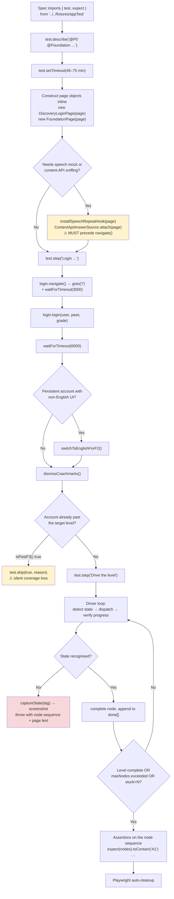

#### Concrete example — `foundation-f2.spec.ts` (TC-020)

```ts
test.describe('@P0 @Foundation F2 series (single session, F2 account)', () => {
  test('TC-020 F2: login → English → Start F2 → complete full F2 (A1 → A2 → A3)',
    async ({ page }) => {
      test.setTimeout(45 * 60 * 1000);
      const login = new DiscoveryLoginPage(page);
      const foundation = new FoundationPage(page);

      await test.step('Login as the F2 account and resume F2 in English', async () => { … });
      await test.step('TC-020 (F2): Start F2 → complete Learn/Practice nodes through A1', async () => {
        const nodes = await foundation.completeFoundationThroughApply(1);
        const level = await foundation.foundationLevel();
        expect(level, `unexpected level=${level}`).not.toBe('F1');
        expect(nodes, `nodes: ${nodes.join(' ')}`).toContain('StartF');
        expect(nodes.some((n) => n.startsWith('L'))).toBeTruthy();
        expect(nodes, …).toContain('P');
        expect(nodes, …).toContain('A1');
      });
      await test.step('TC-020 (F2 cont.): same session → complete A2 → A3 (full F2)', async () => {
        const nodes = await foundation.completeFoundationThroughApply(2, 2);
        expect(nodes, …).toContain('A2');
        expect(nodes, …).toContain('A3');
        await foundation.expectFoundationApplyCompleted();
      });
    });
});
```

Three practices here are worth highlighting for new engineers:

1. **`test.step()` structure** gives the custom reporter per-step granularity, screenshots and video offsets inside a 45-minute test — without it, the report would be one opaque block.
2. **Assertion messages carry diagnostic context.** `expect(nodes, \`nodes: ${nodes.join(' ')}\`)` means the failure message names the exact sequence of completed nodes. This is the single most valuable debugging affordance in the suite.
3. **Assertions are on the returned node sequence, not on screenshots or text.** The driver returns `string[]` such as `['StartF','L1','P','L2','P','A1']`, and the spec asserts against that. This makes the assertion robust to UI churn while still proving the journey happened.

#### Suite B — CURA flow

Two patterns coexist. The correct one (`tc002`, `tc003`, `tc011`) uses fixtures:

```ts
test('TC-002…', async ({ curaHomePage }) => { await curaHomePage.expect…(); });
```

The incorrect one (`tc001`, `tc004`–`tc009`, `tc013`, `tc015`) inlines locators despite the page objects existing:

```ts
await page.locator('#txt-username').fill(validUser.username);
```

`tc001` performs 34 such calls and additionally constructs `CuraAppointmentModule` without ever using it. Recorded as a Medium finding — see [Findings — Medium](#findings--medium).

### Authentication Flow

#### Sequence diagram — AXL guest login

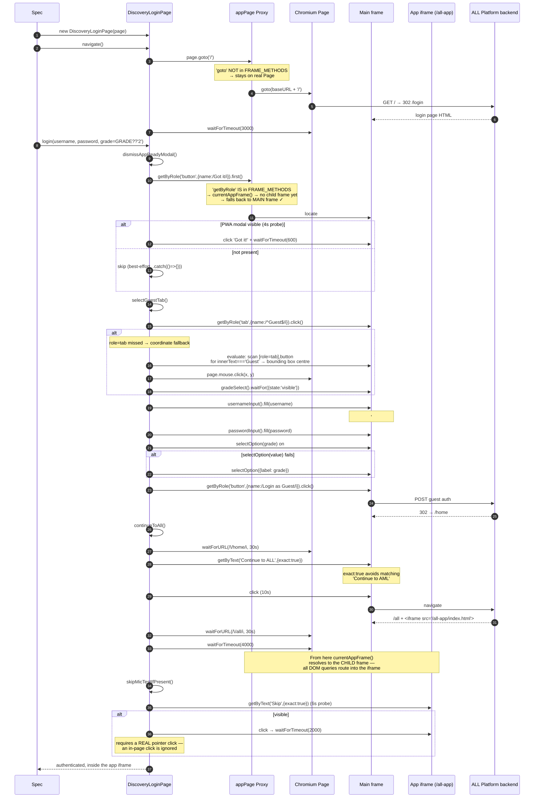

#### Notable implementation details

| Detail | Code | Rationale |
|---|---|---|
| `exact: true` on "Continue to ALL" | `getByText('Continue to ALL', { exact: true })` | Comment states this avoids matching "Continue to AML" — a real sibling button |
| OR'd selectors | `'#username-guest, input[placeholder="User ID"]'` | Survives the app switching between an ID and a placeholder |
| Coordinate fallback for the Guest tab | `page.mouse.click(box.x, box.y)` | Comment: `role="tab"` "which some locator strategies miss" |
| Grade is config-driven | `static readonly DEFAULT_GRADE = process.env.GRADE || '2'` | Avoids hardcoding a grade in specs |
| Two-attempt `selectOption` | value, then `{label}` | Handles the option value/label mismatch |
| Everything after the tab is best-effort | `.catch(() => {})` on modal, Continue, Skip | Tolerates optional screens — **but also hides genuine failures** (see Error Handling below) |

#### The English-switch path (F2/F3/M4 accounts)

`switchToEnglishForF2()` handles accounts whose saved UI language is Hindi. Four guarded steps, each safe to call when already satisfied:

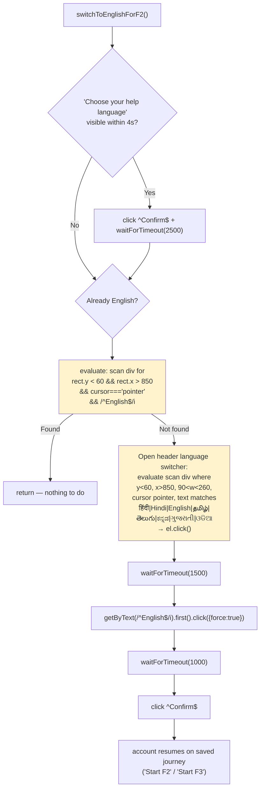

The amber steps are geometry-based DOM scans inside `page.evaluate()`. They are necessary — the switcher has no accessible name and no stable class — but they hardcode viewport coordinates (`y < 60`, `x > 850`) and are therefore viewport-locked.

### Fixture Flow

#### Complete fixture inventory

| Fixture | File | Scope | Inputs | Output | Setup | Teardown | Used by |
|---|---|---|---|---|---|---|---|
| `page` (override) | `appTest.ts` | test | `page` | iframe-aware `Page` Proxy | `appPage(page)` | none (Playwright closes context) | 5 Suite A specs |
| `curaHomePage` | `katalon/index.ts` | test | `page` | `CuraHomePage` | `new CuraHomePage(page)` | none | tc002, tc003 |
| `curaLoginPage` | `katalon/index.ts` | test | `page` | `CuraLoginPage` | `new` | none | tc003, tc011, tc012 |
| `curaAppointmentPage` | `katalon/index.ts` | test | `page` | `CuraAppointmentPage` | `new` | none | tc004, tc010 |
| `curaConfirmationPage` | `katalon/index.ts` | test | `page` | `CuraConfirmationPage` | `new` | none | tc010, tc014 |
| `curaAppointmentModule` | `katalon/index.ts` | test | `page` | `CuraAppointmentModule` | `new` | none | (declared; used sparsely) |
| `loginPage`, `homePage`, `productPage`, `checkoutPage` | `fixtures/index.ts` | test | `page` | scaffold POs | `new` | none | 3 scaffold specs |
| `loginModule`, `productModule`, `checkoutModule` | `fixtures/index.ts` | test | `page` | scaffold modules | `new` | none | 3 scaffold specs |
| `authenticatedPage` | `fixtures/index.ts` | test | `browser` | logged-in `Page` | `newContext` → `newPage` → UI login → `waitForURL('**/home')` | `context.close()` | **none** |
| `authenticatedContext` | `auth.fixture.ts` | test | `browser` | logged-in `BrowserContext` | as above + `context.storageState({path:'.auth/user.json'})` | `context.close()` | **none** |
| `authenticatedPage` | `auth.fixture.ts` | test | `browser` | logged-in `Page` | UI login | `context.close()` | **none** |
| `page` (override) | `auth.fixture.ts` → `authenticatedTest` | test | `browser` | `Page` from stored state | `try` stored state → `catch` fresh UI login | `context.close()` | **none** |

**Four of twelve fixtures are dead code.** All the session-reuse machinery is implemented and unused.

#### Fixture resolution sequence

```mermaid
sequenceDiagram
    participant PW as Playwright runner
    participant BASE as base test
    participant EXT as base.extend()
    participant AF as appFrame.appPage
    participant T as Test body

    PW->>BASE: create built-in fixtures for this test
    BASE->>BASE: browser (worker-scoped, reused)
    BASE->>BASE: context = browser.newContext() (test-scoped)
    BASE->>BASE: page = context.newPage() (test-scoped)
    PW->>EXT: resolve declared fixtures for the test signature
    EXT->>AF: appPage(page)
    AF-->>EXT: Proxy&lt;Page&gt;
    EXT->>T: await use(proxy)
    Note over T: test body executes with<br/>iframe-transparent page
    T-->>EXT: body complete or threw
    EXT->>BASE: control returns after use()
    Note over EXT: appTest declares NO teardown —<br/>relies on Playwright closing the context
    BASE->>BASE: context.close() → cookies/storage discarded
```

`appTest.ts` in full — the entire iframe migration is this small:

```ts
export const test = base.extend({
  page: async ({ page }, use) => {
    await use(appPage(page));
  },
});
export { expect };
```

#### Hooks

| Hook | Present? | Where |
|---|---|---|
| `beforeAll` | **[NOT IMPLEMENTED]** | No occurrences |
| `beforeEach` | **[IMPLEMENTED]** | `login.spec.ts` (`loginModule = new LoginModule(page)`), `tta-sample.spec.ts` (`page.goto(BASE_URL)`), a few debug specs |
| `afterEach` | **[NOT IMPLEMENTED]** | No occurrences |
| `afterAll` | **[NOT IMPLEMENTED]** | No occurrences |
| `globalSetup` / `globalTeardown` | **[NOT IMPLEMENTED]** | Not configured |
| Fixture-based teardown | **[PARTIAL]** | `context.close()` after `use()` in the four unused auth fixtures only |

**Consequence.** There is no place where global preparation (account provisioning, report directory hygiene, environment health check) or global cleanup (deleting generated guest users) can occur. This is the structural reason test-data cleanup is absent — see [Cleanup](#cleanup).

### Test Case Flow — main business journey

The most important application workflow is the **Foundation level progression**, driven by `completeFoundationThroughApply()`.

```mermaid
sequenceDiagram
    autonumber
    participant S as foundation-f2.spec.ts
    participant FP as FoundationPage
    participant AP as AssessmentPage
    participant TTS as TtsHelper
    participant PG as Page / iframe
    participant APP as ALL Platform

    S->>FP: completeFoundationThroughApply(targetApplies=1, startApplyNum=1, maxNodes=120)
    FP->>FP: done: string[] = []; stuck = 0

    loop up to maxNodes iterations
        FP->>FP: clickStartFoundationIfPresent()
        alt "Start F#" button present
            FP->>PG: getByText(/Start\s*F\d+/i).click({force:true})
            FP->>FP: done.push('StartF')
        end

        FP->>FP: isOnPracticeDemo()?
        FP->>PG: read page text for demo markers
        alt on Learn / Letter Train
            FP->>FP: completeLetterTrain()
            FP->>FP: dismissCoachmarks(); installMicInjection()
            loop up to 45 iterations
                FP->>PG: trainProgress() → "N/16"
                alt counter gone (confirmed after 700 ms re-check)
                    FP-->>FP: lesson complete → break
                end
                FP->>FP: rightmostArrow()
                alt arrow found → LEARN phase
                    FP->>PG: mouse.click(arrow.x, arrow.y)
                    FP->>PG: waitForTimeout(1500)
                else no arrow → WORD phase
                    FP->>PG: readCurrentWord() → "Ice"
                    FP->>TTS: generateWavBase64("Ice")
                    TTS-->>FP: base64 WAV (cached)
                    FP->>AP: clickRecordToggle() (start)
                    FP->>PG: waitForTimeout(300)
                    FP->>PG: __playInjected(b64, 3000)
                    PG->>APP: records the real word audio
                    FP->>PG: waitForTimeout(2600)
                    FP->>AP: clickRecordToggle() (stop) → advances
                    FP->>PG: waitForTimeout(1500)
                end
                FP->>PG: trainProgress() → compare
                alt unchanged
                    FP->>FP: stuck++ ; if stuck>=8 return
                else changed
                    FP->>FP: stuck = 0
                end
            end
            FP->>FP: done.push('L'+n)
        else on Letter Hunt practice
            FP->>FP: completeLetterHuntPractice()
            FP->>FP: done.push('P')
        else on Word Recognition practice (F2)
            FP->>FP: completeWordRecognitionPractice()
            FP->>FP: done.push('P')
        else on Apply entry
            FP->>FP: completeApplyChallenge()
            FP->>FP: done.push('A'+applyNum)
            alt applyNum === targetApplies
                FP-->>S: return done
            end
        else unrecognised screen
            FP->>FP: captureState('foundation-opening-unrecognised')
            FP->>PG: screenshot → test-results/&lt;tag&gt;.png
            FP->>PG: pageTextHead()
            FP-->>S: throw Error(with node sequence + level + page text)
        end
    end

    FP-->>S: done = ['StartF','L1','P','L2','P','A1']
    S->>S: expect(done).toContain('A1') etc.
```

#### F3 variant

F3 replaces Learn/Practice with two different mini-games. `completeF3()` dispatches on `isOnLetterLauncher()` and `isOnMemoryChallenge()`, pushing `'LL'` and `'MC'` markers, and terminates when `isPastF3()` becomes true. The spec then asserts:

```ts
expect(games).toContain('StartF3');
expect(games.filter(g => g === 'LL').length).toBeGreaterThan(0);
expect(games.filter(g => g === 'MC').length).toBeGreaterThan(0);
expect(await foundation.isPastF3()).toBe(true);
```

The recorded successful run produced `StartF3 → 16× LetterLauncher + 6× MemoryChallenge → past F3`.

#### Letter Launcher audio recovery

`installLetterLauncherHook()` intercepts the page's audio `play()` to recover which letter or word was spoken, because the Launcher requires comparing a *shown* letter against a *spoken* one and pressing ✓ or ✗. The prompt audio is served at `/audio/<lang>/letter/<WORD>.wav`, so the filename reveals the answer — the same hook serves F2's word-recognition practice.

### Locator Flow and Strategy

#### Strategy by mechanism

```mermaid
flowchart TD
    A["Need to interact with an element"] --> B{"Does the app expose<br/>an accessible role/name?"}
    B -->|Yes| C["getByRole('tab',{name:/^Guest$/i})<br/>getByRole('button',{name:/Login as Guest/i})<br/>✅ BEST"]
    B -->|No| D{"Is the label real DOM text?"}
    D -->|Yes| E["getByText('Continue to ALL',{exact:true})<br/>getByText(/Start\\s*F\\d+/i)<br/>✅ GOOD"]
    D -->|No| F{"Stable id or attribute?"}
    F -->|Yes| G["locator('#grade-guest')<br/>locator('#txt-username')<br/>locator('img[alt=\"Play\"]')<br/>✅ GOOD"]
    F -->|No| H{"Label baked into SVG?"}
    H -->|Yes| I["evaluate(): geometric DOM scan<br/>bounding box + size + aspect ratio<br/>+ cursor:pointer<br/>⚠ VIEWPORT-LOCKED"]
    I --> J["page.mouse.click(cx, cy)<br/>or fixed fallback coords<br/>⚠ LAST RESORT"]
    H -->|No| K["locator('div.css-1w4297d')<br/>❌ FRAGILE — hash changes per build"]

    style C fill:#d4edda
    style E fill:#d4edda
    style G fill:#d4edda
    style I fill:#fff3cd
    style J fill:#fff3cd
    style K fill:#f8d7da
```

#### Mechanism inventory with evidence

| Mechanism | Used? | Examples | Count |
|---|---|---|---|
| **Role locators** | ✅ | `getByRole('tab',{name:/^Guest$/i})`, `getByRole('button',{name:/^Skip$/i})`, `getByRole('heading',{level:4})` | ~12 |
| **Text locators** | ✅ heavily | `getByText('Start Assessment',{exact:true})`, `getByText(/Let.?s\s*Start/i)`, `getByText(/Hurray|successfully completed/i)` | ~40 |
| **CSS / ID** | ✅ | `#username-guest`, `#grade-guest`, `#txt-username`, `#btn-book-appointment`, `#combo_facility` | ~60 (mostly CURA) |
| **XPath** | ❌ **[NOT IMPLEMENTED]** | Zero occurrences — a genuine positive | 0 |
| **Attribute** | ✅ | `img[alt="Play"]`, `[class*="error"]`, `[role="alert"]`, `[data-testid*="mic"]` | ~8 |
| **Chaining** | ✅ | `getByRole('heading',{level:4})` … `.first()`; `div.css-1m9gxh8 > div` | ~15 |
| **Dynamic / parameterised** | ✅ | `mastery.startLevelButton(4)`, `expectOnFoundationLevel(label)`, `getByText(/Start\s*F\d+/i)` | ~10 |
| **Reusable locators** | ✅ | Arrow-function properties on every page object | all |
| **Geometric `evaluate()` scan** | ⚠️ | 76 `page.evaluate` calls; language switcher, Letter Hunt bubbles, "Let's Start", word reading | 76 |
| **Coordinate `mouse.click`** | ⚠️ | 20 occurrences; `page.mouse.click(c ? c.x : 640, c ? c.y : 472)` | 20 |
| **Hashed CSS classes** | ❌ | `div.css-1w4297d` (Retry), `div.css-4g6ai3` / `div.css-1m9gxh8 > div` (Next) in `AssessmentPage` | 3 |
| **`force: true`** | ⚠️ | 39 occurrences | 39 |

#### Good practices

- **No XPath at all.** Zero occurrences across 96 files — unusual and commendable.
- **Correct locator hierarchy.** Role → text → id → attribute → geometry. The framework reaches for geometry only where the application genuinely offers nothing else, and the code comments say so explicitly.
- **Arrow-function locators** re-evaluate per call, which is mandatory for both the re-rendering DOM and the Proxy frame resolution.
- **Case-insensitive, whitespace-tolerant regexes**: `/Start\s*F\d+/i` survives "Start F2" / "StartF2" / "start f2".
- **Anchored regexes** where ambiguity matters: `/^Confirm$/i`, `/^English$/i`, `/^Guest$/i` — prevents matching a longer string containing the word.
- **OR'd selectors** for elements the app renders inconsistently.
- **Structural frame selection** rather than URL matching in `currentAppFrame()`, because the iframe navigates internally.
- **Documented rationale.** `FoundationPage`'s header comment records exactly why fragile techniques were necessary — invaluable for the next maintainer.

#### Potentially fragile practices

| Practice | Location | Risk |
|---|---|---|
| **Hashed CSS classes** | `AssessmentPage`: `div.css-1w4297d`, `div.css-4g6ai3`, `div.css-1m9gxh8 > div` | **Will break on the next build.** The framework's own comments acknowledge "css-* hashes change per build" — yet three remain |
| **Fixed viewport coordinates** | `mouse.click(640, 472)`; scans filtered by `cx < 520 \|\| cx > 760`, `r.y < 150 \|\| r.y > 400`, `y < 60 && x > 850` | Any layout change or viewport change silently mis-clicks |
| **Structural sibling assumption** | `div.css-1m9gxh8 > div` | Direct-child dependency |
| **Geometry as identity** | Letter Hunt bubbles selected by size 30–80 px and aspect ratio 0.7–1.4 | Cannot distinguish *which* letter; the code admits this: "We cannot know which letter is which without OCR/audio" |
| **`force: true`** (39×) | throughout | Bypasses actionability checks — clicks a covered or disabled element, converting a real defect into a pass |
| **`.first()` on broad locators** | `getByText(/Hurray\|successfully completed\|completed assessment/i).first()` | Masks strict-mode violations; may bind to an unintended match |

#### Impact of the locator strategy

| Dimension | Assessment |
|---|---|
| **Stability** | Mixed. Role/text/id locators are stable. Geometry-based interaction is stable *only* while the viewport and layout are frozen. The three hashed-class locators are actively unstable |
| **Maintainability** | Good where locators are centralised in page objects with `LOCATORS` sections. Undermined by geometry embedded in 76 inline `evaluate()` blocks that cannot be reused or unit-tested |
| **Flakiness** | The dominant contributors are not locators but the 241 fixed sleeps (below) and the 111 swallowed exceptions (below). Locator flakiness is a secondary factor |
| **Resilience to app change** | Poor for build-to-build CSS churn (three known breakers) and layout change (viewport-locked geometry). Good for text/label churn thanks to tolerant regexes |

#### Recommended improvements — [RECOMMENDED]

1. **Request `data-testid` attributes from the application team.** This is the highest-value change available and would eliminate the geometry layer. The team has already demonstrated this collaboration pattern with the [Outstanding Dev Request](docs/BUILD_HISTORY.md#outstanding-dev-request-m4-s1-non-audio-answer-hook) in `docs/BUILD_HISTORY.md`.
2. Replace the three hashed-class locators with role, `alt`, or geometric selection consistent with the rest of the file.
3. Extract the repeated geometric scans into named, reusable helpers (e.g. `findClickableByGeometry(bounds)`) in `utils/`, so the viewport assumptions live in one auditable place.
4. Audit all 39 `force: true` usages; keep only those with a documented reason.

### Wait and Synchronisation Strategy

#### Mechanism inventory

| Mechanism | Used? | Occurrences | Detail |
|---|---|---|---|
| **Playwright auto-waiting** | ✅ implicit | all `click`/`fill`/`expect` | Free with every action and web-first assertion |
| **`expect` auto-retry** | ✅ | `expect.timeout: 15000` | `toBeVisible`, `toHaveURL`, `toHaveText` retry until timeout |
| **`waitForURL`** | ✅ | ~6 | `waitForURL(/\/home/i, {timeout:30000})`, `/\/all/i` |
| **`waitFor({state:'visible'})`** | ✅ | ~10 | `startF1Button().waitFor(...)`, `gradeSelect().waitFor(...)` |
| **`waitForFunction`** | ✅ | 1 | `waitForAppFrame`: polls `document.querySelectorAll('iframe').length > 0` |
| **`waitForLoadState('networkidle')`** | ✅ | 2 | `MicrophoneTestPage.waitForPageLoad`, `WaitHelper.waitForNetworkIdle` (unused) |
| **Per-call `timeout` options** | ✅ | ~30 | `click({timeout:4000})`, `isVisible({timeout:6000})` |
| **`test.setTimeout`** | ✅ | 5 | 25/45/50/75 min per long spec |
| **Custom polling** | ✅ | `WaitHelper.waitForCondition` | 500 ms interval, generic predicate — **but `WaitHelper` has 0 importers** |
| **Bespoke retry loops** | ✅ | many | `dismissCoachmarks(maxTries=6)`, `completeLetterLauncher(maxRounds=80)`, `completeMemoryChallenge(maxRounds=8)`, `stuck` counters |
| **`page.waitForTimeout` (hard sleep)** | ⚠️ **241** | see below | The dominant mechanism |

#### Hard-sleep distribution

| File | Count |
|---|---|
| `pages/foundation/FoundationPage.ts` | 37 |
| `tests/discovery/discovery-demo.spec.ts` | 30 |
| `tests/discovery/discovery-e2e.spec.ts` | 28 |
| `pages/mastery/MasteryPage.ts` | 22 |
| `modules/discovery/DiscoveryModule.ts` | 20 |
| `tests/discovery/discovery.spec.ts` | 15 |
| `pages/discovery/HelpLanguagePage.ts` | 8 |
| debug specs and others | ~81 |
| **Total** | **241** |

#### Why hard sleeps were used — a fair assessment

Some are legitimately unavoidable and should be defended:

- **`waitForTimeout(2600)` while injected audio plays.** There is no DOM event signalling "the app has finished recording enough audio". Waiting a fixed duration is correct here.
- **`waitForTimeout(300)` between starting the recording and playing audio.** Ordering guard for a media pipeline with no observable ready state.
- **`waitForTimeout(4000)` after reaching `/all`.** Waiting for a heavy PWA-in-iframe to become interactive. `waitForAppFrame()` exists and does this properly with `waitForFunction`, but `continueToAll()` does not call it.
- **`waitForTimeout(6000)` for a 3-2-1 countdown.** A deliberate, animated app delay.

Others are clearly substitutable:

- `navigate()` ends with `waitForTimeout(3000)` after `goto('/')` — replaceable with `expect(usernameInput()).toBeVisible()`.
- `waitForTimeout(1500)` / `(2500)` / `(1000)` after clicks in `switchToEnglishForF2` — replaceable with `expect(...).toBeVisible()` on the resulting state.
- `waitForTimeout(700)` in `trainProgress()`'s "confirm the counter is really gone" re-check — a reasonable debounce, but expressible as a short polling loop.

#### Effect on flakiness

Hard sleeps affect flakiness in both directions, and it is worth being precise:

- **They reduce flakiness on a slow environment** by over-waiting — which is why they accumulate: each one was added to fix a real intermittent failure.
- **They increase flakiness on a slower-than-expected environment**, because a fixed 3,000 ms is not adaptive. A UAT instance under load will break a sleep that has always passed.
- **They inflate runtime unconditionally.** 241 sleeps averaging ~1.5 s is roughly six minutes of dead time per full pass, paid whether the app is fast or slow.

The framework's genuine flakiness defences are elsewhere and are good: the `stuck` counters, the `maxNodes`/`maxRounds` bounds, the re-check debounce in `trainProgress()`, and the `captureState()` diagnostics on unrecognised screens.

#### Recommended improvements — [RECOMMENDED]

1. Replace navigation and post-click sleeps with `expect(locator).toBeVisible()` — same intent, adaptive, usually faster.
2. Call the existing `waitForAppFrame(page)` from `continueToAll()` instead of `waitForTimeout(4000)`.
3. Adopt the already-written `WaitHelper.waitForCondition()` for the bespoke polling loops rather than leaving it unused.
4. Keep and **comment** the media-pipeline sleeps so a future maintainer does not "optimise" them away.

### Assertion Flow

#### Where assertions live

Assertions are **distributed across two layers by design**, not centralised:

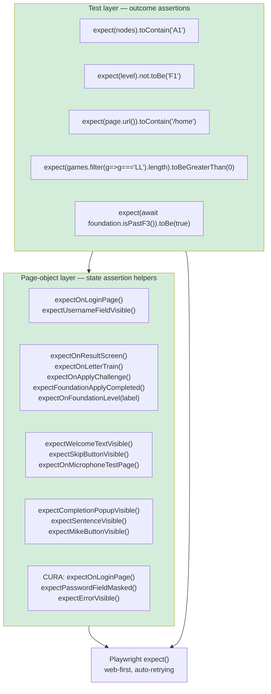

**The split is coherent:** page objects assert *"am I on the right screen / is this control present"* (reusable, locator-adjacent); specs assert *"did the business outcome occur"* (test-specific). A new engineer should follow this convention.

#### Assertion types found

| Type | Status | Examples |
|---|---|---|
| **UI / element visibility** | ✅ | `expect(this.usernameInput()).toBeVisible()`, `expect(foundation.startFoundationButton()).toBeVisible({timeout:20000})` |
| **Text content** | ✅ | `expect(page.locator('.lead')).toContainText('Please be informed…')`, `expect(page.locator('#facility')).toHaveText('Tokyo CURA Healthcare Center')` |
| **URL / route** | ✅ | `expect(page).toHaveURL(/profile\.php#login/)`, `expect(page.url()).toContain('/home')`, frame-URL checks via `appUrl()` |
| **Attribute** | ✅ | `expect(passwordInput()).toHaveAttribute('type','password')` |
| **Form value** | ✅ | `expect(page.locator('#txt-username')).toHaveValue(validUser.username)` |
| **Checked state** | ✅ | `expect(page.locator('#radio_program_medicare')).toBeChecked()`, `.not.toBeChecked()` |
| **Title** | ✅ | `expect(page).toHaveTitle(/CURA Healthcare Service/)` |
| **Business / journey state** | ✅ ★ | `expect(nodes).toContain('A1')`, `expect(games).toContain('StartF3')`, `expect(await isPastF3()).toBe(true)` — asserting on the *sequence of completed learning nodes* is the most robust and most domain-meaningful assertion style in the suite |
| **Negative / error validation** | ✅ | CURA `expectErrorVisible()`, `getErrorMessage()`; `expect(level).not.toBe('F1')` |
| **API response assertions** | ❌ **[NOT IMPLEMENTED]** | `src/api/*` throws on non-2xx internally but is never invoked by a test |
| **Soft assertions** (`expect.soft`) | ❌ **[NOT IMPLEMENTED]** | Zero occurrences — notable given the long single-session tests, where soft assertions would let one failure not abort 18 remaining test cases |
| **Snapshot / visual** | ❌ **[NOT IMPLEMENTED]** | No `toMatchSnapshot` or `toHaveScreenshot` |
| **Custom matchers** | ❌ **[NOT IMPLEMENTED]** | No `expect.extend` |

#### Assertion quality observations

**Strong:** the diagnostic-message convention. Nearly every Suite A assertion passes a second argument:

```ts
expect(nodes, `nodes: ${nodes.join(' ')}`).toContain('A1');
expect(level, `unexpected level=${level}`).not.toBe('F1');
expect(await foundation.isPastF3(), 'expected to have completed F3 (advanced past it)').toBe(true);
```

On failure the report shows exactly what state the app reached. In a 45-minute test this is the difference between a debuggable failure and an unusable one.

**Weak:** `tta-sample.spec.ts` contains vacuous assertions — `expect(true).toBeTruthy()` and `expect(url).toBeTruthy()`. These always pass and assert nothing. It is a reporter-demonstration spec, but it is collected by `testDir` and counts toward pass statistics.

**Risk:** assertion coverage is thin relative to action volume in the geometry-driven flows. The Letter Hunt path, for example, taps bubbles without being able to verify *which* letter was tapped — the code says so. Progress is asserted (the counter advances), correctness is not.

### Error Handling and Recovery

#### Mechanism inventory

| Mechanism | Status | Detail |
|---|---|---|
| **`try`/`catch`** | ✅ | `authenticatedTest` (stored-state fallback), `ContentApiAnswerSource.ingest` (JSON parse), `WaitHelper.retry`, `visionService` HTTP status checks |
| **`.catch(() => …)` swallow** | ⚠️ **111** | The dominant pattern — see below |
| **Playwright retries** | ✅ | `retries: process.env.CI ? 2 : 0` |
| **Timeout handling** | ✅ | Per-test, per-assertion, per-action; explicit `test.setTimeout` for long specs |
| **Custom retry loops** | ✅ | `dismissCoachmarks(6)`, `completeLetterLauncher(80)`, `completeMemoryChallenge(8)`, `completeLetterTrain(45)`, `maxNodes(120)` |
| **`stuck` counters** | ✅ ★ | Detect no-progress conditions independently of timeouts |
| **Failure recovery** | ✅ | `clickLetsStart()`: text → geometric scan → fixed coordinates. `selectGuestTab()`: role → coordinate. `selectGrade()`: value → label. `authenticatedTest`: stored state → fresh login. `recoverIfDisconnected()`: detects an app-side "Couldn't connect" screen and resumes (added after the Build #7 incident — see [Regression Report History](#regression-report-history)) |
| **Screenshot capture** | ✅ | `screenshot: 'only-on-failure'` globally, plus explicit `captureState(tag)` writing to `test-results/<tag>.png` |
| **Video capture** | ✅ | `video: 'retain-on-failure'` |
| **Trace capture** | ✅ | `trace: 'retain-on-failure'` |
| **Logging** | ✅ | `Logger` (ISO timestamp, level, context) in modules; `console.log` progress markers in drivers (`[Letter Train] 7/16`, `[TC-022] F3 games completed: …`) |
| **Diagnostic errors** | ✅ ★ | Thrown errors embed the completed-node sequence, current level and leading page text |
| **Cleanup on failure** | ✅ implicit | Playwright closes the context regardless of outcome |
| **Error reporting** | ✅ | `CustomTTAReporter` captures `error`, `errorStack`, per-step `error`/`stackTrace` into the HTML report |
| **Global error handler** | ❌ **[NOT IMPLEMENTED]** | No `globalTeardown`, no `afterEach` diagnostic hook |

#### Good practice: diagnostic failure

```ts
if (++stuck > 12) {
  await this.captureState('f3-unrecognised');
  throw new Error(`completeF3: unrecognised screen after ${done.length} games ` +
                  `(${done.join(' ')}). Page text: "${await this.pageTextHead()}"`);
}
```

Three things happen: a screenshot is written with a semantic filename, the leading page text is captured, and the error names the exact journey position. There are seven `captureState` tags in `FoundationPage` — `letter-launcher-stuck`, `memory-challenge-no-sequence`, `f3-unrecognised`, `foundation-apply-did-not-complete`, `practice-did-not-advance`, `foundation-opening-unrecognised`. This is deliberate, well-executed observability.

#### The 111 swallowed exceptions — the primary risk

The pattern appears 111 times:

```ts
await helpConfirm.click({ force: true }).catch(() => {});
await foundation.dismissCoachmarks().catch(() => {});
await page.getByText(/^English$/i).first().click({ force: true }).catch(() => {});
await this.micTestSkip().click({ timeout: 5000 }).catch(() => {});
```

**Why it was done.** Many of these screens are genuinely optional — the PWA modal may or may not appear, coachmarks may already be dismissed, the help-language modal appears only for some accounts. Guarding each with `.catch(() => {})` makes the flow tolerant of optional steps.

**Why it is dangerous.** The pattern cannot distinguish *"this optional element was absent"* from *"this required element failed to appear because the application is broken"*. Consider the recorded F2 failure: `switchToEnglishForF2()` swallows every failure, so if the language switcher never appears the method returns successfully and the test proceeds to fail later at a less informative point. The regression report's diagnosis — *"'Start F2' never appears"* — is a downstream symptom, not the root cause.

**Compounding factor.** 39 `force: true` clicks bypass Playwright's actionability checks. A `force` click on a disabled or covered button succeeds silently. Combined with `.catch(() => {})`, a genuine application defect can produce a green step.

**Recommended pattern — [RECOMMENDED]:**

```ts
// Distinguish "optional and absent" from "required and broken"
const isPresent = await locator.isVisible({ timeout: 4000 }).catch(() => false);
if (isPresent) {
  await locator.click();          // no .catch — a real failure here IS a failure
} else {
  logger.info('Optional element absent, continuing: help-language modal');
}
```

This keeps optional-step tolerance while making genuine failures loud, and leaves a log trail of which optional branches were taken.

#### `isVisible()` vs `waitFor()` — a documented trap

`discovery-e2e.spec.ts` contains a comment every new engineer should read:

> `locator.isVisible()` does **NOT** wait — it samples the current state. To wait for an element we must use `waitFor()`.

The spec's `clickByText` helper implements this correctly:

```ts
const clickByText = async (text, timeout = 6000) => {
  const loc = (typeof text === 'string' ? page.getByText(text, {exact:true}) : page.getByText(text)).first();
  try { await loc.waitFor({ state: 'visible', timeout }); }
  catch { return false; }
  await loc.click({ force: true }).catch(() => {});
  return true;
};
```

Note it returns a boolean, so the caller *can* branch on absence — better than a bare swallow. Elsewhere in the codebase `isVisible({timeout: N})` is used, which does accept a timeout and does poll, so both patterns are present.

#### Debugging workflow when a test fails

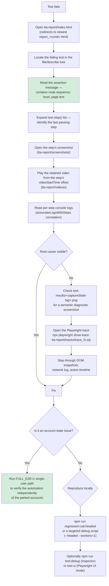

The available debugging affordances are unusually rich for a suite of this size: four report formats, per-step screenshots with video offsets, semantic diagnostic screenshots, embedded console logs, traces, a headed mode for every script, ~12 targeted debug npm scripts, and the `FULL_E2E` escape hatch for isolating account problems from automation problems.

### Cleanup

| Cleanup concern | Status | Detail |
|---|---|---|
| **Browser context** | ✅ **[IMPLEMENTED]** | Playwright closes the per-test context automatically; cookies and storage are discarded |
| **Browser process** | ✅ | Playwright closes its bundled Chromium after the run. The config comments warn against killing `chrome.exe` by name, since that would also kill the user's own browser |
| **Fixture teardown** | ⚠️ **[PARTIAL]** | `context.close()` after `use()` exists only in the four unused auth fixtures. `appTest` declares none, relying on Playwright |
| **Temporary WAV files** | ✅ | `TtsHelper` does `fs.unlinkSync(outFile)` in a `try` after reading, so `os.tmpdir()` is not polluted |
| **Report directories** | ✅ | `initializeLiveReport()` creates `tta-report/` recursively if missing; `npm run clean` removes `dist test-results playwright-report tta-report` |
| **CI workspace** | ✅ | `Jenkinsfile` `post { always { cleanWs() } }` |
| **Generated test users** | ❌ **[NOT IMPLEMENTED]** | Every Discovery run creates a permanent `testuser_<timestamp>` account in the shared UAT application. Nothing deletes them. Accumulates unbounded |
| **Persistent account reset** | ❌ **[NOT IMPLEMENTED]** | `Testf2auto`/`Testf3auto`/`m4auto` progress is never reset, which is the root cause of the forward-only exhaustion problem |
| **`.auth/user.json`** | ⚠️ | Written by `authenticatedContext`; never deleted; not in `.gitignore` |
| **In-memory reporter state** | ⚠️ | `CustomTTAReporter` retains all results, steps and maps for the whole run; released only at process exit |

**Recommended — [RECOMMENDED]:** add a `globalTeardown` that (a) requests deletion of guest accounts created during the run, if the application exposes such an endpoint, or at minimum logs the created usernames to a file so they can be purged in bulk; and (b) add `.auth/` to `.gitignore`.

### Sequence Diagram — Reporting

```mermaid
sequenceDiagram
    autonumber
    participant PW as Playwright runner
    participant R as CustomTTAReporter
    participant FS as tta-report/
    participant HB as built-in html reporter
    participant JS as json reporter
    participant LS as list reporter
    participant J as Jenkins
    participant U as Engineer

    PW->>R: onBegin(config, suite)
    R->>R: runId = 20260812_130422
    R->>R: outputFile = tta-report/report_20260812_130422.html
    R->>U: console banner: 🎭 TTA PLAYWRIGHT AUTOMATION<br/>Started, Total Tests, Environment (TEST_ENV),<br/>Mode (TEST_MODE)
    R->>FS: mkdir -p tta-report/
    R->>FS: write initial HTML (live report)
    R->>U: "📡 Real-time report: <path>"

    loop each test
        PW->>R: onTestBegin(test)
        R->>U: console "▶️ STARTING: <title>", file, suite
        R->>R: runningTests.set(id, {status:'passed', …})
        loop each step
            PW->>R: onStepEnd(test, result, step)
            R->>R: StepData{title, category, duration, status,<br/>error, stackTrace, startTime,<br/>videoStartTime = stepStart - testStart,<br/>videoEndTime = start + duration}
            R->>FS: updateReportRealTime() → rewrite HTML
            Note over FS,U: report is readable WHILE the<br/>75-minute test is still running
        end
        PW->>R: onTestEnd(test, result)
        R->>FS: copy screenshots → tta-report/screenshots/screenshot_N_M.png
        R->>FS: copy video → tta-report/videos/video_N.webm
        R->>FS: copy trace → tta-report/traces/trace_N.zip
        R->>R: match screenshots to steps<br/>(step-N-, step_N_, "step N", cleaned name)
        R->>R: associateLogsWithSteps(): parse step-N-logs<br/>attachments, stdout/stderr, pattern-match<br/>step titles, distribute unassigned logs
        R->>R: parse @tags from title (/@\w+/g)
        R->>R: update fileGroups + suiteStats<br/>{total, passed, failed, skipped, flaky}
    end

    PW->>R: onEnd(result)
    R->>R: endTime; duration; passRate
    R->>FS: report_20260812_130422.html (final)
    R->>FS: index.html → meta-refresh redirect to newest
    R->>FS: generateHistoryPage() → list of all report_*.html,<br/>newest marked LATEST
    R->>U: console summary
    PW->>HB: playwright-report/index.html
    PW->>JS: test-results/results.json
    PW->>LS: console (list format)

    J->>J: post always: publishHTML(playwright-report)<br/>publishHTML(tta-report)
    J->>J: archiveArtifacts test-results/**, tta-report/**
    J->>J: cleanWs()
    Note over J,U: NOTIFICATION: not implemented.<br/>Only echo statements;<br/>slackSend is commented out.
```

### Business Flow Diagrams

#### Complete ALL Platform learner journey as automated

```mermaid
flowchart TD
    START(["page.goto('/')"]) --> LOGIN["/login — Guest tab<br/>User ID · Password · Grade"]
    LOGIN --> HOME["/home"]
    HOME -->|"Continue to ALL"| ALL["/all + app iframe"]
    ALL --> MIC["Microphone calibration<br/>'Now repeat what you heard!'"]
    MIC -->|"Skip"| HELP["Help-language modal<br/>(Kannada/Telugu/Hindi)"]
    HELP -->|"Confirm"| DSTART["/discover-start"]
    DSTART --> LANG["Header language switcher<br/>→ English → Confirm"]
    LANG --> A1["Discovery Assessment 1<br/>demo → 5 sentences<br/>mic · stop · play · retry · next"]
    A1 -->|"Continue"| A2["Discovery Assessment 2<br/>5 sentences"]
    A2 -->|"Continue"| LH["Letter Hunt (discovery)<br/>bubbles by geometry"]
    LH -->|"deliberate fail"| DEND["/discover-end<br/>placement / result screen"]
    DEND -->|"Let's Start"| F1MAP["F1 journey map<br/>'Start F1'"]

    F1MAP --> F1["F1: L1–L9 Letter Train<br/>+ P1–P9 Letter Hunt<br/>+ A1 · A2 · A3 Apply"]
    F1 --> F2["F2: Letter Train<br/>+ Word Recognition practice<br/>+ A1 · A2 · A3"]
    F2 --> F3["F3: Letter Launcher (letters+words)<br/>+ Memory Challenge<br/>+ A1 · A2 · A3"]
    F3 --> WPM["'Words per minute' phase map<br/>Foundation complete"]
    WPM --> MGATE{"Mastery gating"}
    MGATE -->|"single linear user"| M1["Start Level 1<br/>M4 NOT reachable"]
    MGATE -->|"parked m4auto account"| M4["M4: Speed Practice P1–P4<br/>Read Aloud · paced ticker ·<br/>'Did you see' recall"]
    M4 --> S1["S1: picture MCQ<br/>speak the correct answer"]
    S1 --> BLOCKED["BLOCKED — app-side<br/>submission not wired<br/>(test.fixme TC-024)"]

    style DEND fill:#d4edda
    style WPM fill:#d4edda
    style M1 fill:#fff3cd
    style BLOCKED fill:#f8d7da
```

**Coverage mapping.** TC-001…TC-013 cover login through the F1 landing. TC-014…TC-019 cover F1. TC-020 covers F2. TC-021/022 cover F3. TC-023 covers M4 P1–P4. TC-024 covers S1 and is blocked application-side.

The **Mastery gating** branch is an important finding recorded in the regression report: a single linear user reaching Mastery lands on "Start Level 1", proving M4 is sequentially gated behind M1–M3 and is only reachable via the parked account. This is an application progression constraint, not a defect.

#### Letter Train node — decision flow

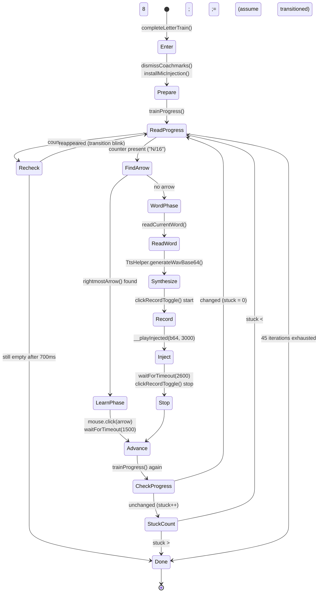

**Explanation.** The node is a two-phase lesson: a *learn* phase advanced by a next-arrow, and a *word* phase requiring spoken input. The driver distinguishes them by the presence of the arrow rather than by any explicit app signal. Termination is triple-bounded — counter disappearance (with a debounce re-check to survive transition blinks), a `stuck` counter, and a hard 45-iteration cap — so the method cannot hang indefinitely inside a 45-minute test. This defensive structure is characteristic of the whole `FoundationPage` driver design and is one of the framework's real strengths.

---

## CI/CD, Reporting and Infrastructure

**Audience:** Automation Engineers, DevOps, QA Lead

### CI/CD Architecture

The CI platform is **Jenkins**, using a declarative pipeline with a Docker agent. There is no GitHub Actions, GitLab CI, Azure Pipelines, or CircleCI configuration in the repository.

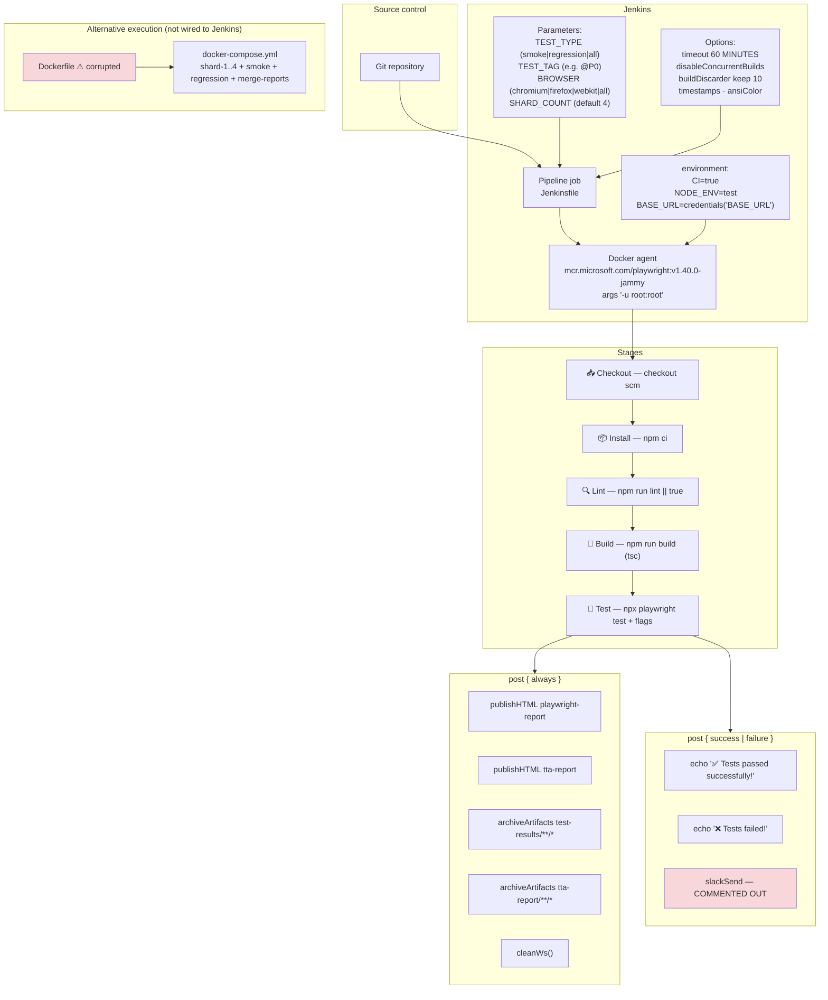

#### Timeline diagram

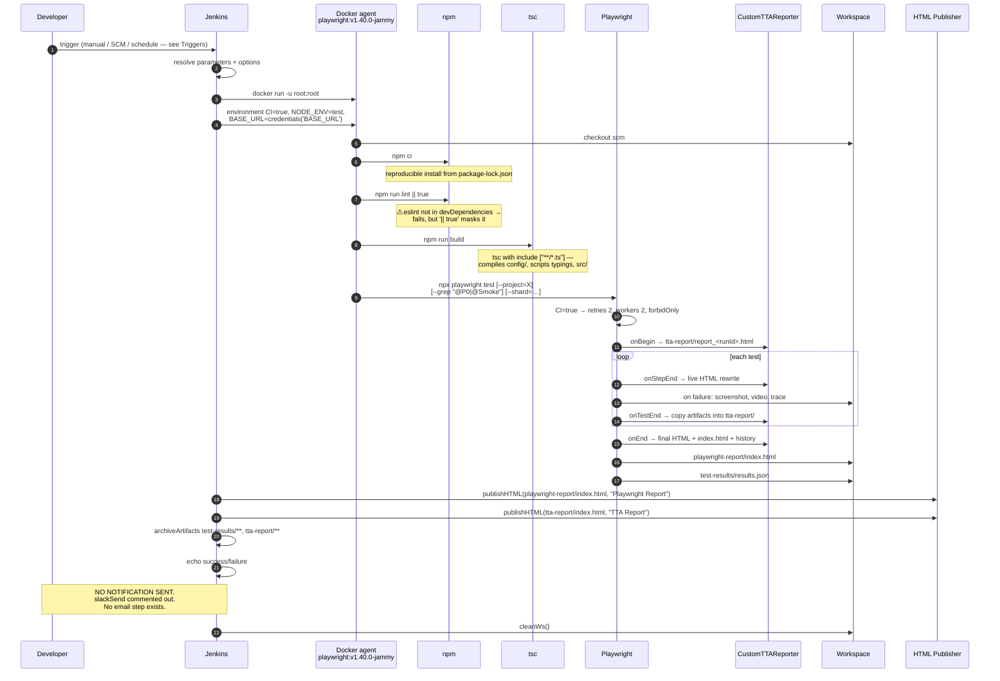

### Pipeline

#### Stage detail

| # | Stage | Command | Failure behaviour | Notes |
|---|---|---|---|---|
| 1 | 📥 Checkout | `checkout scm` | Fails build | Standard |
| 2 | 📦 Install Dependencies | `npm ci` | Fails build | Correct — uses the lockfile for reproducibility |
| 3 | 🔍 Lint Check | `npm run lint \|\| true` | **Never fails** | `\|\| true` swallows all lint failures. `eslint` is not in `devDependencies`, so this stage cannot succeed on a clean install — and the build will never know |
| 4 | 📝 TypeScript Build | `npm run build` (`tsc`) | Fails build | Useful compile-time gate. `tsconfig.json` has `include: ["**/*.ts"]`, so it type-checks `config/`, `src/` and everything else |
| 5 | 🧪 Run Tests | dynamically composed | Fails build | See below |

#### Test command composition (Groovy in stage 5)

```groovy
def testCommand = 'npx playwright test'
if (params.BROWSER != 'all')            testCommand += " --project=${params.BROWSER}"
if (params.TEST_TYPE == 'smoke')        testCommand += ' --grep "@P0|@Smoke"'
if (params.TEST_TAG?.trim())            testCommand += " --grep \"${params.TEST_TAG}\""
if (params.TEST_TYPE != 'smoke' && params.SHARD_COUNT.toInteger() > 1)
                                        testCommand += " --shard=\$SHARD/\${params.SHARD_COUNT}"
sh testCommand
```

**Three defects in this block:**

1. **Broken sharding.** `--shard=\$SHARD/\${params.SHARD_COUNT}` escapes `$SHARD` so the shell receives a literal `$SHARD`, which is **never defined anywhere in the pipeline**. The result is `--shard=/4`, an invalid argument. Sharding has never worked in Jenkins. (The `docker-compose.yml` sharding is separately implemented and correct.)
2. **`--grep` can be specified twice.** If `TEST_TYPE=smoke` *and* `TEST_TAG` is set, two `--grep` flags are appended; the second silently overrides the first, so the smoke filter is lost.
3. **The pipeline does not use the framework's own runner.** It calls `npx playwright test` directly, bypassing `scripts/run-e2e.js`. Consequences: no `--env` translation (so `config/environments.ts` falls back to `BASE_URL` or the `uat` default), and no `--workers=1` protection for the non-parallel-safe Suite A regression specs. CI would attempt to run `discovery-e2e.spec.ts`, `foundation-f2.spec.ts` and `foundation-f3.spec.ts` concurrently across 2 workers, and they share persistent application accounts.

**Recommended replacement — [RECOMMENDED]:**

```groovy
sh "node scripts/run-e2e.js --regression --env=${params.ENV}"
```

#### Job options

| Option | Value | Effect |
|---|---|---|
| `timeout` | 60 MINUTES | **⚠ Insufficient.** The recorded full-Foundation run took 68m41s and the headed re-run 78m24s. `discovery-e2e.spec.ts` alone sets `test.setTimeout(75 * 60 * 1000)`. A full Suite A regression would be killed by Jenkins before completing |
| `disableConcurrentBuilds` | — | ✅ Correct and important — prevents two builds corrupting the shared persistent accounts |
| `buildDiscarder` | keep 10 | Report retention bounded to the last 10 builds |
| `timestamps` | — | Useful for diagnosing long runs |
| `ansiColor('xterm')` | — | Renders the reporter's coloured console banner |

#### Environment and credentials

```groovy
environment {
  CI = 'true'
  NODE_ENV = 'test'
  BASE_URL = credentials('BASE_URL')
}
```

`CI=true` correctly activates `retries: 2`, `workers: 2` and `forbidOnly`. Using the Jenkins credentials store for `BASE_URL` is good practice — but note that **`VISION_API_KEY` is not injected via credentials**; it lives in the committed `.env`, which is the security finding.

Also note `BASE_URL` is the *second*-precedence selector in `resolveEnvironment()`. Passing `ENV=uat|lab|lab2` instead would be more idiomatic and would produce the correct environment name in the report header.

### Triggers

| Trigger | Status | Evidence |
|---|---|---|
| **Manual** | ✅ **[IMPLEMENTED]** | The `parameters {}` block makes this a "Build with Parameters" job |
| **On push / SCM polling** | ❌ **[NOT IMPLEMENTED]** | No `triggers { pollSCM(...) }`, no `githubPush()`, no webhook configuration in the repository. Push-triggered execution would require configuration in the Jenkins job UI, which is outside version control and cannot be verified from the code |
| **Scheduled / nightly** | ❌ **[NOT IMPLEMENTED]** | No `triggers { cron('...') }` block anywhere |
| **Pull-request / merge gate** | ❌ **[NOT IMPLEMENTED]** | No branch conditions, no `when` blocks, no status-check publishing |
| **Upstream/downstream** | ❌ **[NOT IMPLEMENTED]** | No `build job:` steps |

**Answers to the required CI questions:**

- *How is automation triggered?* Manually, via a parameterised Jenkins build.
- *Can it run on push?* **Not as configured in the repository.** No SCM trigger is declared.
- *Can it run on schedule?* **No.** No cron trigger is declared.

**Recommended — [RECOMMENDED]:** add to the `Jenkinsfile` so triggers are version-controlled rather than hidden in job configuration:

```groovy
triggers {
  cron('H 2 * * 1-5')        // weekday nightly regression
  pollSCM('H/15 * * * *')    // or a webhook from the SCM
}
```

### Environment Setup

| Concern | Mechanism | Status |
|---|---|---|
| Node.js runtime | Provided by the `mcr.microsoft.com/playwright:*-jammy` base image | ✅ |
| Browsers | Pre-installed in the image (`PLAYWRIGHT_BROWSERS_PATH=/ms-playwright`) | ✅ — see Dependency and Browser Installation for the version mismatch |
| `CI` flag | Jenkins `environment` block | ✅ |
| Target URL | `credentials('BASE_URL')` | ✅ but see Environment and Credentials above |
| Environment selection (`ENV`) | **Not passed** | ⚠ falls back to `BASE_URL` matching or `uat` |
| `.env` in CI | Present in the repository, so `dotenv.config()` picks it up | ⚠ security risk; also means CI silently uses the committed key |
| Windows SAPI (for `TtsHelper`) | **Unavailable** on the Linux image | ❌ **blocks the F-series in CI** |
| Report directories | Created by `initializeLiveReport()` and the `Dockerfile` `RUN mkdir -p` | ✅ |
| `xvfb` / display | Not needed — headless by default | ✅ |
| Audio device | Not needed — `--use-fake-device-for-media-stream` | ✅ |

#### The CI blocker, stated plainly

`TtsHelper.generateWavBase64()` executes:

```ts
execFileSync('powershell', ['-NoProfile', '-NonInteractive', '-Command', ps], { stdio: 'ignore' });
```

On `playwright:v1.40.0-jammy` (Ubuntu), `powershell` does not exist and this throws `ENOENT`. Every F-series "say the word" phase therefore fails in the containerised pipeline. This is a **High** finding: the pipeline as configured cannot execute the framework's primary suite.

**Remediation options — [RECOMMENDED]**, in order of preference:

1. **Pre-generate and commit WAV fixtures** for the finite set of F-series words, with `TtsHelper` reading from `src/testdata/audio/<word>.wav` and falling back to SAPI locally. Deterministic, cross-platform, no new dependency, and removes a per-run cost.
2. Use a cross-platform TTS (e.g. `espeak-ng` installed in a custom image, or a Node TTS library) behind the existing `TtsHelper` interface — the interface is already correct, only the implementation changes.
3. Run the F-series on a Windows Jenkins agent and the rest on Linux. Highest infrastructure cost.

### Dependency and Browser Installation

| Aspect | Detail | Assessment |
|---|---|---|
| Install command | `npm ci` | ✅ Lockfile-based, reproducible |
| Browser install | Pre-baked in the Docker image | ✅ Faster than `npx playwright install` |
| **Image version** | `mcr.microsoft.com/playwright:v1.40.0-jammy` | ❌ **Mismatch.** `package.json` requires `@playwright/test ^1.60.0`. The image ships browser binaries built for 1.40.0. Playwright validates that the installed browser revision matches the library and will error, or behave unpredictably |
| Where the version appears | `Dockerfile` line 7 and `Jenkinsfile` agent block | Both must be updated together |
| `-u root:root` | Jenkins agent arg | Works, but running as root is a container-hardening concern |

**Recommended — [RECOMMENDED]:** pin the image to the matching version (`mcr.microsoft.com/playwright:v1.60.0-jammy`) in both files, and add a comment linking the two so they are updated in lockstep. Consider a `postinstall` or CI assertion that compares `npx playwright --version` against the image tag.

### Report Generation

Four reporters run on every execution, configured in `playwright.config.ts`:

```ts
reporter: [
  ['./src/utils/CustomTTAReporter.ts'],
  ['html', { open: 'never' }],
  ['json', { outputFile: 'test-results/results.json' }],
  ['list'],
],
```

| Reporter | Output | Purpose |
|---|---|---|
| `CustomTTAReporter` | `tta-report/report_<YYYYMMDD_HHMMSS>.html` + `index.html` + history | Primary human-facing report |
| `html` (built-in) | `playwright-report/index.html` | Playwright's own report, with trace viewer integration |
| `json` | `test-results/results.json` | Machine-readable; available for downstream tooling (none currently consumes it) |
| `list` | Console | Live progress in the Jenkins log |

#### `CustomTTAReporter` — what it produces

**Run identity.** `onBegin` computes `runId = YYYYMMDD_HHmmss` and sets `outputFile = tta-report/report_<runId>.html`. Every run is therefore preserved rather than overwritten — the mechanism behind report history.

**Console banner.** Printed at start:

```
╔════════════════════════════════════════════════════════════════╗
║        🎭 TTA PLAYWRIGHT AUTOMATION - REAL-TIME REPORT         ║
╠════════════════════════════════════════════════════════════════╣
║  📅 Started: <locale string>                                   ║
║  📊 Total Tests: <suite.allTests().length>                      ║
║  🌐 Environment: <process.env.TEST_ENV || 'UAT'>                ║
║  🖥️  Mode: <process.env.TEST_MODE || 'headless'>                ║
╚════════════════════════════════════════════════════════════════╝
📡 Real-time report: tta-report/report_<runId>.html
```

`TEST_ENV` and `TEST_MODE` are set by `playwright.config.ts` from `resolveEnvironment()` and the `--headed` flag, so the report header always names the environment actually targeted.

**Live updating.** `onStepEnd` calls `updateReportRealTime()`, which regenerates and rewrites the entire HTML file — including a separate "in-progress" view built from the `runningTests` map. A 75-minute test is therefore observable while running, not only afterwards.

**Report contents**

| Element | Source |
|---|---|
| Suite statistics | `suiteStats {total, passed, failed, skipped, flaky}` |
| Pass rate | computed in `onEnd` and `generateMetaSection` |
| Environment, mode, browser, platform | `TEST_ENV`, `TEST_MODE`, `config.projects[0].name`, `process.platform` mapped to Mac/Windows/Linux |
| Author | `process.env.TEST_AUTHOR \|\| 'TTA-QA'` |
| Total duration | `endTime - startTime`, via `formatDuration` |
| Grouping | `fileGroups: Map<file, {describes: Map<string, TestData[]>, stats}>` — tests grouped by file then by `describe` path |
| Per-test data | id, title, `fullTitle` (describe path joined with ` › `), file, `location` (`file:line`), duration, status, retry count, error, error stack |
| Tags | parsed from the title with `/@\w+/g` — surfaces `@P0`, `@Smoke`, `@Foundation`, `@Regression`, `@Discovery`, `@Mastery` |
| Test group | derived from a `P0`/`P1`/`P2` tag if present |
| Per-step data | title, category, duration, status, start time, error, stack trace, console logs, `videoStartTime`, `videoEndTime` |
| Filters | `generateFilters()` — client-side filtering by status/tag |
| History page | `generateHistoryPage()` lists all `report_*.html`, parses the timestamp from each filename into `YYYY-MM-DD HH:MM:SS`, marks the newest `LATEST` |
| `index.html` | A meta-refresh redirect to the newest report — so a bookmarked or published URL always shows the latest run |

**Step ↔ screenshot correlation.** `onTestEnd` matches attachments to steps using several strategies in sequence: an exact `step-<index>-` prefix, a `step_<n+1>_` prefix, a `step <n+1>` substring, and a cleaned attachment name with `/step[-_]?\d+[-_:]?/i` stripped. This is why the report can show *which* screenshot belongs to *which* step, rather than a flat attachment list.

**Log correlation.** `associateLogsWithSteps()` reads `step-<N>-logs` attachments where present; otherwise it collects `result.stdout` and `result.stderr`, builds a regex per step title (escaping regex metacharacters), assigns each log line to the first step whose title it matches, and distributes any unassigned lines evenly across steps that have none. This is what makes the `[Letter Train] 7/16` progress markers appear next to the step that emitted them.

**Video timeline.** For each step, `videoStartTime = stepStartTime - testStartTime` and `videoEndTime = videoStartTime + duration`; `formatVideoTime` renders `mm:ss.cc`. A report reader can jump straight to the moment of failure inside a 45-minute video.

### Artifacts

#### Capture policy

From `playwright.config.ts` `use`:

| Artifact | Policy | Behaviour |
|---|---|---|
| Screenshot | `'only-on-failure'` | Automatic capture on failure |
| Video | `'retain-on-failure'` | Recorded always, deleted on pass |
| Trace | `'retain-on-failure'` | Recorded always, deleted on pass |

This is a sensible balance: failures are fully diagnosable, passing runs do not accumulate gigabytes.

#### Directory layout

```
test-results/
├── results.json                      json reporter output
├── <test-dir>/                        Playwright's raw per-test artifacts
└── <captureState-tag>.png             explicit FoundationPage diagnostics:
                                       letter-launcher-stuck.png
                                       memory-challenge-no-sequence.png
                                       f3-unrecognised.png
                                       foundation-apply-did-not-complete.png
                                       practice-did-not-advance.png
                                       foundation-opening-unrecognised.png

playwright-report/
├── index.html                         built-in HTML report
└── data/                              attachments (png, webm, md)

tta-report/
├── index.html                         meta-refresh → newest report
├── report_20260812_130422.html        timestamped run report
├── report_<earlier runs>.html         retained history
├── screenshots/screenshot_<N>_<M>.png copied by the reporter
├── videos/video_<N>.webm              copied by the reporter
└── traces/trace_<N>.zip               copied by the reporter
```

Note that the reporter **copies** artifacts into `tta-report/` with predictable sequential names, making the report self-contained and publishable independently of `test-results/`.

#### Jenkins archiving

```groovy
post { always {
  publishHTML(target: [allowMissing:true, alwaysLinkToLastBuild:true, keepAll:true,
                       reportDir:'playwright-report', reportFiles:'index.html',
                       reportName:'Playwright Report'])
  publishHTML(target: [allowMissing:true, alwaysLinkToLastBuild:true, keepAll:true,
                       reportDir:'tta-report', reportFiles:'index.html',
                       reportName:'TTA Report'])
  archiveArtifacts artifacts: 'test-results/**/*', allowEmptyArchive: true
  archiveArtifacts artifacts: 'tta-report/**/*',   allowEmptyArchive: true
  cleanWs()
}}
```

`keepAll: true` preserves reports per build; `buildDiscarder(logRotator(numToKeepStr:'10'))` bounds that to 10 builds.

#### Retention

| Location | Retention | Mechanism |
|---|---|---|
| Local `tta-report/` | **Unbounded** | Every run adds a `report_*.html`; nothing prunes. `npm run clean` deletes the whole directory |
| Local `playwright-report/` | Overwritten each run | Built-in reporter behaviour |
| Local `test-results/` | Overwritten each run | — |
| Jenkins published reports | Last 10 builds | `buildDiscarder` |
| Jenkins archived artifacts | Last 10 builds | `buildDiscarder` |
| `.gitignore` coverage | `test-results/`, `playwright-report/`, `playwright/.cache/` ignored. **`tta-report/` is NOT ignored** | Risk of committing generated reports |

**Recommended — [RECOMMENDED]:** add `tta-report/` and `.auth/` to `.gitignore`; add a pruning step (keep the newest N reports) to `generateHistoryPage()` or a small script.

### Screenshots, Videos and Traces

| Capability | Status | Detail |
|---|---|---|
| Automatic failure screenshots | ✅ | `screenshot: 'only-on-failure'` |
| Explicit diagnostic screenshots | ✅ ★ | `FoundationPage.captureState(tag)` → `test-results/<tag>.png` with `fullPage: false`, wrapped in `.catch(() => {})` so a screenshot failure never masks the real error. Also logs `pageTextHead()` |
| Ad-hoc screenshots in specs | ✅ | e.g. `tta-sample.spec.ts` → `tta-report/screenshots/homepage.png` |
| Per-step screenshot correlation | ✅ ★ | Multi-strategy attachment matching in `onTestEnd` |
| Video recording | ✅ | `retain-on-failure`; copied to `tta-report/videos/video_N.webm` |
| Video seek offsets per step | ✅ ★ | `videoStartTime`/`videoEndTime` computed per step; `formatVideoTime` → `mm:ss.cc` |
| Trace recording | ✅ | `retain-on-failure`; copied to `tta-report/traces/trace_N.zip`; open with `npx playwright show-trace <file>` |
| Console-log capture | ✅ ★ | `associateLogsWithSteps()` — see Report Generation above |
| Error and stack capture | ✅ | Per test and per step |
| Retry visibility | ✅ | `retry` count on `TestData`; `flaky` in `suiteStats` |

The three starred capabilities are what distinguish this reporter from the built-in one and justify its 1,951 lines.

### Email Notifications

**Status: [NOT IMPLEMENTED].**

An exhaustive search of the repository for `nodemailer`, `smtp`, `sendmail`, `mailto`, `sendEmail`, `emailext`, and `mail` found:

| Match | Location | Relevance |
|---|---|---|
| `slackSend(...)` — commented out | `Jenkinsfile` lines 143, 149 | Only notification code present; inactive |
| `"Slack Notifications, Planned, ⏳ Pending"` | `docs/test-cases/excel-exports/TestPlan_Summary.csv` line 78 | Documented as planned |
| `"Email Notifications, Planned, ⏳ Pending"` | `TestPlan_Summary.csv` line 79 | **Explicitly documented as planned, not built** |
| `email` fields | `CheckoutModule`, `AuthApi`, `CheckoutPage`, `DataGenerator.randomEmail` | Application form fields and test-data generation — unrelated to result notification |

Therefore, for the required documentation items:

| Item | Status |
|---|---|
| Trigger | **[NOT IMPLEMENTED]** |
| Recipients | **[NOT IMPLEMENTED]** |
| SMTP / configuration | **[NOT IMPLEMENTED]** |
| Attachment | **[NOT IMPLEMENTED]** |
| Report format in email | **[NOT IMPLEMENTED]** |
| Execution conditions | **[NOT IMPLEMENTED]** |

The `post { success }` and `post { failure }` blocks contain only `echo` statements.

#### Recommended implementation — [RECOMMENDED]

The infrastructure to make notification useful already exists — a self-contained, publishable HTML report and a JSON result file. A minimal Jenkins addition:

```groovy
post {
  always {
    // …existing publish/archive steps…
  }
  failure {
    emailext(
      subject: "❌ ${env.JOB_NAME} #${env.BUILD_NUMBER} — automation FAILED",
      mimeType: 'text/html',
      body: """<p>Environment: ${params.ENV ?: 'uat'}</p>
               <p><a href="${env.BUILD_URL}TTA_20Report/">TTA Report</a></p>
               <p><a href="${env.BUILD_URL}console">Console</a></p>""",
      recipientProviders: [developers(), requestor()],
      to: '$DEFAULT_RECIPIENTS'
    )
  }
  unstable { /* same */ }
}
```

Requires the Jenkins Email Extension plugin and a configured SMTP server — both Jenkins-side configuration rather than repository changes. Linking to the published report is preferable to attaching it, since the reports embed video and traces and would exceed typical mail size limits.

### Failure Handling in CI

| Mechanism | Status | Detail |
|---|---|---|
| Retries | ✅ | `retries: 2` when `CI=true` |
| `forbidOnly` | ✅ | `test.only` fails the CI build — prevents an accidentally narrowed run passing |
| Build marked failed | ✅ | A non-zero Playwright exit code fails stage 5 |
| Artifacts on failure | ✅ | Screenshots, video, traces retained and archived |
| Reports published regardless | ✅ | `post { always }` with `allowMissing: true` |
| `disableConcurrentBuilds` | ✅ | Prevents concurrent runs corrupting shared accounts |
| Job timeout | ⚠ | 60 min — **shorter than a known-good 78 min run** |
| Lint failures | ❌ | `\|\| true` masks them entirely |
| Notification on failure | ❌ | Only `echo` |
| Flaky-test tracking | ⚠ | `suiteStats.flaky` is computed and displayed in the report, but there is no trend analysis or quarantine mechanism |
| Test-result publishing to Jenkins | ⚠ | `results.json` is archived but not fed to a `junit`-style step, so Jenkins' own test-trend graphs are unavailable. Playwright can emit JUnit XML (`['junit', {outputFile: …}]`) which would enable them |

### Alternative Execution Infrastructure

#### `docker-compose.yml` — [IMPLEMENTED, not wired to CI]

Services:

| Service | Command | Purpose |
|---|---|---|
| `playwright-base` | — | Build context + shared `environment` and `volumes`; extended by the rest |
| `shard-1` … `shard-4` | `npx playwright test --shard=N/4 --reporter=list,json` | 4-way parallel sharding |
| `smoke` | `npx playwright test --grep "@P0\|@Smoke" --project=chromium` | Quick validation |
| `regression` | `npx playwright test` | Full run in one container |
| `merge-reports` | `npx playwright merge-reports --reporter html ./test-results` | Combines shard results; `depends_on` all four shards with `condition: service_completed_successfully` |

Volumes mount `./test-results`, `./playwright-report`, `./tta-report` so artifacts survive container exit.

This sharding implementation is **correct**, unlike the Jenkins one. `BASE_URL` defaults to `${BASE_URL:-https://example.com}` — a scaffold-era default that should be updated to the UAT URL or left unset to allow the registry default.

#### `Dockerfile` — [NOT FUNCTIONAL]

The file is corrupted by what appear to be stray keystrokes:

```dockerfile
COPY package*.json 44444./          # ← invalid destination
# C mopy source code                # ← corrupted comment
CO PY . .                           # ← invalid instruction
m# Build TypeScript                 # ← stray character
RUN npm run build
```

`docker build` will fail at the `COPY package*.json 44444./` line. Consequently `docker-compose` cannot build any service, and the entire Docker execution path is non-functional. Corrected version:

```dockerfile
FROM mcr.microsoft.com/playwright:v1.60.0-jammy
WORKDIR /app
ENV CI=true NODE_ENV=test PLAYWRIGHT_BROWSERS_PATH=/ms-playwright
COPY package*.json ./
RUN npm ci
COPY . .
RUN npm run build
RUN mkdir -p /app/test-results /app/playwright-report /app/tta-report
CMD ["npx", "playwright", "test"]
```

This is a **High** finding — trivially fixable, but it silently disables the containerised path the `Jenkinsfile` and `docker-compose.yml` both assume.

#### `run-demo.bat`

A Windows convenience launcher for headed demonstration runs. Consistent with the Windows-first local development reality created by the SAPI dependency.

### CI/CD Findings Summary

Full prioritisation is in [Technical Review and Recommendations](#technical-review-and-recommendations). Infrastructure-specific findings:

| Priority | Finding | Impact |
|---|---|---|
| **Critical** | `.env` with a live `VISION_API_KEY` is committed and not gitignored | Credential exposure |
| **High** | `Dockerfile` is corrupted | Containerised execution impossible |
| **High** | `TtsHelper` requires Windows PowerShell; CI agent is Linux | Suite A F-series cannot run in CI |
| **High** | Playwright image `v1.40.0` vs package `^1.60.0` | Browser/library revision mismatch |
| **High** | Jenkins job timeout 60 min vs known 78 min run | Successful runs killed |
| **High** | Jenkins sharding expression references an undefined `$SHARD` | Sharding has never worked |
| **Medium** | No scheduled or push trigger in version control | Automation only runs when someone remembers |
| **Medium** | Pipeline bypasses `scripts/run-e2e.js` | No `--env` translation; no `--workers=1` guard on non-parallel-safe specs |
| **Medium** | `npm run lint \|\| true` and `eslint` missing from `devDependencies` | Lint gate is inoperative and invisible |
| **Medium** | No notification mechanism | Failures unnoticed until someone opens Jenkins |
| **Low** | Double `--grep` possible | Smoke filter silently overridden |
| **Low** | `tta-report/` not gitignored; no report pruning | Repository pollution; unbounded local growth |
| **Low** | `results.json` archived but not published as test results | No Jenkins test-trend graphs |
| **Low** | `docker-compose` `BASE_URL` defaults to `example.com` | Misleading default |

---

## Traceability and Coverage

**Audience:** QA Lead, QA Manager, Automation Engineers, auditors
**Source of truth:** the repository source code, cross-checked against the regression execution record and `docs/test-cases/`. (This section, together with [Master Test Case List](#master-test-case-list), supersedes the old root `TRACEABILITY_MATRIX.md`, which has been retired — see [Documentation Inconsistencies Found](#documentation-inconsistencies-found) for its history.)

### Test Case Mapping — Suite A (ALL Platform)

24 documented test cases, sourced from `docs/test-cases/excel-exports/DiscoveryFullFlow.csv` and `FSeriesFullFlow.csv`. (For the original, more granular step-by-step version of TC-001–TC-010 from the earlier `discoveryFull.xlsx`-derived catalogue, see [Master Test Case List](#master-test-case-list).)

| TC | Module | Scenario | Spec file | Page object(s) | Utility / Service | Key assertion |
|---|---|---|---|---|---|---|
| TC-001 | Discovery | Guest login + skip mic test | `discovery-e2e.spec.ts` | `DiscoveryLoginPage`, `MicrophoneTestPage` | `appFrame` | `expectWelcomeTextVisible`, URL/frame check |
| TC-002 | Discovery | Choose help language → Confirm | `discovery-e2e.spec.ts` | `HelpLanguagePage` | — | popup visible → confirmed |
| TC-003 | Discovery | Choose learning language (English) → Confirm | `discovery-e2e.spec.ts` | `LearningLanguagePage` | — | language applied |
| TC-004 | Discovery | Start assessment → leave demo, sentence shown | `discovery-e2e.spec.ts` | `AssessmentPage` | `DEMO_SENTENCE` guard | `getSentenceText()` ≠ demo sentence |
| TC-005 | Discovery | Record the sentence (mic → stop) | `discovery-e2e.spec.ts` | `AssessmentPage` | `clickMike`/`clickStop` | recording accepted |
| TC-006 | Discovery | Replay recorded audio | `discovery-e2e.spec.ts` | `AssessmentPage` | `img[alt="Play"]` | `expectPlayButtonVisible` |
| TC-007 | Discovery | Re-record via Retry | `discovery-e2e.spec.ts` | `AssessmentPage` | `retryButton()` | `expectRetryButtonVisible` |
| TC-008 | Discovery | Move to next sentence | `discovery-e2e.spec.ts` | `AssessmentPage` | `nextButton()` | sentence text changes |
| TC-009 | Discovery | Complete Assessment 1 → Continue | `discovery-e2e.spec.ts` | `AssessmentPage` | `completeAllSentences` | `expectCompletionPopupVisible` |
| TC-010 | Discovery | Complete Assessment 2 → Continue | `discovery-e2e.spec.ts` | `AssessmentPage` | — | completion popup |
| TC-011 | Discovery | Skip Letter Hunt demo | `discovery-e2e.spec.ts` | `AssessmentPage` | `skipDemoButton` | demo left |
| TC-012 | Discovery | Fail Letter Hunt → placement/result screen | `discovery-e2e.spec.ts` | `AssessmentPage`, `FoundationPage` | `getLetterBubbles` (geometry) | `expectOnResultScreen`, app-frame URL |
| TC-013 | **F1** | "Let's Start" → F1 module landing | `discovery-e2e.spec.ts` | `FoundationPage` | `clickLetsStart` 3-tier fallback | `expectF1Landing` |
| TC-014 | **F1** | L1 Letter Train → P1 | `discovery-e2e.spec.ts` | `FoundationPage`, `AssessmentPage` | `TtsHelper`, `installMicInjection` | node sequence contains `L1`, `P` |
| TC-015 | **F1** | P1 Letter Hunt (10 Q) → L2 | `discovery-e2e.spec.ts` | `FoundationPage` | `installLetterLauncherHook` (`play()` hook) | node sequence progression |
| TC-016 | **F1** | L2 Train → P2 → L3 | `discovery-e2e.spec.ts` | `FoundationPage` | `play()` hook + `TtsHelper` | node sequence |
| TC-017 | **F1** | L3 Train + P3 Hunt → A1 | `discovery-e2e.spec.ts` | `FoundationPage` | train + hunt helpers | `expectOnApplyChallenge` |
| TC-018 | **F1** | A1 → L4/P4 → L5/P5 → L6/P6 → A2 | `discovery-e2e.spec.ts` | `FoundationPage` | `completeApplyChallenge`, `completeLearnPracticePair`, length-independent `trainProgress` | node sequence contains `A2` |
| TC-019 | **F1** | A2 → L7–L9/P7–P9 → complete A3 | `discovery-e2e.spec.ts` | `FoundationPage` | same helpers; variable train lengths /14 & /15 | `expectFoundationApplyCompleted` |
| TC-020 | **F2** | Login (F2 acct) → English → Start F2 → A1 → A2 → A3 | `foundation-f2.spec.ts` | `FoundationPage` | `switchToEnglishForF2`, `completeFoundationThroughApply`, `completeWordRecognitionPractice` | `nodes` contains `StartF`,`L*`,`P`,`A1`,`A2`,`A3`; `expectFoundationApplyCompleted` |
| TC-021 | **F3** | Login (F3 acct) → English → Start F3 → P1–P5 Letter Launcher + A1 | `foundation-f3.spec.ts` | `FoundationPage` | `installLetterLauncherHook`, `completeLetterLauncher`, `completeF3` | `games` contains `StartF3`, `LL` count > 0 |
| TC-022 | **F3** | P6 → A3: Memory Challenge (letters+words), word Launcher, A2/A3 → F3 complete | `foundation-f3.spec.ts` | `FoundationPage` | `completeMemoryChallenge`, `completeF3`, `isPastF3` | `MC` count > 0; `isPastF3() === true` |
| TC-023 | **M4** | Start Level 4 → P1–P4 Speed Practice (Read Aloud, paced ticker, "Did you see") → reach S1 | `mastery-m4.spec.ts` | `MasteryPage`, `FoundationPage` | `completeM4Practices`, `driveToS1`, `doReadAloudItem`, `answerDidYouSee`, `isAtS1` | `:S1-reached` |
| TC-024 | **M4** | S1 picture-MCQ, speak the correct answer → advance | `mastery-m4-s1.spec.ts` | `VqaSpeakingAssessment`, `MasteryPage` | `speechHook`, `ContentApiAnswerSource`/`VisionAnswerSource`, `answerMatcher` | **`test.fixme`** — blocked app-side |

#### TC → test-case-source mapping

| TC range | Source sheet |
|---|---|
| TC-001 – TC-012 | `docs/test-cases/excel-exports/DiscoveryFullFlow.csv` |
| TC-013 – TC-019 | `docs/test-cases/excel-exports/FSeriesFullFlow.csv` |
| TC-020 – TC-024 | both sheets; supplemented by `ALL_v3-0_Flow_Foundation_Levels.csv` and `ALL_v3-0_Flow_Mastery_Levels.csv` |

### Test File Mapping

#### Suite A — `src/tests/discovery/` (36 tests)

| File | Lines | Role | In regression set? |
|---|---|---|---|
| `discovery-e2e.spec.ts` | 417 | **TC-001 → TC-019** in one session, one login, fresh generated guest. `FULL_E2E=1` extends through F2/F3 | ✅ |
| `foundation-f2.spec.ts` | — | **TC-020** — persistent `Testf2auto` | ✅ |
| `foundation-f3.spec.ts` | — | **TC-021/TC-022** — persistent `Testf3auto` | ✅ |
| `mastery-m4.spec.ts` | — | **TC-023** — persistent `m4auto` | ✅ |
| `mastery-m4-s1.spec.ts` | — | **TC-024** — `test.fixme` | ✅ (skipped) |
| `discovery.spec.ts` | 386 | Earlier per-TC Discovery suite | ❌ |
| `discovery-demo.spec.ts` | 315 | Demo/walkthrough variant | ❌ |
| `discovery-tc-001-to-004.spec.ts` | 135 | Narrow subset | ❌ |
| `english-selection-flow.spec.ts` | — | Focused language-switch flow | ❌ |
| `all-tc-debug.spec.ts` | 300 | **Debug** | ❌ |
| `all-debug-consolidated.spec.ts` | 234 | **Debug** | ❌ |
| `tc002-debug.spec.ts` | 317 | **Debug** | ❌ |
| `tc003-debug.spec.ts` | 203 | **Debug** | ❌ |
| `tc003-detailed-debug.spec.ts` | 190 | **Debug** | ❌ |
| `dropdown-english-debug.spec.ts` | 205 | **Debug** | ❌ |
| `dropdown-parent-debug.spec.ts` | 149 | **Debug** | ❌ |
| `help-language-debug.spec.ts` | 161 | **Debug** | ❌ |
| `topright-area-debug.spec.ts` | 166 | **Debug** | ❌ |
| `dump-html.spec.ts` | 104 | **Debug** — DOM dump utility | ❌ |

**Important:** all 19 files are inside `testDir`, so `npm test`, `npm run test:discovery` and the Jenkins `npx playwright test` command **collect and execute the 10 debug specs**. Only `scripts/run-e2e.js --regression` restricts execution to the five real specs. This is why the Jenkins pipeline bypassing the runner (see [Pipeline](#cicd-reporting-and-infrastructure)) matters.

#### Suite B — `src/tests/katalon/` (15 tests)

| File | TC | Scenario | Uses fixtures? |
|---|---|---|---|
| `tc001-full-happy-path.spec.ts` | TC-001 | Complete end-to-end appointment booking, 11 `test.step`s | ❌ 34 inline `page.locator`; constructs an unused module |
| `tc002-homepage-elements.spec.ts` | TC-002 | Homepage element verification | ✅ `curaHomePage` |
| `tc003-login-page-verification.spec.ts` | TC-003 | Login page verification | ✅ `curaHomePage`, `curaLoginPage` |
| `tc004-appointment-form-elements.spec.ts` | TC-004 | Appointment form elements | ⚠ mixed |
| `tc005-appointment-facility-tokyo.spec.ts` | TC-005 | Book — Tokyo facility | ❌ inline |
| `tc006-appointment-facility-hongkong.spec.ts` | TC-006 | Book — Hong Kong | ❌ inline |
| `tc007-appointment-facility-seoul.spec.ts` | TC-007 | Book — Seoul | ❌ inline |
| `tc008-appointment-with-readmission.spec.ts` | TC-008 | Readmission checkbox checked | ❌ inline |
| `tc009-appointment-with-comment.spec.ts` | TC-009 | Comment field populated | ❌ inline |
| `tc010-confirmation-page-elements.spec.ts` | TC-010 | Confirmation page elements | ⚠ mixed |
| `tc011-login-invalid-credentials.spec.ts` | TC-011 | Invalid credentials → error | ✅ |
| `tc012-login-empty-fields.spec.ts` | TC-012 | Empty fields → error | ✅ mostly |
| `tc013-appointment-without-date.spec.ts` | TC-013 | Date omitted | ❌ inline |
| `tc014-navigate-back-from-confirmation.spec.ts` | TC-014 | Back navigation | ⚠ mixed |
| `tc015-all-healthcare-programs.spec.ts` | TC-015 | All three programs | ❌ inline |

**Note:** Suite B's `TC-00N` identifiers are a **separate numbering space** from Suite A's `TC-001…TC-024`. `tc001` in Suite B is CURA appointment booking, not AXL login. This collision is a documentation hazard — see [Documentation Inconsistencies Found](#documentation-inconsistencies-found).

#### Suite C — `src/tests/*.spec.ts` (42 tests)

| File | Lines | Scenario groups | Target |
|---|---|---|---|
| `login.spec.ts` | 127 | `@P1 @Regression @Login` → `@P0 @Smoke Valid Login Scenarios` (valid, remember-me, logout) + invalid scenarios (data-driven over `invalidUsers`) | Unconfigured |
| `product.spec.ts` | 160 | Product search, detail, listing | Unconfigured |
| `checkout.spec.ts` | 164 | Cart, shipping, payment, order | Unconfigured |
| `tta-sample.spec.ts` | 151 | `@P0 @Smoke Sample Tests` — reporter demonstration against `BASE_URL \|\| 'https://example.com'` | `example.com` |

### Feature Mapping

| Feature area | TC coverage | Automation status | Notes |
|---|---|---|---|
| **Guest authentication & onboarding** | TC-001 | ✅ Automated | Full flow: PWA modal, Guest tab, credentials, Grade, Continue to ALL |
| **Language selection (help)** | TC-002 | ✅ Automated | Includes the Kannada/Telugu popup path |
| **Language selection (learning)** | TC-003 | ✅ Automated | Includes the header switcher and the Hindi-account path |
| **Discovery Assessment 1** | TC-004 – TC-009 | ✅ Automated | Demo exit, record, replay, retry, next, completion |
| **Discovery Assessment 2** | TC-010 | ✅ Automated | |
| **Letter Hunt (discovery)** | TC-011, TC-012 | ⚠ Partially | Bubbles tapped by geometry; *which* letter cannot be verified — the code states this |
| **Placement / result screen** | TC-012, TC-013 | ✅ Automated | |
| **Foundation F1** | TC-013 – TC-019 | ✅ Automated | L1–L9, P1–P9, A1–A3 |
| **Foundation F2** | TC-020 | ✅ Automated | Word-recognition practice variant |
| **Foundation F3** | TC-021, TC-022 | ✅ Automated | Letter Launcher + Memory Challenge |
| **Mastery M4 Speed Practice** | TC-023 | ✅ Automated | P1–P4 |
| **Mastery M4 S1 assessment** | TC-024 | ❌ Blocked | `test.fixme` — application-side submission not wired |
| **Mastery M1–M3** | — | ❌ Not automated | Required to reach M4 with a linear user |
| **Mastery M5–M9** | — | ❌ Not automated | |
| **Progress Dashboard** | — | ❌ Not automated | `TestPlan_Summary.csv` records 0% coverage |
| **Audio lifecycle across navigation/language change** | — | ❌ Not automated | Listed as a High-priority objective in `TestPlan_Summary.csv`, status "Pending". Not identified in the current implementation |
| **CURA appointment booking** | Suite B TC-001 – TC-015 | ✅ Automated | Third-party demo site |
| **E-commerce login/product/checkout** | Suite C | ⚠ Built, not runnable | No configured application |
| **API-level testing** | — | ❌ Not implemented | `src/api/` exists but is orphaned and targets the scaffold |
| **Visual regression** | — | ❌ Not implemented | |
| **Accessibility** | — | ❌ Not implemented | Declared out of scope |
| **Performance / load** | — | ❌ Not implemented | Declared out of scope |
| **Security** | — | ❌ Not implemented | Declared out of scope |

### Page / Object Mapping

| Page object | TCs served | Suite | Reuse |
|---|---|---|---|
| `DiscoveryLoginPage` | TC-001, TC-020, TC-021/022, TC-023, TC-024 | A | ★★★ every Suite A spec |
| `MicrophoneTestPage` | TC-001 | A | ★ |
| `HelpLanguagePage` | TC-002 | A | ★ |
| `LearningLanguagePage` | TC-003 | A | ★ |
| `AssessmentPage` | TC-004 – TC-012, plus every F-series word phase via `FoundationPage` | A | ★★★ |
| `FoundationPage` | TC-012 – TC-022, plus composed by `MasteryPage` for TC-023/024 | A | ★★★ |
| `MasteryPage` | TC-023, TC-024 | A | ★★ |
| `VqaSpeakingAssessment` | TC-024 | A | ★★ designed for M4–M9 |
| `CuraHomePage` | B TC-002, TC-003 | B | ★ |
| `CuraLoginPage` | B TC-003, TC-011, TC-012 | B | ★ |
| `CuraAppointmentPage` | B TC-004, TC-010 | B | ★ |
| `CuraConfirmationPage` | B TC-010, TC-014 | B | ★ |
| `LoginPage` | C login.spec | C | ★ |
| `HomePage` | C | C | ★ |
| `ProductPage` | C product.spec | C | ★ |
| `CheckoutPage` | C checkout.spec | C | ★ |

### Utility Mapping

| Utility / Service | TCs served | Purpose in that TC |
|---|---|---|
| `appFrame` (`appPage`, `currentAppFrame`) | **all Suite A** | Routes DOM queries into the app iframe; `appUrl()` for frame-based route checks |
| `TtsHelper` | TC-014, TC-016, TC-018, TC-019, TC-020 | Synthesises the displayed word for microphone injection |
| `FoundationPage.installMicInjection` | TC-014 – TC-023 | Replaces `getUserMedia` with a controllable stream |
| `FoundationPage.installLetterLauncherHook` | TC-015 – TC-022 | Recovers the spoken letter/word from the audio URL |
| `speechHook` | TC-024 | Mocks `SpeechRecognition` to deliver a chosen transcript |
| `ContentApiAnswerSource` | TC-024 (default) | Reads the correct option from the app's `GetContent` payload (`isAns:true`) |
| `VisionAnswerSource` + `VisionService` | TC-024 (`S1_ANSWER_SOURCE=vision`) | Vision-model fallback |
| `answerMatcher.matchOption` | TC-024 | Fuzzy-matches a free-text answer to an on-screen option |
| `DiscoveryHelper.createTestUser` | TC-001 – TC-019 | Generates a unique guest per run |
| `Logger` | Suite A via `DiscoveryModule`; Suites B, C via modules | Contextual step logging |
| `CustomTTAReporter` | all | Report generation |
| `config/environments.ts` | all Suite A | `baseURL` resolution |
| `WaitHelper` | **none** | Unused |
| `DataGenerator` | **none** | Unused |
| `ApiHelper` | **none** (only the orphaned `api/`) | Unused |

### Assertion Mapping

| TC | Primary assertion style | Example |
|---|---|---|
| TC-001 – TC-011 | Element visibility + text state | `expectWelcomeTextVisible()`, `expectCompletionPopupVisible()` |
| TC-012 | Frame-URL + result-screen text | `expectOnResultScreen()`, `appUrl()` check |
| TC-013 | Landing-screen presence | `expectF1Landing()` |
| TC-014 – TC-019 | **Node-sequence assertions** | `expect(nodes).toContain('A1')` with `nodes.join(' ')` in the message |
| TC-020 | Node sequence + level guard + completion | `expect(level).not.toBe('F1')`; `expect(nodes).toContain('A2'\|'A3')`; `expectFoundationApplyCompleted()` |
| TC-021/022 | Game-marker counts + level advance | `expect(games.filter(g => g==='LL').length).toBeGreaterThan(0)`; `expect(await isPastF3()).toBe(true)` |
| TC-023 | State check | `isAtS1()` → `:S1-reached` |
| TC-024 | Would assert advancement | Not executed (`test.fixme`) |
| Suite B TC-001 – TC-015 | Title, URL, value, checked, text | `toHaveTitle(/CURA Healthcare Service/)`, `toHaveURL(/appointment\.php#summary/)`, `toHaveValue`, `toBeChecked`, `toHaveText('Tokyo CURA Healthcare Center')` |
| Suite C | URL + module verification | `expect(page.url()).toContain('/home')`, `verifyLoggedIn()` |

**Assertion-quality note.** Suite A's node-sequence assertions are the strongest pattern in the repository: they assert the *journey* rather than a screenshot or a single element, and the diagnostic message names the exact sequence achieved. Suite B's assertions are conventionally thorough — `tc001` asserts 30+ conditions across 11 steps. `tta-sample.spec.ts` contains vacuous assertions (`expect(true).toBeTruthy()`) that should be removed.

### Automation Coverage

#### Coverage by suite

| Suite | Tests | Target reachable? | Documented TCs | Automated | Blocked | Not automated |
|---|---|---|---|---|---|---|
| **A — ALL Platform** | 36 | ✅ Yes | 24 | 23 | 1 (TC-024) | M1–M3, M5–M9, dashboard, audio lifecycle |
| **B — CURA demo** | 15 | ✅ Yes (third-party) | 15 | 15 | 0 | — |
| **C — E-commerce scaffold** | 42 | ❌ No | — | n/a | n/a | — |
| **Total** | **93** | — | **39** | **38** | **1** | see Coverage Gaps below |

#### Suite A test-case status

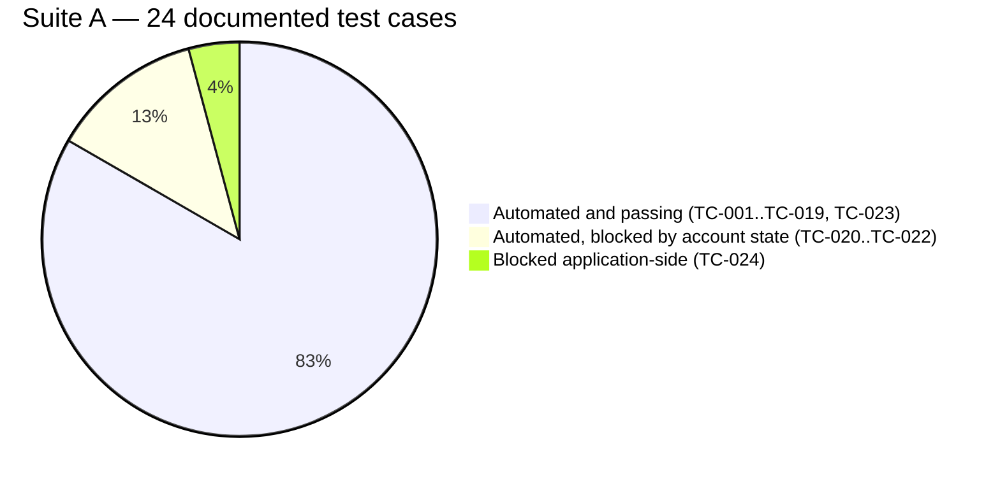

#### Coverage claims requiring correction

`docs/test-cases/excel-exports/TestPlan_Summary.csv` asserts:

| Claim | Assessment |
|---|---|
| "Authentication & Onboarding — Discovery Flow — ✅ Completed — 100%" | **Supportable** for the automated flow |
| "Language Selection & Settings — ✅ Completed — 100%" | **Supportable** |
| "Regression Testing — Discovery — ✅ Completed — 100%" | **Unsubstantiated** — "100%" has no requirements baseline in the repository |
| "Audio Lifecycle Testing — Discovery — ✅ Completed — 100%" | **Not supported.** No test exercising audio behaviour across navigation or language change was identified. The same file lists "Audio lifecycle stability" as a *Pending* objective, contradicting the 100% claim |
| "Speed Practice Module — Foundation/Mastery — ⏳ Pending — 0%" | **Outdated** — TC-023 automates M4 Speed Practice P1–P4 and passes |
| "Progress Dashboard — ⏳ Pending — 0%" | **Accurate** |
| "Current Build #489 · b91140e" | **Stale** — the regression execution record shows Build #4 (`371bfce`), Build #6 (`36a8321` / v3.0.7) and Build #7 (`3b6a229`) |
| "Cross-browser (Phase 1) — Chrome only initially" | **Accurate and important** — Suite A is Chromium-only in practice due to the fake-media flags and speech mocks |

### Coverage Gaps

From the old `TRACEABILITY_MATRIX.md` "Coverage gaps (next)" section plus this review:

| Area | Planned TC | Status | Notes |
|---|---|---|---|
| F2 beyond A1 | TBD | **Resolved** | `foundation-f2.spec.ts` now covers A1 → A2 → A3; the old matrix entry was outdated |
| M4 S1 assessment | TC-024 | **Blocked application-side** | the [Outstanding Dev Request](docs/BUILD_HISTORY.md#outstanding-dev-request-m4-s1-non-audio-answer-hook) in `docs/BUILD_HISTORY.md` is a formal request to the development team for a submit hook. The "correct answer" half is solved and verified (content-API match at score 1.00); submission is not wired |
| Mastery M1–M3 | TBD | **Not automated** | Required for a linear user to reach M4 — see Reusable Components / Test Independence below |
| Mastery M5–M9 | TBD | **Not automated** | `VqaSpeakingAssessment` and `AnswerSource` were built for this expansion |
| Progress Dashboard | — | **Not automated** | 0% per the test plan |
| Audio lifecycle | — | **Not automated** | High-priority objective, no implementation |
| API-level testing of ALL Platform | — | **Not implemented** | `ContentApiAnswerSource` observes the content API but does not test it |
| Negative / error paths in Suite A | — | **Thin** | Suite A automates the happy path plus one deliberate failure (Letter Hunt). Invalid-credential, network-failure and permission-denied paths are absent. Suite B covers negative login well |
| Cross-browser Suite A | — | **Not viable** | Chromium-only by mechanism |
| Unit tests for pure functions | — | **Not implemented** | `answerMatcher.matchOption` is explicitly written to be unit-testable; no test exists |

### Reusable Components (Traceability View)

#### Reuse across test cases

| Component | TCs | Reuse factor |
|---|---|---|
| `appFrame.appPage` | all 24 | Highest — one fixture, whole suite |
| `DiscoveryLoginPage.login()` | TC-001, 020, 021/022, 023, 024 | 5 specs |
| `AssessmentPage.clickRecordToggle` | TC-005 – TC-012 **and** every F-series word phase | Cross-module |
| `FoundationPage.completeLetterTrain` | TC-014, 016, 018, 019, 020 | Across F1 and F2 |
| `FoundationPage.completeApplyChallenge` | TC-017 – TC-022 | Across F1, F2, F3 |
| `FoundationPage.installMicInjection` | TC-014 – TC-023 | Composed by `MasteryPage` |
| `TtsHelper.generateWavBase64` | TC-014, 016, 018, 019, 020 | Cached per word |
| `AnswerSource` + `answerMatcher` | TC-024 | Designed for M4–M9 |
| `config/environments.ts` | all | Per-run |
| `CustomTTAReporter` | all suites | Per-run |

#### Test independence

| Level | Independent? | Analysis |
|---|---|---|
| **Between suites** | ✅ Yes | A, B, C share no state or data |
| **Between Suite B tests** | ✅ Yes | Each logs in fresh against a stateless demo app; parallel-safe |
| **Between Suite C tests** | ✅ Yes (by design) | Fresh context per test |
| **Between Suite A specs** | ❌ **No** | `foundation-f2`, `foundation-f3` and `mastery-m4` depend on the position of three shared, persistent application accounts. Running them changes that position |
| **Within `discovery-e2e.spec.ts`** | ❌ **No, by design** | TC-001 → TC-019 are `test.step`s inside a single test. A failure at TC-014 leaves TC-015 – TC-019 unexecuted |
| **Idempotency** | ❌ No | Suite A mutates server-side learner progress on every run. Discovery is idempotent only because it creates a new user each time — which itself leaks data (see [Cleanup](#cleanup)) |

#### Two documented application constraints

Both are recorded in the regression execution record and are **application behaviour, not automation defects**:

1. **Mastery is sequentially gated.** A single linear user completing Foundation lands on "Start Level 1" (log: `[E2E-M4] Mastery landing: starts=["Start Level 1"]`). M4 is therefore unreachable without completing M1–M3, which is why TC-023 requires the parked `m4auto` account.
2. **Foundation progress is permanent.** Once an account completes a level it cannot retest it. This is the root cause of the forward-only exhaustion problem.

### Execution Results Summary

The full run-by-run execution record — including the 2026-08-12 regression run, the single-user full-Foundation E2E, the 2026-08-13 headed re-run, and the 2026-08-14 all-green Build #7 run with the `recoverIfDisconnected()` fix — is consolidated in [Regression Report History](#regression-report-history) to avoid repeating the same run data twice. The key figures are summarised in [Overview § Automation Benefits](#automation-benefits).

### Documentation Inconsistencies Found

Recording these because they affect the reliability of the existing traceability artifacts.

| # | Inconsistency | Detail | Correct position |
|---|---|---|---|
| 1 | **TC-020/021/022 status conflict** | The old `TRACEABILITY_MATRIX.md` (2026-08-03) showed all three ✅ PASS. The regression execution record (2026-08-12) showed all three ❌ FAIL as standalone specs, then ✅ PASS via the `FULL_E2E` single-user run | The regression report is newer and more precise. This document (and the historical run log in [Regression Report History](#regression-report-history)) is the corrected, dated record |
| 2 | **TC-024 status conflict** | Old matrix: "⏳ Pending", spec/page-object "planned". Regression report: `test.fixme`, blocked application-side with a documented investigation | The code and regression report are authoritative: implemented, evidence-backed, blocked app-side |
| 3 | **Wrong account in the old matrix** | The old matrix said `mastery-m4.spec.ts` uses "persistent `Testf3auto`" | The code uses `m4auto` (confirmed in both `mastery-m4.spec.ts` and `mastery-m4-s1.spec.ts`) |
| 4 | **Stale coverage gap** | Old matrix gap: "F2 beyond A1 — TC-020 covers the F2 opening through A1; continue A1 → A2 → …" | `foundation-f2.spec.ts` already covers A1 → A2 → A3 |
| 5 | **Stale build reference** | `TestPlan_Summary.csv`: "Current Build #489 · b91140e" | The regression execution record tests Build #4 (`371bfce`), #6 (`36a8321`), and #7 (`3b6a229`) |
| 6 | **Contradictory audio-lifecycle status** | `TestPlan_Summary.csv` lists it both as "✅ Completed 100%" (scope table) and "Pending" (objectives table) | Not implemented — no such test exists |
| 7 | **Speed Practice marked 0%** | `TestPlan_Summary.csv` | TC-023 automates M4 Speed Practice and passes |
| 8 | **`config/environments.ts` described as absent** | An earlier reading of the repository suggested the file was missing because `DiscoveryLoginPage.ts:55` references it and it is not under `src/config/` | The file exists at the repository root under `config/`, not `src/config/`. Corrected in this document |
| 9 | **TC numbering collision** | Suite A `TC-001…TC-024` and Suite B `tc001…tc015` are separate spaces | Recommend prefixing: `AXL-TC-001`, `CURA-TC-001` |

**Actioned:** the regression execution record is the authoritative execution record; the root `TRACEABILITY_MATRIX.md` this table duplicated has been retired — this document is now the single traceability source rather than a regeneration of it. Still outstanding: add a "last verified against build" field, and retire or clearly date `TestPlan_Summary.csv`.

### Consolidated Traceability Table

| Test Case | Test File | Page/Object | Utility | Feature | Assertion |
|---|---|---|---|---|---|
| TC-001 | `discovery/discovery-e2e.spec.ts` | `DiscoveryLoginPage`, `MicrophoneTestPage` | `appFrame`, `DiscoveryHelper` | Guest auth + onboarding | `expectWelcomeTextVisible` |
| TC-002 | `discovery/discovery-e2e.spec.ts` | `HelpLanguagePage` | `appFrame` | Help language | popup confirmed |
| TC-003 | `discovery/discovery-e2e.spec.ts` | `LearningLanguagePage` | `appFrame` | Learning language | language applied |
| TC-004 | `discovery/discovery-e2e.spec.ts` | `AssessmentPage` | `DEMO_SENTENCE` guard | Assessment start | sentence ≠ demo |
| TC-005 | `discovery/discovery-e2e.spec.ts` | `AssessmentPage` | mic controls | Recording | recording accepted |
| TC-006 | `discovery/discovery-e2e.spec.ts` | `AssessmentPage` | `img[alt="Play"]` | Replay | `expectPlayButtonVisible` |
| TC-007 | `discovery/discovery-e2e.spec.ts` | `AssessmentPage` | `retryButton` | Re-record | `expectRetryButtonVisible` |
| TC-008 | `discovery/discovery-e2e.spec.ts` | `AssessmentPage` | `nextButton` | Navigation | sentence changes |
| TC-009 | `discovery/discovery-e2e.spec.ts` | `AssessmentPage` | `completeAllSentences` | Assessment 1 | `expectCompletionPopupVisible` |
| TC-010 | `discovery/discovery-e2e.spec.ts` | `AssessmentPage` | — | Assessment 2 | completion popup |
| TC-011 | `discovery/discovery-e2e.spec.ts` | `AssessmentPage` | `skipDemoButton` | Letter Hunt demo | demo left |
| TC-012 | `discovery/discovery-e2e.spec.ts` | `AssessmentPage`, `FoundationPage` | `getLetterBubbles` geometry | Letter Hunt fail path | `expectOnResultScreen` |
| TC-013 | `discovery/discovery-e2e.spec.ts` | `FoundationPage` | `clickLetsStart` fallback chain | F1 entry | `expectF1Landing` |
| TC-014 | `discovery/discovery-e2e.spec.ts` | `FoundationPage`, `AssessmentPage` | `TtsHelper`, `installMicInjection` | F1 L1 → P1 | `nodes` contains `L1`,`P` |
| TC-015 | `discovery/discovery-e2e.spec.ts` | `FoundationPage` | `installLetterLauncherHook` | F1 P1 → L2 | node progression |
| TC-016 | `discovery/discovery-e2e.spec.ts` | `FoundationPage` | `play()` hook, `TtsHelper` | F1 L2 → P2 → L3 | node sequence |
| TC-017 | `discovery/discovery-e2e.spec.ts` | `FoundationPage` | train + hunt helpers | F1 L3 → A1 | `expectOnApplyChallenge` |
| TC-018 | `discovery/discovery-e2e.spec.ts` | `FoundationPage` | `completeApplyChallenge`, `completeLearnPracticePair` | F1 A1 → A2 | `nodes` contains `A2` |
| TC-019 | `discovery/discovery-e2e.spec.ts` | `FoundationPage` | same helpers | F1 A2 → A3 | `expectFoundationApplyCompleted` |
| TC-020 | `discovery/foundation-f2.spec.ts` | `FoundationPage`, `DiscoveryLoginPage` | `switchToEnglishForF2`, `completeWordRecognitionPractice` | F2 full | `nodes` A1/A2/A3 + completion |
| TC-021 | `discovery/foundation-f3.spec.ts` | `FoundationPage`, `DiscoveryLoginPage` | `installLetterLauncherHook`, `completeLetterLauncher` | F3 → A1 | `games` contains `StartF3`, `LL`>0 |
| TC-022 | `discovery/foundation-f3.spec.ts` | `FoundationPage` | `completeMemoryChallenge`, `isPastF3` | F3 → A3 | `MC`>0, `isPastF3()` true |
| TC-023 | `discovery/mastery-m4.spec.ts` | `MasteryPage`, `FoundationPage`, `DiscoveryLoginPage` | `completeM4Practices`, `driveToS1` | M4 Speed Practice | `isAtS1()` |
| TC-024 | `discovery/mastery-m4-s1.spec.ts` | `VqaSpeakingAssessment`, `MasteryPage` | `speechHook`, `AnswerSource`, `answerMatcher` | M4 S1 | `test.fixme` — blocked |
| B TC-001 | `katalon/tc001-full-happy-path.spec.ts` | *(inline locators)* | `cura-data.json` | Appointment booking E2E | 30+ assertions, 11 steps |
| B TC-002 | `katalon/tc002-homepage-elements.spec.ts` | `CuraHomePage` | — | Homepage | element visibility |
| B TC-003 | `katalon/tc003-login-page-verification.spec.ts` | `CuraHomePage`, `CuraLoginPage` | — | Login page | field/button visibility |
| B TC-004 | `katalon/tc004-appointment-form-elements.spec.ts` | `CuraAppointmentPage` | — | Form elements | element visibility |
| B TC-005 | `katalon/tc005-appointment-facility-tokyo.spec.ts` | *(inline)* | `facilities[0]` | Facility Tokyo | `toHaveText` confirmation |
| B TC-006 | `katalon/tc006-appointment-facility-hongkong.spec.ts` | *(inline)* | `facilities[1]` | Facility Hong Kong | `toHaveText` |
| B TC-007 | `katalon/tc007-appointment-facility-seoul.spec.ts` | *(inline)* | `facilities[2]` | Facility Seoul | `toHaveText` |
| B TC-008 | `katalon/tc008-appointment-with-readmission.spec.ts` | *(inline)* | — | Readmission | `toBeChecked` |
| B TC-009 | `katalon/tc009-appointment-with-comment.spec.ts` | *(inline)* | — | Comment field | `toHaveText` |
| B TC-010 | `katalon/tc010-confirmation-page-elements.spec.ts` | `CuraAppointmentPage`, `CuraConfirmationPage` | — | Confirmation page | element + text |
| B TC-011 | `katalon/tc011-login-invalid-credentials.spec.ts` | `CuraLoginPage` | `invalidUsers` | Negative login | `expectErrorVisible` |
| B TC-012 | `katalon/tc012-login-empty-fields.spec.ts` | `CuraLoginPage` | `invalidUsers` | Negative login | `expectErrorVisible` |
| B TC-013 | `katalon/tc013-appointment-without-date.spec.ts` | *(inline)* | — | Date omitted | confirmation state |
| B TC-014 | `katalon/tc014-navigate-back-from-confirmation.spec.ts` | `CuraConfirmationPage` | — | Back navigation | URL |
| B TC-015 | `katalon/tc015-all-healthcare-programs.spec.ts` | *(inline)* | `healthcarePrograms` | All 3 programs | `toBeChecked`, `toHaveText` |
| C — login | `login.spec.ts` | `LoginPage`, `LoginModule` | `users.json` | Scaffold login | `url` contains `/home` |
| C — product | `product.spec.ts` | `ProductPage`, `ProductModule` | `products.json` | Scaffold product | element/text |
| C — checkout | `checkout.spec.ts` | `CheckoutPage`, `CheckoutModule` | `src/config testData` | Scaffold checkout | order confirmation |
| C — sample | `tta-sample.spec.ts` | *(none)* | — | Reporter demo | ⚠ includes `expect(true).toBeTruthy()` |

---

## Master Test Case List

**Source:** the original `docs/test-cases/MASTER_TEST_CASES.md` catalogue (`discoveryFull.xlsx` / `ALL v3-0 Flow.xlsx`, last updated 2026-05-29 by Kiro). This predates the August 2026 code-level review above, so where it conflicts with [Traceability and Coverage](#traceability-and-coverage) — coverage percentages in particular — the newer, code-verified figures there are authoritative. This section preserves what that older catalogue contains that is *not* duplicated above: the literal numbered step-by-step procedure for TC-001–TC-010, and the mechanics/pass-criteria descriptions for the Foundation and Mastery levels beyond what the current automation covers.

**Project:** EkStep Practice Platform (ALL) · **Application URL:** `https://all-uat.theall.ai` · **Framework:** Playwright + TypeScript

### Discovery Flow — detailed steps (TC-001 – TC-010)

**Source file:** `discoveryFull.xlsx` · **Module:** DS-01 · **Total test cases:** 10 · **Automation status (as originally recorded):** ✅ 100% automated

#### TC-001: Login with Valid Credentials
- **Priority:** High | **Type:** Functional | **Status:** ✅ Automated
- **Precondition:** None
- **Steps:**
  1. Open URL: `https://all-uat.theall.ai`
  2. Create unique username (format: `testuser_<timestamp>`)
  3. Enter username
  4. Enter password (same as username)
  5. Click login button
  6. Verify text: "Hi! Listen to the audio and repeat it!"
  7. Click Skip button
- **Expected Result:** Student lands on microphone test page and can skip it
- **Automation:** `src/tests/discovery/discovery.spec.ts` (superseded by `discovery-e2e.spec.ts` in the current regression set — see [Traceability and Coverage](#traceability-and-coverage))

#### TC-002: Choose Help Language
- **Priority:** High | **Type:** Functional | **Status:** ✅ Automated
- **Precondition:** Student logged in
- **Steps:**
  1. On help language popup, choose language (English/Telugu/Hindi)
  2. Click Confirm button
- **Expected Result:** Help language selected successfully
- **Automation:** `src/tests/discovery/discovery.spec.ts`

#### TC-003: Choose Learning Language
- **Priority:** High | **Type:** Functional | **Status:** ✅ Automated
- **Precondition:** Student logged in
- **Steps:**
  1. Click language dropdown on home page
  2. Choose 'English' from popup
  3. Click Confirm button
- **Expected Result:** Learning language selected successfully
- **Automation:** `src/tests/discovery/discovery.spec.ts`

#### TC-004: Start Language Assessment
- **Priority:** High | **Type:** Functional | **Status:** ✅ Automated
- **Precondition:** New student logged in
- **Steps:**
  1. Click Start Assessment button
  2. Click Skip Demo button
- **Expected Result:** Assessment sentence displayed for selected language
- **Automation:** `src/tests/discovery/discovery.spec.ts`

#### TC-005: Record Sentence
- **Priority:** High | **Type:** Functional | **Status:** ✅ Automated
- **Precondition:** Assessment started
- **Steps:**
  1. Click microphone button
  2. Read displayed sentence (e.g., "Anil like to eat sweets")
  3. Click stop button
- **Expected Result:** Sentence displayed and audio recorded
- **Automation:** `src/tests/discovery/discovery.spec.ts`
- **Note:** Audio recording simulated in automation

#### TC-006: Replay Recorded Audio
- **Priority:** High | **Type:** Functional | **Status:** ✅ Automated
- **Precondition:** Sentence recorded
- **Steps:**
  1. Click play button
- **Expected Result:** Play button visible and audio plays back
- **Automation:** `src/tests/discovery/discovery.spec.ts`

#### TC-007: Re-record Audio
- **Priority:** High | **Type:** Functional | **Status:** ✅ Automated
- **Precondition:** Sentence recorded
- **Steps:**
  1. Click retry button
  2. Read displayed sentence
  3. Click stop button
- **Expected Result:** Retry button visible and re-recording successful
- **Automation:** `src/tests/discovery/discovery.spec.ts`

#### TC-008: Move to Next Sentence
- **Priority:** High | **Type:** Functional | **Status:** ✅ Automated
- **Precondition:** Current sentence recorded
- **Steps:**
  1. Click next button
- **Expected Result:** Next button visible and next sentence displayed
- **Automation:** `src/tests/discovery/discovery.spec.ts`

#### TC-009: Complete Assessment 1
- **Priority:** High | **Type:** Functional | **Status:** ✅ Automated
- **Precondition:** Assessment started
- **Steps:**
  1. Complete all sentences (5 total)
- **Expected Result:** Completion popup visible, Continue button moves to next assessment
- **Automation:** `src/tests/discovery/discovery.spec.ts`

#### TC-010: Complete Assessment 2
- **Priority:** High | **Type:** Functional | **Status:** ✅ Automated
- **Precondition:** Assessment 1 completed
- **Steps:**
  1. Repeat TC-005 to TC-008
  2. Complete all sentences (5 total)
- **Expected Result:** Assessment 2 completed, Continue button moves to next stage
- **Automation:** `src/tests/discovery/discovery.spec.ts`

### Foundation Level Test Case Descriptions (F0–F3)

**Source file:** `ALL v3-0 Flow.xlsx`. These mechanics/pass-criteria descriptions are from the original test plan and cover more detail than the current code-level review captures for the levels not automated (F0). F1–F3 are automated in the current framework — see [Traceability and Coverage](#traceability-and-coverage) for the code-level mapping; the mechanics below is the original functional-requirement framing.

#### F0: Auditory & Visual Tests
- **Total test cases:** TBD · **Status (as originally recorded):** 📝 Not yet automated — remains **[NOT IMPLEMENTED]** in the current codebase
- **Description:** Perceptual skills assessment (Auditory and Video questions)
- **Pass Criteria:**
  - Auditory Accuracy: 4/5
  - Video Accuracy: 4/5

#### F1: Letter Recognition
- **Total test cases:** TBD · **Status:** ✅ Automated (TC-013 – TC-019, see [Traceability and Coverage](#traceability-and-coverage))
- **Description:**
  - English: 36 combinations (26 Alphabets + Diphthongs)
  - Telugu: 51 combinations (16 vowels + 36 Consonants)
- **Mechanics:** Letter Train, Letter Hunt
- **Levels:** Learn (L1–L9), Practice (P1–P9), Apply (A1–A3)

#### F2: Phonological Awareness (Syllables)
- **Total test cases:** TBD · **Status:** ✅ Automated (TC-020, see [Traceability and Coverage](#traceability-and-coverage))
- **Description:**
  - English: 54 common syllables
  - Telugu: 54 common compound consonants
- **Mechanics:** Syllable Clap, Letter Hunt, Barakadi (Indic)
- **Levels:** Learn (L1–L9), Practice (P1–P9), Apply (A1–A3)

#### F3: Letter Speed & Sequence Recall
- **Total test cases:** TBD · **Status:** ✅ Automated (TC-021/TC-022, see [Traceability and Coverage](#traceability-and-coverage))
- **Description:** Speed check for letters and syllables
- **Mechanics:** Letter Launcher, Memory Challenge
- **Pass Criteria:** 80% accuracy, 80% fuel points under 90 seconds

### Mastery Level Test Case Descriptions (M1–M9)

**Source file:** `ALL v3-0 Flow.xlsx`. Only M4 (Speed Practice, TC-023) is automated in the current framework; M1–M3 and M5–M9 remain **[NOT IMPLEMENTED]** — see [Coverage Gaps](#coverage-gaps). The mechanics and pass-criteria descriptions below are preserved from the original test plan since they do not appear anywhere in the code-level documentation.

#### M1: Simple Words (1-2 Syllables)
- **Total test cases:** TBD · **Status:** 📝 Not yet automated
- **Skills:** Blending and Segmentation
- **Mechanics:** Word Hunt, Sound Hunt, Word Speaking
- **Pass Criteria:** 80% accuracy

#### M2: Word Vocabulary
- **Total test cases:** TBD · **Status:** 📝 Not yet automated
- **Skills:** Word vocabulary building
- **Mechanics:** Bingo Cards, Word Hunt, Sound Hunt
- **Pass Criteria:** 80% accuracy

#### M3: Phrase Reading
- **Total test cases:** TBD · **Status:** 📝 Not yet automated
- **Skills:** Blending, Segmentation, Reading
- **Mechanics:** Phrase Reading, Correct Image Phrase, Repeat Phrase
- **Pass Criteria:** Accuracy 80%, Familiarity 70%, Fluency Fair/Good

#### M4: Sentence Reading (Simple)
- **Total test cases:** TBD · **Status:** ✅ Automated (TC-023 Speed Practice P1–P4; TC-024 S1 blocked app-side — see [Traceability and Coverage](#traceability-and-coverage))
- **Skills:** Reading comprehension
- **Mechanics:** Fill in the Blank, Form a Sentence, Read the Image, Read Aloud
- **Pass Criteria:** Accuracy 80%, Familiarity 70%, Fluency Fair/Good

#### M5: Sentence Reading (Moderate)
- **Total test cases:** TBD · **Status:** 📝 Not yet automated
- **Skills:** Reading fluency
- **Mechanics:** Speed Practice, Ticker, Word Recall, Read Aloud
- **Pass Criteria:** Accuracy 80%, Familiarity 70%, Fluency Fair/Good

#### M6: Sentence Reading (Complex)
- **Total test cases:** TBD · **Status:** 📝 Not yet automated
- **Skills:** Advanced reading
- **Mechanics:** Paced Reading, Ticker, Word Recall, Read Aloud
- **Pass Criteria:** Accuracy 80%, Familiarity 70%, Fluency Fair/Good, cWPM > 45

#### M7: Paragraph Reading (Simple)
- **Total test cases:** TBD · **Status:** 📝 Not yet automated
- **Skills:** Paragraph comprehension
- **Mechanics:** Read Aloud, Read the Image
- **Pass Criteria:** Accuracy 80%, Familiarity 70%, Fluency Fair/Good, Prosody Natural/Flat, cWPM > 45

#### M8: Paragraph Reading (Moderate)
- **Total test cases:** TBD · **Status:** 📝 Not yet automated
- **Skills:** Advanced paragraph reading
- **Mechanics:** Read Aloud, Read the Image, Fluency Practice
- **Pass Criteria:** Accuracy 80%, Familiarity 70%, Fluency Fair/Good, Prosody Natural/Flat, cWPM > 45

#### M9: Paragraph Reading (Complex)
- **Total test cases:** TBD · **Status:** 📝 Not yet automated
- **Skills:** Expert level reading
- **Mechanics:** Read from Book, Word Recall, Read Aloud
- **Pass Criteria:** Accuracy 80%, Familiarity 70%, Fluency Fair/Good, Prosody Natural/Flat, cWPM > 45

### Notes & Assumptions (original test plan)

**Audio Handling**
- Original implementation note: audio recording simulated with timeouts, with no actual audio quality validation. (The current framework has since moved beyond this — see the TTS-into-fake-microphone design in [Overview § Key Design Decisions](#key-design-decisions) — but audio *quality* validation remains out of scope in both eras.)
- Recommendation carried forward: manual testing is still required for audio quality.

**Language Support**
- Supported: English, Telugu, Hindi.
- Test data available for all three languages; automation has historically focused on English, with the Hindi-UI account path now also automated (see [Overview § Key Design Decisions](#key-design-decisions), decision on the English-switch path).

**Test Data Strategy**
- Username: dynamic generation (`testuser_<timestamp>`).
- Password: same as username.
- Languages: configurable via test data.
- Sentences: dynamic from application.

**Known Limitations (as originally recorded)**
1. Audio quality not validated.
2. Microphone permissions require manual grant (superseded — the current framework grants the `microphone` permission programmatically via `playwright.config.ts`, see [Runner Configuration Values](#test-execution-flow-and-sequences)).
3. Cross-browser testing pending (still true for Suite A — see [Scalability Assessment](#technical-review-and-recommendations)).
4. Network throttling not tested (still true — see [Automation Scope § Out of scope](#automation-scope)).

### Historical Automation Roadmap (original test plan, 2026-05-29)

This roadmap predates and is superseded in detail by the current [Recommended Roadmap](#recommended-roadmap) in Technical Review and Recommendations, which is based on the actual code rather than a plan. It is retained here only for the historical phase framing it used, which the newer roadmap does not restate:

- **Phase 1 — Discovery Flow:** originally marked complete (TC-001–TC-010 automated, page objects created, test data configured, documentation complete).
- **Phase 2 — Foundation Levels:** originally "pending" (F0 auditory/visual, F1 Letter Recognition, F2 Phonological Awareness, F3 Speed & Sequence Recall). F1–F3 are now automated; F0 remains not automated.
- **Phase 3 — Mastery Levels:** originally "pending" (M1–M3 words/phrases, M4–M6 sentences, M7–M9 paragraphs). Only M4 is now automated.
- **Phase 4 — Enhancements:** originally "pending" (API testing integration, cross-browser testing, performance testing, accessibility testing). All four remain not implemented — see [Coverage Gaps](#coverage-gaps) and [Automation Scope § Out of scope](#automation-scope).

---

## Regression Report History

> Living report — regenerate by running `npm run regression:uat` (or `:lab` / `:lab2`). A
> timestamped HTML copy is written to `tta-report/report_<YYYYMMDD_HHMMSS>.html` (Environment
> and Mode are shown in the report header). This section is the authoritative, dated execution
> record referenced throughout [Traceability and Coverage](#traceability-and-coverage) and
> [Overview § Automation Benefits](#automation-benefits).

### Run 2026-08-12 (Build #4) — metadata

| Field | Value |
| ----- | ----- |
| Environment | **UAT** (`https://all-uat.theall.ai`) |
| Execution | Full regression (5 real specs, serial `--workers=1`) |
| Browser | Chromium (bundled) |
| Mode | Headless |
| Date | 2026-08-12 |
| App build | Build #4 · `371bfce` |
| Runner | `npm run regression:uat` |
| Totals | 2 specs passed · 2 failed · 1 skipped · **wall time 25m 42s** |
| HTML report | `tta-report/report_20260812_130422.html` |

#### Results by test case

| TC | Description | Status | Time | Remarks / Evidence |
| --- | --- | --- | --- | --- |
| TC-001 | Login (Guest) & skip mic test | ✅ PASS | 16.1s | Discovery+F1 single session (`discovery-e2e`) |
| TC-002 | Choose help language & confirm | ✅ PASS | 5.2s | |
| TC-003 | Choose learning language (English) & confirm | ✅ PASS | 5.9s | |
| TC-004 | Start assessment & leave demo | ✅ PASS | 12.1s | |
| TC-005 | Record the sentence | ✅ PASS | 4.1s | |
| TC-006 | Replay recorded audio | ✅ PASS | 3.5s | |
| TC-007 | Re-record via Retry | ✅ PASS | 4.2s | |
| TC-008 | Move to next sentence | ✅ PASS | 1.9s | verified sentence changes |
| TC-009 | Complete Assessment 1 → Continue | ✅ PASS | 28.2s | |
| TC-010 | Complete Assessment 2 → Continue | ✅ PASS | 47.7s | |
| TC-011 | Skip Letter Hunt demo | ✅ PASS | 5.5s | |
| TC-012 | Fail Letter Hunt → discovery result screen | ✅ PASS | 16.0s | app-frame URL check |
| TC-013 | "Let's Start" → F1 module landing | ✅ PASS | 4.1s | |
| TC-014 | F1: L1 Letter Train → P1 | ✅ PASS | 61.1s | |
| TC-015 | F1: P1 Letter Hunt (10 Qs) → L2 | ✅ PASS | 40.0s | |
| TC-016 | F1: L2 Train → P2 → L3 | ✅ PASS | 91.7s | |
| TC-017 | F1: L3 Train + P3 Hunt → A1 | ✅ PASS | 91.9s | |
| TC-018 | F1: A1 → L4/P4 → L5/P5 → L6/P6 → A2 | ✅ PASS | 6m 35s | |
| TC-019 | F1: A2 → L7–L9/P7–P9 → complete A3 | ✅ PASS | 8m 43s | |
| **TC-020** | **F2**: login → Start F2 → A1–A3 | ❌ **FAIL** | 58.5s | **Deployment account-blocker** — `Testf2auto` no longer resumes at F2 on Build #4; "Start F2" never appears. Needs a dedicated parked account (`f2auto`). Not a code regression. |
| **TC-021/022** | **F3**: login → complete F3 (P1→A3) | ❌ **FAIL** | 51.4s | **Deployment account-blocker** — `Testf3auto` lands on a fresh **"Guest 0" Discovery** screen ("Start Assessment"), not F3. Needs a dedicated parked account (`f3auto`). Not a code regression. |
| TC-023 | M4: login → Start Level 4 → P1–P4 → S1 | ✅ PASS | 46.6s | via `m4auto`; account is parked at S1, so P1–P4 already complete → reaches S1 immediately (`:S1-reached`). Forward-only persistent account. |
| TC-024 | M4 S1: speak-the-answer → advance | ⏭️ SKIP | — | `test.fixme` — app-side answer-submission not wired (verified builds #1 & #4); see the [Outstanding Dev Request](docs/BUILD_HISTORY.md#outstanding-dev-request-m4-s1-non-audio-answer-hook) in `docs/BUILD_HISTORY.md`. Not a false pass. |

#### Summary

- **Discovery + F1 (TC-001–019): 19/19 PASS.**
- **Mastery M4 P1–P4 (TC-023): PASS.**
- **M4 S1 (TC-024): SKIPPED** (honest pending — app submit hook required).
- **F2 (TC-020) & F3 (TC-021/022): BLOCKED** by the deployment login-model change — the old
  persistent Foundation accounts don't resume; they need dedicated parked accounts
  (`f2auto` / `f3auto`), exactly as M4 required `m4auto`. **This is not a code regression and is
  not caused by the environment-config changes** — the same `navigate()`/login path is exercised
  by Discovery (fresh guest) and M4 (`m4auto`), both of which PASS.

### Single-user full-Foundation E2E (2026-08-12) — F Series COMPLETE

To validate F2/F3 without the broken parked accounts, one **fresh Guest user** (username ==
password, generated per run) was driven through the **entire Foundation in ONE continuous
session** via `FULL_E2E=1` on `discovery-e2e.spec.ts` (UAT, headless).

| Stage | Coverage | Status | Evidence |
| --- | --- | --- | --- |
| Discovery + F1 | TC-001–019 | ✅ PASS | all 19 steps |
| **F2** | TC-020 | ✅ **PASS** | nodes `StartF → L/P×3 → A1 → A2 → A3` (full F2) |
| **F3** | TC-021/022 | ✅ **PASS** | `StartF3 → 16× LetterLauncher + 6× MemoryChallenge → past F3` |
| Mastery landing | — | ℹ️ | Foundation complete; single linear user enters Mastery (level indicator empty on the map; M4 needs M1–M3, validated separately via `m4auto`) |

**Result: PASSED, 68m 41s (one user).** This confirms **F2 and F3 are functionally correct** —
the standalone-spec failures (TC-020/021/022) are solely the stale parked accounts
(`Testf2auto`/`Testf3auto`), not the automation. **The F Series is complete and verified.**

Command: `FULL_E2E=1 ENV=uat node scripts/run-e2e.js src/tests/discovery/discovery-e2e.spec.ts`

### Headed re-run through TC-023 (2026-08-13, Build #6 / v3.0.7) — Mastery gating CONFIRMED

Repeated the single-user run **headed**, extended to attempt **M4 (TC-023)** after F3, on the
newly deployed **Build #6 · v3.0.7 · `36a8321`** (78m24s). Foundation again all green
(TC-001–019 ✅, F2 ✅, F3 ✅). At the Mastery map the single user landed on
**`Start Level 1`** (log: `[E2E-M4] Mastery landing: starts=["Start Level 1"]`) — proving
**Mastery is sequentially gated**: a single linear user starts at **M1**, and **M4 / TC-023 is
NOT reachable** until M1–M3 are completed. This is an app-progression constraint, not a defect.

**Conclusion:** with one user, TC-001 → **TC-022** is fully achievable; **TC-023 (M4) requires
M1–M3 automation** (or the parked `m4auto` account, where TC-023 already passes as a
state-check). Foundation is also re-validated on Build #6.

### Full headed all-TC run (2026-08-14, Build #7 / `3b6a229`) — ALL GREEN

Single continuous user `testuser_1786707550234`, **headed**, UAT, serial. Command:

```bash
FULL_E2E=1 ENV=uat node scripts/run-e2e.js --headed --workers=1 \
  src/tests/discovery/discovery-e2e.spec.ts \
  src/tests/discovery/mastery-m4.spec.ts \
  src/tests/discovery/mastery-m4-s1.spec.ts
```

| TC | Description | Status | Time |
| --- | --- | --- | --- |
| TC-001 | Login (Guest) & skip mic test | ✅ PASS | 13.3s |
| TC-002 | Help language & Confirm | ✅ PASS | 5.2s |
| TC-003 | Learning language English & Confirm | ✅ PASS | 6.1s |
| TC-004 | Start assessment & leave demo | ✅ PASS | 12.5s |
| TC-005 | Record the sentence | ✅ PASS | 4.5s |
| TC-006 | Replay recorded audio | ✅ PASS | 2.3s |
| TC-007 | Re-record via Retry | ✅ PASS | 4.4s |
| TC-008 | Move to next sentence | ✅ PASS | 4.1s |
| TC-009 | Complete Assessment 1 → Continue | ✅ PASS | 35.3s |
| TC-010 | Complete Assessment 2 → Continue | ✅ PASS | 51.3s |
| TC-011 | Skip Letter Hunt demo | ✅ PASS | 6.5s |
| TC-012 | Fail Letter Hunt → result screen | ✅ PASS | 17.4s |
| TC-013 | "Let's Start" → F1 landing | ✅ PASS | 4.5s |
| TC-014 | F1: L1 Letter Train → P1 | ✅ PASS | 67.9s |
| TC-015 | F1: P1 Letter Hunt → L2 | ✅ PASS | 43.6s |
| TC-016 | F1: L2 Train → P2 → L3 | ✅ PASS | 103.3s |
| TC-017 | F1: L3 Train + P3 Hunt → A1 | ✅ PASS | 102.6s |
| TC-018 | F1: A1 → L4/P4 → L5/P5 → L6/P6 → A2 | ✅ PASS | 7m 18s |
| TC-019 | F1: A2 → L7–L9/P7–P9 → complete A3 | ✅ PASS | 9m 59s |
| TC-020 | **F2** (same user): StartF → L/P×3 → A1 → A2 → A3 | ✅ PASS | 23m 24s |
| TC-021/022 | **F3** (same user): 16× LL + 6× MC → past F3 | ✅ PASS | 25m 24s |
| TC-023 | M4 P1–P4 → S1 (via `m4auto`) | ✅ PASS | 48s |
| TC-023 (single user) | M4 via the linear user | 🔒 GATED | 12.2s — lands at `Start Level 1` (annotated, expected) |
| TC-024 | M4 S1 speak-the-answer | ⏭️ SKIP | `test.fixme` — app submit hook pending |

**Totals: 2 specs passed · 0 failed · 1 skipped · 76m 12s.** Report:
`tta-report/report_20260814_170908.html`.

#### Root cause of the earlier TC-018 failures + the fix

Two consecutive TC-018 failures (`Ready for Challenge` not found, stalling at
`[Letter Train] 14/16`) were **not** automation defects. The failure screenshot showed the app's
own **"Couldn't connect right now / check your internet connection"** page, and the build stamp
had changed **#6 → #7 mid-run**: the server was **redeployed while the test was running**,
dropping the session.

**Fix:** `FoundationPage.recoverIfDisconnected()` — detects that screen by its connectivity copy
(deliberately not by the "Try Again" button alone, since games have their own `TRY AGAIN` for
wrong answers), clicks **Try Again** (reload fallback), and resumes; after 3 failed attempts it
throws with a screenshot instead of hanging. Wired into 4 stall points (Letter Train, Apply
Challenge, Foundation-through-Apply, F3) so it fires **only** when progress has stalled — the
happy path is unchanged. In the all-green run above it **did not need to fire** (0 occurrences),
so it is insurance for future deploys, not something masking a real failure. This method is also
documented in [Code and Component Reference § FoundationPage](#code-and-component-reference).

### Regression-Safety Conclusion

The environment-configuration work (multi-instance support) introduced **no regressions**: the
runnable baseline (Discovery+F1, M4) is identical to the documented baseline. F2/F3 remain
blocked on dedicated accounts (an external dependency, not code). No changes were made to the
stable F2/F3 page objects/specs.

---

## Technical Review and Recommendations

**Audience:** QA Lead, Engineering Manager, Architect

This section is an objective assessment. It is not a criticism of the team's work: several mechanisms in this framework are genuinely sophisticated solutions to hard problems, and the honesty of the existing documentation (marking TC-024 `test.fixme` with evidence rather than letting it pass) reflects good engineering discipline. The findings below are prioritised so that the small number of items that genuinely block or endanger delivery are separated from the larger number of quality improvements.

### Framework Strengths

#### Solving genuinely hard automation problems

The application under test is hostile to automation in five distinct ways, and the framework has a specific engineering answer to each. This is the framework's defining strength and should be recognised as such.

| Obstacle | Solution | Assessment |
|---|---|---|
| Entire journey inside an iframe | `appPage()` Proxy routing 19 DOM methods to the current app frame, resolved lazily per call | Elegant. Made a whole suite iframe-aware with a one-line import change per spec |
| No test IDs; labels inside SVGs; per-build CSS hashes | Layered locator strategy: role → text → id → geometry, with documented rationale | Pragmatic and correctly ordered |
| Progress gated on speaking a displayed word | Local SAPI TTS → base64 WAV → `getUserMedia` override → Web Audio injection | Inventive; deterministic; cached |
| Speech recognition returns nothing headless | `SpeechRecognition` mock via `addInitScript`, echoing the app's own dictated phrase | Isolated and opt-in, protecting the F-series |
| Picture MCQs require the correct answer | Strategy pattern: passive `GetContent` sniffing (`isAns:true`) or a vision model, with fuzzy option matching | Well-designed; the content-API source is deterministic and free |

#### Reporting

`CustomTTAReporter` is a real asset. Timestamped self-contained reports, live updating during execution, per-step screenshots correlated by multiple naming strategies, per-step video seek offsets, console-log correlation, run history with a `LATEST` marker, and an `index.html` redirect so a published URL always shows the newest run. For a suite where a single test can run 75 minutes, live reporting and step-level video offsets are not luxuries — they are what make failures diagnosable at all.

#### Diagnostic design

The `captureState(tag)` pattern plus diagnostic assertion messages is the single practice most worth preserving and extending:

```ts
throw new Error(`completeF3: unrecognised screen after ${done.length} games ` +
                `(${done.join(' ')}). Page text: "${await this.pageTextHead()}"`);
```

Seven semantic diagnostic tags, screenshots wrapped so a screenshot failure cannot mask the real error, and assertion messages that name the exact journey position. This is better than most production suites achieve.

#### Environment architecture

`config/environments.ts` is clean, typed, documented, and achieves its stated goal: adding an instance is one line, with no test changes. The precedence order is explicit, unknown keys warn rather than fail silently, and an unmatched `BASE_URL` produces a synthetic `CUSTOM` environment. `scripts/run-e2e.js` complements it with cross-platform CLI invocation and a documented regression spec list.

#### Architectural conformance tooling

A custom rule engine (`scripts/rule-engine.js` + JSON config) that enforces file placement, with `--changed` and `--staged` modes designed for git hooks. Very few teams build this. It is the mechanism that will keep the structure from decaying as the team grows.

#### Assertion style

Asserting on the **node sequence** returned by the driver (`expect(nodes).toContain('A1')`) rather than on screenshots or single elements is domain-meaningful, robust to UI churn, and produces excellent failure messages. This should be the house pattern.

#### Engineering honesty

TC-024 is marked `test.fixme` with a detailed block comment recording that the application-side submission is not wired, verified across two builds, with a formal request to the development team in the [Outstanding Dev Request](docs/BUILD_HISTORY.md#outstanding-dev-request-m4-s1-non-audio-answer-hook) section of `docs/BUILD_HISTORY.md`. The `FULL_E2E` single-user run was built specifically to prove the automation correct independently of broken parked accounts. Both are marks of a team that would rather report an honest gap than a green run.

#### Other strengths

- **Zero XPath** across 96 files.
- **Minimal dependency surface** — four devDependencies, no production dependencies.
- `strict: true` TypeScript throughout.
- Arrow-function locators (necessary for both the re-rendering DOM and Proxy frame resolution) used consistently.
- `forbidOnly` on CI prevents an accidentally narrowed run from passing.
- `disableConcurrentBuilds` correctly protects the shared persistent accounts.
- Sensible artifact policy (`only-on-failure` / `retain-on-failure`).
- Extensive inline comments explaining *why*, not just *what* — unusual and valuable.

### Framework Weaknesses

| Weakness | Evidence | Consequence |
|---|---|---|
| **Committed live credential** | `.env` contains `VISION_API_KEY=sk-ant-api03-…`; `.gitignore` omits `.env` | Credential exposure |
| **Silent failure by default** | 111 × `.catch(() => {})`, 39 × `force: true` | Genuine defects can produce green steps |
| **Sleep-based synchronisation** | 241 × `page.waitForTimeout` | Environment-sensitive flakiness; ~6 min of dead time per pass |
| **Shared mutable external state** | `Testf2auto`, `Testf3auto`, `m4auto` | Forward-only exhaustion; deployment fragility; no concurrency |
| **CI cannot run the primary suite** | Windows PowerShell TTS on a Linux agent; corrupted `Dockerfile`; image/package version mismatch; 60-min timeout vs 78-min run | The pipeline exists but cannot execute Suite A end to end |
| **No notification** | Only commented-out `slackSend` | Failures unnoticed until someone opens Jenkins |
| **Test independence violated** | 19 test cases inside one test | One defect masks eighteen |
| **God object** | `FoundationPage` 1,063 lines / 40 methods | Merge conflicts, hard to test, hard to onboard |
| **Dead code** | `src/api/` (3 classes, 558 lines), `ApiHelper`, `WaitHelper`, `DataGenerator`, 4 auth fixtures, 7 path aliases | Misleads readers about capability |
| **42 tests with no target** | Suite C points at `localhost:3000` / `example.com` | 45% of the test count is non-executable |
| **Debug specs inside `testDir`** | 10 files, ~2,000 lines | Collected by `npm test` and by the Jenkins command |
| **Fixture fragmentation** | 3 independent `base.extend()` roots; 15 specs import `@playwright/test` directly | A Suite A spec with the wrong import silently queries the wrong frame |
| **Viewport-coupled locators** | Geometry filtered by absolute pixel bounds; fixed-coordinate clicks | Any layout change breaks tests silently |
| **Documentation drift** | 9 inconsistencies catalogued in [Documentation Inconsistencies Found](#documentation-inconsistencies-found) | Traceability artifacts cannot be trusted without cross-checking the code |

### Technical Debt

| Debt item | Size | Interest rate |
|---|---|---|
| Suite C — 42 tests, ~15 files, no configured application | Large | Low (inert) but misleading |
| `src/api/` + `ApiHelper` — 704 lines, zero importers | Medium | Low |
| `WaitHelper` (148 lines) unused while equivalent logic is duplicated inline in `FoundationPage` | Small | **Medium** — real duplication |
| `DataGenerator` (177 lines) unused, imported but never called | Small | Low |
| `auth.fixture.ts` — complete session-reuse implementation, unused | Small | **Medium** — Suite A logs in via UI every time and would benefit |
| `DiscoveryModule` (783 lines) duplicating the journey now encoded in `discovery-e2e.spec.ts` | Medium | **High** — two implementations drift apart |
| 10 debug specs (~2,000 lines) in `testDir` | Medium | **Medium** — pollute default runs and pass statistics |
| 7 unused `tsconfig` path aliases (would break at runtime if adopted) | Trivial | Low |
| 3 hashed-CSS locators in `AssessmentPage` | Trivial | **High** — will break on the next build |
| Dead config: `LOG_LEVEL`, `RETRY_COUNT`, `DEFAULT_TIMEOUT` | Trivial | Low, but misleads |
| Duplicated `baseUrl` in `discovery-data.json` | Trivial | Low |
| Hardcoded credentials in 4 specs | Small | Medium |
| Missing `eslint` / `prettier` / `husky` in `devDependencies` | Trivial | **Medium** — quality gates inoperative |
| Vacuous assertions in `tta-sample.spec.ts` | Trivial | Low |
| No unit tests for `answerMatcher.matchOption` (written to be testable) | Small | Low |

### Code Quality Assessment

| Dimension | Rating | Evidence |
|---|---|---|
| **Readability** | Good | Consistent `LOCATORS` / `ACTIONS` / `ASSERTIONS` sectioning; descriptive method names; exceptional explanatory comments |
| **Consistency** | Mixed | Page-object structure is highly consistent. Undermined by three fixture roots, two locator philosophies in Suite B, and 15 direct `@playwright/test` imports |
| **Type safety** | Good | `strict: true`; typed interfaces for test data, `AnswerSource`, `VqaItem`, reporter data structures |
| **Naming** | Good | `completeFoundationThroughApply`, `installLetterLauncherHook`, `isPastF3` are self-documenting |
| **Comments** | Excellent | Comments explain *why* — e.g. why `exact: true` on "Continue to ALL", why the tightest text wrapper is chosen, why `--disable-dev-shm-usage` is needed, why `isVisible()` does not wait |
| **Error handling** | Poor by default, excellent where deliberate | 111 blind swallows vs 7 rich diagnostic capture points — the two extremes coexist |
| **DRY** | Mixed | Genuine reuse of mic injection, record toggle and node helpers. Violated by `DiscoveryModule` vs `discovery-e2e.spec.ts`, and by inline polling that `WaitHelper` already implements |
| **Single Responsibility** | Violated in one place | `FoundationPage` covers three levels, six mini-games, browser hooks, assertions and diagnostics |
| **Testability of framework code** | Poor | `matchOption` is pure and testable but untested; no test infrastructure for framework code exists |
| **Dead code** | Significant | See Technical Debt above |

### Maintainability Assessment

**Strengths.** A new engineer can find things: the folder structure matches the layer model, the rule engine enforces it, and page objects are internally consistent. The comments answer the "why did they do it this way" questions that usually require a walkthrough.

**Risks.**

1. **`FoundationPage` is a bottleneck.** Any F-series change touches one 1,063-line file, creating merge conflicts on a team of more than one.
2. **Geometry is scattered.** 76 inline `page.evaluate()` blocks embed viewport assumptions that cannot be reused, reviewed centrally, or unit-tested. A viewport change requires auditing all 76.
3. **Two journey implementations.** `DiscoveryModule` and `discovery-e2e.spec.ts` encode the same flow. A fix applied to one will be missed in the other.
4. **Documentation cannot be trusted alone.** Nine inconsistencies mean every traceability question requires reading the code.
5. **Onboarding cost.** Understanding this framework requires understanding a Proxy, `getUserMedia` override, Web Audio, `addInitScript`, `SpeechRecognition` mocking, and passive response interception. This document is intended to reduce that cost, but the underlying conceptual load remains.

### Scalability Assessment

| Axis | Verdict |
|---|---|
| Multiple environments | ✅ **Ready** — best-designed axis; one blocker (`expectOnLoginPage` hardcodes the UAT host) |
| Larger suites | ⚠️ **Partially** — layering and the rule engine support growth; `FoundationPage` and in-memory reporter state do not |
| Parallel execution | ❌ **Not ready for Suite A** — shared accounts and single-session tests force `--workers=1`. Suites B and C are ready |
| Multiple users | ❌ **Not ready** — Discovery generates users correctly; F2/F3/M4 depend on three specific shared accounts with no pooling |
| Multiple browsers | ⚠️ **Configured, not viable for Suite A** — fake-media flags and speech mocks are Chromium-specific |
| CI execution | ❌ **Blocked** — see [CI/CD Findings Summary](#cicd-reporting-and-infrastructure) |

### Stability & Flakiness Risk Assessment

Ranked by expected contribution to intermittent failure.

| Rank | Risk | Mechanism | Mitigation present? |
|---|---|---|---|
| 1 | **241 hard sleeps** | Fixed durations do not adapt to a loaded environment | Partially — generous durations |
| 2 | **111 swallowed exceptions** | Failures pass silently, surfacing later at an uninformative point | No |
| 3 | **Persistent account drift** | Account position changes between runs and across deployments | Yes — the `FULL_E2E` alternative path |
| 4 | **Geometry + fixed coordinates** | Viewport/layout coupling | Partially — three-tier fallback in `clickLetsStart` |
| 5 | **3 hashed-CSS locators** | Break on the next application build | One is OR'd with `img[alt="Retry"]`; the Next button has no fallback |
| 6 | **39 `force: true` clicks** | Bypass actionability; click covered/disabled elements | No |
| 7 | **Long single-session tests** | Any transient issue in 75 minutes fails 19 test cases | Yes — `stuck` counters, `maxNodes` bounds, step-level reporting |
| 8 | **Third-party demo host** | `katalon-demo-cura.herokuapp.com` availability is outside the team's control | No |
| 9 | **Vision-model non-determinism** | If `S1_ANSWER_SOURCE=vision` | Yes — `matchOption` with a 0.3 floor; content-API is the default |
| 10 | **Renderer OOM on long runs** | Heavy PWA-in-iframe with audio | Yes — `--disable-dev-shm-usage`, with an explanatory comment |

**Genuine flakiness defences worth preserving:** the `stuck` counters (progress-based rather than time-based), `maxNodes`/`maxRounds` bounds, the 700 ms debounce re-check in `trainProgress()` that survives transition blinks, the `TtsHelper` cache, and `CI ? 2 : 0` retries.

### Findings — Critical

| Priority | Observation | Impact | Recommendation |
|---|---|---|---|
| **Critical** | A live Anthropic API key is committed in `.env` (`VISION_API_KEY=sk-ant-api03-XAqZ…`), and `.gitignore` excludes only `.env.local` / `.env.*.local`, not `.env`. The file's own comment falsely states "No key committed". | If the repository has ever been pushed to any remote, the credential is exposed and can be used to incur billed API usage against the owning account. Committed secrets persist in git history even after deletion. | **1. Revoke the key immediately** at `console.anthropic.com`. **2.** Add `.env` to `.gitignore`. **3.** Create `.env.example` with the variable names and empty values, and commit that instead. **4.** Purge the key from git history (`git filter-repo` or BFG) and force-push if the remote is shared. **5.** Inject `VISION_API_KEY` via the Jenkins credentials store, as `BASE_URL` already is. **6.** Correct the misleading comment. |

### Findings — High

| Priority | Observation | Impact | Recommendation |
|---|---|---|---|
| **High** | `Dockerfile` is corrupted: `COPY package*.json 44444./`, `# C mopy source code`, `CO PY . .`, `m# Build TypeScript`. | `docker build` fails at line 18. Every `docker-compose` service is unbuildable, so the entire containerised execution path — including the 4-way sharding that works correctly in `docker-compose.yml` — is dead. | Replace with the corrected Dockerfile in [Alternative Execution Infrastructure](#cicd-reporting-and-infrastructure). Add `docker build .` as a CI stage so corruption cannot recur silently. |
| **High** | `TtsHelper.generateWavBase64()` calls `execFileSync('powershell', …)`, but the Jenkins agent and `Dockerfile` both use `mcr.microsoft.com/playwright:v1.40.0-jammy` (Linux). | `powershell` does not exist on the agent, so every F-series "say the word" phase throws `ENOENT`. TC-014, TC-016, TC-018, TC-019 and TC-020 cannot pass in CI. **The pipeline cannot execute the framework's primary suite.** | Pre-generate WAV fixtures for the finite F-series word set, commit them under `src/testdata/audio/`, and have `TtsHelper` read from disk with a SAPI fallback for local authoring. Deterministic, cross-platform, faster, and the `TtsHelper` interface does not change. Alternatives in [The CI blocker, stated plainly](#cicd-reporting-and-infrastructure). |
| **High** | Playwright Docker image pinned to `v1.40.0-jammy` while `package.json` requires `@playwright/test ^1.60.0`. | The image's browser binaries do not match the library's expected revision. Playwright validates this and will error or behave unpredictably. Twenty minor versions of fixes and API changes are missing. | Update the tag to `v1.60.0-jammy` in **both** `Dockerfile` and `Jenkinsfile`. Add a cross-reference comment in each, and a CI assertion comparing `npx playwright --version` to the image tag. |
| **High** | Jenkins job `timeout(time: 60, unit: 'MINUTES')`, but the regression execution record shows a successful full-Foundation run at **68m41s**, a headed re-run at **78m24s**, and an all-green run at **76m12s**; `discovery-e2e.spec.ts` itself sets `test.setTimeout(75 min)`. | Jenkins aborts runs that would have succeeded, producing false failures and destroying the reports for those runs. | Raise to at least 120 minutes. Better: split into separate jobs (Discovery+F1, F2, F3, M4) so each has a realistic bound and a failure in one does not lose the others. |
| **High** | Jenkins shard expression `--shard=\$SHARD/\${params.SHARD_COUNT}` references `$SHARD`, which is never defined in the pipeline. | Produces `--shard=/4`, an invalid argument. Sharding has never functioned in Jenkins despite `SHARD_COUNT` being an exposed parameter that implies it does. | Either implement sharding properly with a `matrix` or parallel stage that sets `SHARD` per branch, or remove the `SHARD_COUNT` parameter and the shard logic so the pipeline does not advertise a capability it lacks. The `docker-compose.yml` sharding is a correct reference implementation. |
| **High** | 111 occurrences of `.catch(() => {})` swallow all exceptions, combined with 39 `force: true` clicks that bypass actionability checks. | A required element failing to appear is indistinguishable from an optional element being absent. A `force` click on a disabled or covered control succeeds silently. **Genuine application defects can produce passing steps.** The recorded TC-020 diagnosis ("Start F2 never appears") is a downstream symptom because `switchToEnglishForF2()` swallowed the real failure. | Adopt the present/absent pattern: probe with `isVisible({timeout})`, branch explicitly, log the branch taken, and let genuine failures throw. Pattern in [The 111 swallowed exceptions](#test-execution-flow-and-sequences). Audit all 39 `force: true` usages and keep only those with a documented reason. Prioritise the login and level-entry paths, where a swallowed failure costs the most diagnostic time. |
| **High** | F2, F3 and M4 depend on three shared, persistent, forward-only application accounts (`Testf2auto`, `Testf3auto`, `m4auto`). `foundation-f3.spec.ts` calls `test.skip(true, …)` when `isPastF3()` is true. | Three observed failure modes: forward-only exhaustion (a completed level can never be retested, and the spec *skips* rather than fails, so coverage erodes into a green run); deployment fragility (both F2 and F3 failed on Build #4 purely from account drift); no concurrency (two engineers corrupt each other's account position). | **Promote the `FULL_E2E=1` single-user run to the primary Foundation regression path** — it is already proven (68m41s, F1+F2+F3 all green with one fresh guest, and confirmed again in the 76m12s Build #7 all-TC run) and has no account dependency. Keep the parked accounts as an optional fast path. Longer term, add an account-pool/lease abstraction, or request an application endpoint to reset a learner's progress. Replace the `test.skip` with a hard failure or an explicit `@requires-fresh-account` annotation so lost coverage is visible. |

### Findings — Medium

| Priority | Observation | Impact | Recommendation |
|---|---|---|---|
| **Medium** | 241 `page.waitForTimeout` calls (37 in `FoundationPage`, 30 in `discovery-demo`, 28 in `discovery-e2e`, 22 in `MasteryPage`, 20 in `DiscoveryModule`). | Environment-sensitive flakiness plus roughly six minutes of unconditional dead time per full pass. | Replace navigation and post-click sleeps with `expect(locator).toBeVisible()`. Call the existing `waitForAppFrame(page)` from `continueToAll()` instead of `waitForTimeout(4000)`. Adopt the already-written `WaitHelper.waitForCondition()` for the inline polling loops. **Keep and comment** the media-pipeline sleeps (audio playback duration, record-start ordering) — those are legitimately unavoidable. |
| **Medium** | `FoundationPage.ts` is 1,063 lines / 40 methods, covering three levels, six mini-games, browser hooks, assertions and diagnostics. | Merge-conflict bottleneck; high onboarding cost; impossible to unit-test in parts. | Decompose into `LetterTrainPage`, `LetterHuntPage`, `WordRecognitionPage`, `LetterLauncherPage`, `MemoryChallengePage`, `ApplyChallengePage`, plus a thin `FoundationDriver` holding only the dispatch loop and the state predicates. Keep the returned node-sequence contract unchanged so no spec needs editing. |
| **Medium** | 10 debug/scratch specs (~2,000 lines) live inside `src/tests/discovery/`, which is inside `testDir`. | `npm test`, `npm run test:discovery` and the Jenkins `npx playwright test` command all collect and execute them, inflating runtime and distorting pass statistics. Only `run-e2e.js --regression` excludes them. | Move to `sandbox/` outside `testDir`, or add `testIgnore: [/.*-debug\.spec\.ts/, /dump-html\.spec\.ts/]` to `playwright.config.ts`. Keep the targeted npm scripts working by pointing them at the new path. |
| **Medium** | 42 of 93 tests (Suite C) target `localhost:3000` / `example.com`, with no configured application. | 45% of the test count is non-executable, which distorts every headline metric and misleads anyone reading the repository about actual capability. | Decide explicitly: (a) configure the real target and activate them, (b) move to `templates/` as a documented reference implementation excluded from `testDir`, or (c) delete. Option (b) preserves their genuine value as the cleanest POM example in the repository. |
| **Medium** | `src/api/` (`AuthApi`, `ProductApi`, `OrderApi` — 558 lines), `ApiHelper` (146), `WaitHelper` (148) and `DataGenerator` (177) have no effective importers. `DataGenerator` is imported by `DiscoveryHelper` but never called. | ~1,029 lines of dead code implying API-testing capability the framework does not exercise. Misleads reviewers and new joiners. | Adopt `WaitHelper` (it directly replaces duplicated inline polling — highest value). Remove the unused `DataGenerator` import. Move `api/` and `ApiHelper` to `templates/` or delete them, with a note in the README recording the decision. |
| **Medium** | Suite B specs `tc001`, `tc004`–`tc009`, `tc013`, `tc015` inline `page.locator` calls (34 in `tc001` alone) despite four purpose-built page objects existing. `tc001` constructs `CuraAppointmentModule` and never calls it. | The POM layer is bypassed for over half the suite, so a CURA selector change requires editing eight spec files instead of one page object. | Refactor those specs onto the fixtures and page objects — the model already exists in `tc002`, `tc003` and `tc011`. Add a rule-engine rule forbidding `page.locator(` inside `src/tests/**`. |
| **Medium** | `DiscoveryModule` (783 lines) implements the Discovery journey, but the primary regression spec `discovery-e2e.spec.ts` does not use it — it drives page objects directly with its own inline helpers (`clickByText`, `getLetterBubbles`, `recordCurrentItem`, `onDemo`, `leaveDemoIfPresent`). | Two implementations of the same journey will drift. A fix applied to one will be missed in the other, and it is not obvious to a new engineer which is authoritative. | Choose one. Either migrate `discovery-e2e.spec.ts` onto `DiscoveryModule` (preferred — it restores the layer model and gives step logging), or delete `DiscoveryModule` and promote its inline helpers into the page objects where they belong. |
| **Medium** | Credentials hardcoded in specs: `login('Testf2auto','Testf2auto')`, `login('Testf3auto','Testf3auto')`, `login('m4auto','m4auto')` (×2), plus `DEMO_SENTENCE = 'The cat is sleeping'` and the CURA URL in six specs. | Rotating an account requires editing four spec files. Contradicts the framework's own externalised test-data design. | Move to `src/testdata/discovery/accounts.json` with a typed interface, sourced from environment variables where secret. Move the CURA URL into `cura-data.json` or a `config/environments.ts` entry. |
| **Medium** | No test-data cleanup. Every Discovery run creates a permanent `testuser_<epoch>` account in the shared UAT application; nothing deletes it. There is no `afterAll`, `afterEach`, or `globalTeardown` anywhere in the framework. | Unbounded accumulation of test accounts in a shared environment. Also means there is no structural place for any global cleanup. | Add a `globalTeardown` that either calls an application endpoint to delete accounts created during the run, or at minimum appends created usernames to a file for periodic bulk purge. Add `globalSetup` for an environment health check while you are there. |
| **Medium** | No notification mechanism. The only notification code is two commented-out `slackSend` calls; `post { success }` / `post { failure }` contain only `echo`. `TestPlan_Summary.csv` lists both Slack and email notifications as "Planned / Pending". | A failed nightly run is invisible until someone opens Jenkins. Since there is also no scheduled trigger, in practice failures are only seen by whoever ran the build manually. | Add `emailext` on `failure` and `unstable`, linking to the published TTA Report rather than attaching it (reports embed video and traces). Template in [Recommended implementation](#cicd-reporting-and-infrastructure). Requires the Jenkins Email Extension plugin and SMTP configuration. |
| **Medium** | The Jenkins test stage calls `npx playwright test` directly, bypassing `scripts/run-e2e.js`. | No `--env` translation, so `resolveEnvironment()` falls back to `BASE_URL` matching or the `uat` default and the report header may name the wrong environment. No `--workers=1` guard, so CI will attempt to run the three Suite A specs concurrently across 2 workers — and they share persistent accounts. Debug specs are also collected. | Replace the stage body with `sh "node scripts/run-e2e.js --regression --env=${params.ENV}"` and add an `ENV` choice parameter (`uat`, `lab`, `lab2`). |
| **Medium** | `eslint`, `prettier` and `husky` are referenced by config files and npm scripts but absent from `devDependencies`. The Jenkins lint stage is `npm run lint \|\| true`. | `npm run lint` and `npm run format` fail on a clean install. The lint stage can never succeed, and `\|\| true` guarantees nobody notices. `.lintstagedrc` and `commitlint.config.js` exist but no hook installer, so the rule engine's `--staged` mode is not wired to commits. | Add `eslint`, `@typescript-eslint/*`, `prettier`, `husky`, `lint-staged` and `@commitlint/*` to `devDependencies`. Remove `\|\| true` so lint failures are visible. Install a pre-commit hook running `npm run rules:staged` and `lint-staged`. |
| **Medium** | No scheduled or SCM trigger in the `Jenkinsfile`; the job is manual-only as far as version control shows. | Regression runs only happen when someone remembers, which defeats the "rapid smoke validation after each UAT deployment" objective stated in the test plan. | Add `triggers { cron('H 2 * * 1-5') }` for a weekday nightly, plus a webhook or `pollSCM` for post-merge validation. Keeping triggers in the `Jenkinsfile` makes them reviewable. |
| **Medium** | Three independent `base.extend()` fixture roots and 15 specs importing `test` directly from `@playwright/test`. | A Suite A spec with the wrong import gets a non-iframe-aware `page` and silently finds nothing inside the app — precisely the failure mode the Proxy was built to prevent. | Compose one root fixture that includes the iframe-aware `page` plus all page-object fixtures. Add a rule-engine rule forbidding `from '@playwright/test'` in `src/tests/discovery/**`. |

### Findings — Low

| Priority | Observation | Impact | Recommendation |
|---|---|---|---|
| **Low** | Three hashed-CSS locators remain in `AssessmentPage`: `div.css-1w4297d` (Retry), `div.css-4g6ai3` and `div.css-1m9gxh8 > div` (Next). | Will break on the next application build — the framework's own comments state that "css-* hashes change per build". Retry is OR'd with `img[alt="Retry"]` so is partly protected; **Next has no fallback**. Ranked Low only because it is a two-line fix. | Replace with role, `alt`, or geometric selection consistent with the rest of the file. Add a rule-engine or lint rule rejecting `css-[a-z0-9]{6,}` in selectors. |
| **Low** | `DiscoveryLoginPage.expectOnLoginPage()` asserts `toHaveURL(/.*all-uat\.theall\.ai.*/)`. | Hardcodes UAT, so the assertion fails on LAB and LAB2 — defeating the multi-environment design in the one place it is used. | Build the expected pattern from `resolveEnvironment().baseURL`, or assert on the path only (`/\/login/`). |
| **Low** | `LOG_LEVEL` is read into `config.logLevel` but `Logger` never calls `setLogLevel()`; the static default is `INFO`. `RETRY_COUNT` and `DEFAULT_TIMEOUT` are likewise unused by Suite A. | `LOG_LEVEL=DEBUG` has no effect and `Logger.debug()` output is unreachable. Configuration appears to exist but does not. | Call `Logger.setLogLevel(process.env.LOG_LEVEL as LogLevel)` once at startup (in `playwright.config.ts` or a `globalSetup`). Remove the genuinely unused variables from `.env.example` or wire them up. |
| **Low** | Seven `tsconfig.json` path aliases (`@pages/*` etc.) are declared and used by nothing. Adopting them would additionally require a runtime resolver, which is not installed. | Misleading; a new engineer may try to use them and break execution. | Either add `tsconfig-paths` and adopt them consistently, or delete the `paths` block. |
| **Low** | `tta-report/` and `.auth/` are not in `.gitignore`; `tta-report/` grows unbounded (one HTML file per run, plus copied screenshots, videos and traces). | Risk of committing generated reports and stored auth state; local disk growth. | Add both to `.gitignore`. Add report pruning (keep newest N) to `generateHistoryPage()` or a small maintenance script. |
| **Low** | `tta-sample.spec.ts` contains `expect(true).toBeTruthy()` and `expect(url).toBeTruthy()`. | Assertions that can never fail, counted in pass statistics. | Replace with real assertions or move the spec out of `testDir` as a reporter fixture. |
| **Low** | `answerMatcher.matchOption()` is pure and its doc comment states it is intended to be unit-testable, but no unit test exists. There is no unit-test infrastructure for framework code at all. | The scoring thresholds (1.0 / 0.9 / Jaccard × 0.8, floor 0.3) cannot be changed with confidence. | Add a small unit-test project (Playwright can run non-browser tests, or add Vitest) covering `matchOption`, `resolveEnvironment` and `Logger.shouldLog`. |
| **Low** | Suite A uses `TC-001…TC-024` and Suite B uses `tc001…tc015` — two independent numbering spaces. | "TC-001" is ambiguous across documents and conversations. | Prefix: `AXL-TC-001`, `CURA-TC-001`. Update filenames, titles and the traceability matrix. |
| **Low** | The Jenkins test command can append `--grep` twice (when `TEST_TYPE=smoke` and `TEST_TAG` is set). | The second flag silently overrides the first, losing the smoke filter without warning. | Combine into a single `--grep` expression, or make the parameters mutually exclusive with a validation step. |
| **Low** | `test-results/results.json` is archived but never published as structured test results. | Jenkins' native test-trend graphs, failure history and flaky-test detection are unavailable. | Add `['junit', { outputFile: 'test-results/junit.xml' }]` to the reporter list and a `junit 'test-results/junit.xml'` step in `post { always }`. |
| **Low** | `docker-compose.yml` sets `BASE_URL=${BASE_URL:-https://example.com}`. | A scaffold-era default that would silently run Suite A against `example.com` if `BASE_URL` is unset. | Change the default to the UAT URL, or remove the default so `config/environments.ts` supplies it. |
| **Low** | `DiscoveryHelper.createMultipleTestUsers()` busy-waits on `Date.now()` to guarantee distinct timestamps. | Blocks the Node event loop for up to a millisecond per user. Negligible in practice. | Use `await new Promise(r => setTimeout(r, 1))` or append an incrementing suffix. |
| **Low** | `src/testdata/discovery/discovery-data.json` duplicates `baseUrl`, which `config/environments.ts` owns. | Two sources of truth for the same value; a stale duplicate is a future confusion. | Remove the field and read the URL from the registry. |
| **Low** | `rules/framework-rule-engine.json` has a `module-placement` rule matching `(Module|Modal)\.ts$`, but no `Modal.ts` file exists. | Implies a Modal convention that is not used, and the rule is untested. | Either introduce modal objects where appropriate, or narrow the pattern to `Module\.ts$`. |
| **Low** | `CustomTTAReporter` retains all results, steps and correlation maps in memory for the whole run. | Unbounded growth on a very large suite. Not a problem at 93 tests. | Consider streaming step data to disk if the suite grows by an order of magnitude. |

### Recommended Roadmap

Sequenced by risk reduction per unit of effort. Effort estimates are relative, not absolute.

#### Phase 0 — Immediate (today)

| # | Action | Effort | Finding |
|---|---|---|---|
| 1 | Revoke the exposed `VISION_API_KEY` | Minutes | Critical |
| 2 | Add `.env`, `.auth/`, `tta-report/` to `.gitignore`; commit `.env.example` | Minutes | Critical, Low |
| 3 | Purge the key from git history if the remote is shared | Hours | Critical |
| 4 | Move `VISION_API_KEY` to the Jenkins credentials store | Minutes | Critical |

#### Phase 1 — Unblock CI (week 1)

| # | Action | Effort | Finding |
|---|---|---|---|
| 5 | Fix the corrupted `Dockerfile`; add `docker build` to CI | Hours | High |
| 6 | Align the Playwright image tag with `^1.60.0` in `Dockerfile` and `Jenkinsfile` | Minutes | High |
| 7 | Raise the Jenkins timeout to ≥120 min, or split into per-level jobs | Hours | High |
| 8 | Replace the test stage with `node scripts/run-e2e.js --regression --env=$ENV`; add an `ENV` parameter | Hours | Medium |
| 9 | Fix or remove the broken sharding expression | Hours | High |
| 10 | Pre-generate and commit F-series WAV fixtures; make `TtsHelper` disk-first with a SAPI fallback | Days | High |
| 11 | Add `emailext` notification on failure/unstable | Hours | Medium |
| 12 | Add `cron` and SCM triggers to the `Jenkinsfile` | Minutes | Medium |

**Outcome of Phase 1:** the pipeline can execute Suite A unattended, on a schedule, and tell someone when it fails.

#### Phase 2 — Stabilise (weeks 2–4)

| # | Action | Effort | Finding |
|---|---|---|---|
| 13 | Promote `FULL_E2E=1` to the primary Foundation regression path; keep parked accounts as a fast path | Days | High |
| 14 | Replace `test.skip(isPastF3())` with a visible failure or an explicit annotation | Hours | High |
| 15 | Convert the highest-risk `.catch(() => {})` sites (login, level entry, language switch) to the explicit present/absent pattern with logging | Days | High |
| 16 | Audit all 39 `force: true` usages; keep only the justified ones | Days | High |
| 17 | Replace navigation and post-click sleeps with `expect(...).toBeVisible()`; call `waitForAppFrame()` from `continueToAll()`; adopt `WaitHelper` | Days | Medium |
| 18 | Fix the three hashed-CSS locators; add a lint rule against `css-[a-z0-9]{6,}` | Hours | Low |
| 19 | Fix `expectOnLoginPage()` to be environment-agnostic | Minutes | Low |
| 20 | Add `globalSetup` (health check) and `globalTeardown` (record/purge generated users) | Days | Medium |

**Outcome of Phase 2:** failures are truthful, runs are faster and less environment-sensitive, and Foundation coverage no longer erodes silently.

#### Phase 3 — Consolidate (weeks 5–8)

| # | Action | Effort | Finding |
|---|---|---|---|
| 21 | Move the 10 debug specs out of `testDir` | Hours | Medium |
| 22 | Decompose `FoundationPage` into per-game page objects with a thin driver, preserving the node-sequence contract | Weeks | Medium |
| 23 | Resolve the `DiscoveryModule` vs `discovery-e2e.spec.ts` duplication | Days | Medium |
| 24 | Compose one root fixture; add a rule forbidding direct `@playwright/test` imports in Suite A | Days | Medium |
| 25 | Move hardcoded credentials and the CURA URL into test data | Hours | Medium |
| 26 | Refactor the eight inline-locator CURA specs onto page objects; add a rule forbidding `page.locator(` in `src/tests/**` | Days | Medium |
| 27 | Decide Suite C's fate (configure / archive as templates / delete) | Days | Medium |
| 28 | Remove or adopt `api/`, `ApiHelper`, `DataGenerator`; adopt `WaitHelper` | Days | Medium |
| 29 | Add `eslint`, `prettier`, `husky` to `devDependencies`; remove `\|\| true`; install pre-commit hooks | Hours | Medium |
| 30 | Extract geometric scanning into named reusable helpers so viewport assumptions live in one place | Days | Medium |

**Outcome of Phase 3:** the codebase matches its documented architecture, dead code is gone, and conventions are mechanically enforced.

#### Phase 4 — Extend (weeks 9+)

| # | Action | Effort | Finding |
|---|---|---|---|
| 31 | **Request `data-testid` attributes from the application team** — the highest-leverage change available; would eliminate the geometry layer entirely | Collaboration | Locator strategy |
| 32 | Follow up the [Outstanding Dev Request](docs/BUILD_HISTORY.md#outstanding-dev-request-m4-s1-non-audio-answer-hook) in `docs/BUILD_HISTORY.md` to unblock TC-024 | Collaboration | Coverage |
| 33 | Automate Mastery M1–M3 so M4 is reachable with a linear user | Weeks | Coverage |
| 34 | Extend to M5–M9 using the existing `VqaSpeakingAssessment` and `AnswerSource` | Weeks | Coverage |
| 35 | Add the audio-lifecycle tests listed as a High-priority objective in the test plan | Weeks | Coverage |
| 36 | Add unit tests for `matchOption`, `resolveEnvironment`, `Logger` | Days | Low |
| 37 | Add JUnit XML output and Jenkins `junit` publishing for trend analysis | Hours | Low |
| 38 | Introduce an account-pool/lease abstraction, or an application progress-reset endpoint | Weeks | High |
| 39 | Regenerate the traceability matrix from code + regression report; add "last verified against build"; retire `TestPlan_Summary.csv` or date it | Days | Doc drift |
| 40 | Adopt suite-prefixed test-case IDs (`AXL-TC-001`, `CURA-TC-001`) | Days | Low |

### Closing Assessment

This framework's core engineering is stronger than its infrastructure. The iframe Proxy, the audio-injection chain, the speech mock, the pluggable answer sources and the custom reporter are non-trivial solutions to problems most automation teams would have declared un-automatable, and the diagnostic design means failures in a 75-minute test are actually debuggable. The environment registry and the rule engine show architectural intent beyond the immediate task.

What holds it back is not the test code. It is a committed credential, a broken container build, a Windows dependency on a Linux agent, a job timeout shorter than the run it must contain, no notification, no schedule, and a synchronisation strategy that leans on sleeps and silent catches. Every one of those is a bounded, well-understood fix. Phase 0 and Phase 1 together are roughly one to two weeks of work and would move this from *"a capable suite that a person runs manually on Windows"* to *"a capable suite that runs itself nightly and reports honestly."*

The single most valuable thing outside the team's own control is `data-testid` attributes in the application. Seventy-six geometric DOM scans, twenty fixed-coordinate clicks and three hashed-class locators all exist because the application offers no stable hooks. The team has already shown it can make that case to the developers — the [Outstanding Dev Request](docs/BUILD_HISTORY.md#outstanding-dev-request-m4-s1-non-audio-answer-hook) in `docs/BUILD_HISTORY.md` is exactly the right instrument. The same approach applied to test IDs would remove the framework's largest category of fragility permanently.
